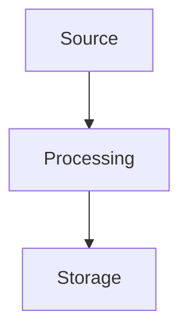
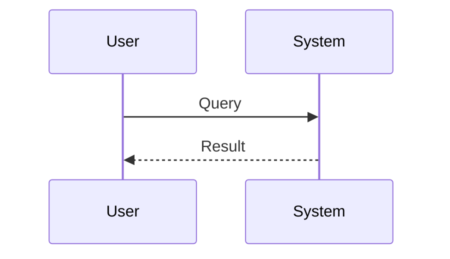

# Term Title Here

Write your 4,000-word definition here.

**CRITICAL RULES:**
1. **Length**: Must be at least 4,000 words.
2. **Authoring**: Written manually, one by one.
3. **Prohibited language**: NO AI-isms (e.g., "delve", "crucial", "testament").
4. **Punctuation**: NO em-dashes (—). Use parentheses or separate sentences instead.
5. **Visuals**: MUST contain exactly two diagrams (Mermaid or SVG).

## Core Definition

[Insert first 1000 words here...]

## Diagram 1: Conceptual Architecture

## Implementation and Operations

[Insert next 2000 words here...]

## Diagram 2: Operational Flow

## Summary and Tradeoffs

[Insert final 1000 words here...]
