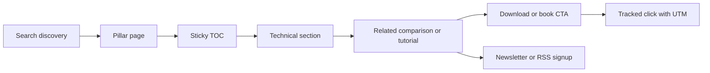

# OpenLakehouse Authority Blueprint

## Executive summary

As of the current crawl, **OpenLakehouse.com is not a live content site**. The domain redirects to a GoDaddy parked “for sale” page that lists the domain as a verified domain for sale at **USD $20,000**. That means this is not a normal optimization project; it is effectively a **net-new authority site launch**. The immediate prerequisite is to acquire or activate the domain, deploy indexable content, and stand up baseline SEO, analytics, and publishing infrastructure before any ranking strategy can succeed. citeturn8view0turn7search0

The keyword landscape splits into three different games. **“Data Lakehouse”** is a mature, highly commercial SERP dominated by large vendor explainers such as Databricks, Google Cloud, Azure Databricks, AWS, HPE, and Salesforce. **“Apache Iceberg”** is even more difficult at the head term because the official Apache project page ranks first and major vendors occupy much of the rest of page one. **“Agentic Analytics”** is newer, faster-moving, and still vendor-led, which makes it the best near-term opening for a neutral, technical publisher to establish topical authority. citeturn2search0turn2search1turn2search2turn2search4turn2search5turn2search6turn3search0turn3search1turn3search3turn3search4turn4search0turn5search0turn5search1turn5search5turn5search9

The fastest path to defensible rankings is **not** trying to outrank giant vendors with thin definition pages. It is building a **vendor-neutral, engineer-first knowledge system** around three pillars: **Data Lakehouse**, **Apache Iceberg**, and **Agentic Analytics**. Each pillar should be supported with tutorials, comparisons, reference assets, governance guides, architecture diagrams, reproducible code examples, and original synthesis that helps a practitioner make implementation decisions. Google’s guidance consistently emphasizes people-first, original, reliable, well-sourced content with clear page metadata, strong structure, and good page experience; that is the operating model this site should adopt from day one. citeturn36view0turn27view0turn28view0turn30view0

The recommended positioning is: **“OpenLakehouse is the neutral technical publication for modern lakehouse architecture, Apache Iceberg implementation, and agentic analytics systems.”** This positioning directly exploits the gap between official docs on one side and vendor marketing pages on the other. Official Apache Iceberg documentation demonstrates deep feature richness and ecosystem breadth, while page-one vendor pages often focus on definitions, product alignment, or high-level architecture. That gap is where OpenLakehouse can win. citeturn37view3turn39view4turn37view0turn37view1turn37view2turn37view6turn37view8

A practical launch plan looks like this: first, ship a technically excellent site architecture and three flagship pillar pages; second, publish a twelve-week cluster of supporting content with rigorous source citations, code review, and schema; third, add internal search, comparison pages, benchmark/dataset pages, and book/download CTAs; fourth, monitor search performance, Core Web Vitals, indexing, and CTA conversion weekly. Google’s own documentation also makes clear that title links, snippets, canonicalization, robots rules, sitemaps, localized versions, mobile-first parity, and structured data all matter operationally and should be correct at launch instead of patched later. citeturn27view0turn28view0turn28view1turn28view2turn28view3turn28view4turn29view0turn29view1turn31view0turn31view1turn31view3turn31view4turn31view5

**Assumptions used in this report:** one English-language site at launch; no legacy CMS or hosting constraints; no existing Search Console or GA4 history; no paywall; and editorial access to publish long-form technical content. Because the domain is parked, current live-page audits of internal links, source markup, and field performance are inherently limited. The report therefore provides a **launch-oriented audit plan and production specification**, not a remediation plan for an existing site. citeturn8view0

## Current state and search landscape

### Current state diagnosis

The most important present-tense fact is that the domain is parked. A parked domain cannot build topical authority, earn stable crawl/index signals, accumulate meaningful internal link equity, or establish user engagement metrics around content. Treat the current state as **zero content, zero crawl architecture, zero trust signals, zero structured data, and zero measurable organic baseline**. citeturn8view0turn7search0

The strategic implication is straightforward: the first milestone is not “optimize OpenLakehouse.com,” it is **“launch OpenLakehouse.com as a real publication.”** Any roadmap that starts with backlink outreach, long-tail scaling, or LLM discoverability before a technically sound launch is out of sequence. citeturn8view0turn28view3turn30view0

### Keyword priority map

The SERPs support a three-tier priority model.

| Keyword | Opportunity | Difficulty | Intent | Recommended role |
|---|---|---:|---|---|
| **Agentic Analytics** | Highest near-term opening | Medium | Definition + architecture + governance + evaluation | Launch pillar and cluster first |
| **Data Lakehouse** | Strong medium-term opportunity | High | Definition + architecture + comparison + migration | Launch pillar immediately, expect slower head-term gains |
| **Apache Iceberg** | Highest long-tail upside | Very high at head term | Official concept + implementation + troubleshooting + ecosystem | Target long-tail and mid-tail first, not only head term |

This prioritization is based on the observed page-one composition. “Agentic Analytics” is crowded with vendor definitions and product pages rather than entrenched neutral authorities, while “Data Lakehouse” and especially “Apache Iceberg” are more occupied by large vendor and official properties. citeturn5search0turn5search1turn5search2turn5search3turn5search4turn5search5turn5search8turn5search9turn2search0turn2search1turn2search2turn2search4turn2search5turn2search6turn3search0turn3search1turn3search2turn3search3turn3search4

### Top SERP pages for Data Lakehouse

| Approx. rank | Page | Observed angle |
|---|---|---|
| 1 | Databricks — **What is a Data Lakehouse?** citeturn2search0 | Category-defining vendor page; emphasizes openness, ACID transactions, and BI/ML unification. |
| 2 | Google Cloud — **What is a Data Lakehouse? Architecture & Benefits** citeturn2search1 | Explains lakehouse through storage, metadata, and semantic layers. |
| 3 | Azure Databricks — **What is a data lakehouse?** citeturn2search2 | Platform-centric architecture/explainer with lake vs warehouse framing. |
| 4 | Reddit discussion — **What exactly is the lakehouse?** citeturn2search3 | Community discussion; indicates user confusion and definitional ambiguity. |
| 5 | AWS — **What is a Data Lakehouse?** citeturn2search4 | Enterprise glossary + capability framing. |
| 6 | HPE — **What is a Data Lakehouse?** citeturn2search5 | Broad glossary and business-benefit framing. |
| 7 | Salesforce — **What Is a Data Lakehouse?** citeturn2search6 | Business-user explanation, structured vs unstructured framing. |
| 8 | YouTube explainer citeturn2search7 | Video result; indicates visual education demand. |
| 9 | Medium article — **Benefits of Adopting a Data Lakehouse** citeturn2search8 | Secondary publisher presence; weaker authority than hyperscalers. |
| 10 | Databricks — **What Is a Lakehouse?** citeturn2search9 | Another Databricks-owned result; shows brand dominance for the term. |

### Top SERP pages for Agentic Analytics

| Approx. rank | Page | Observed angle |
|---|---|---|
| 1 | Tableau — **Agentic Analytics: A New Paradigm for Business Intelligence** citeturn4search0 | Product-led concept framing tied to Tableau Next. |
| 2 | Databricks — **What is Agentic Analytics?** citeturn5search0 | Detailed architecture, governance, use cases, comparisons. |
| 3 | dbt — **Understanding agentic analytics** citeturn5search1 | Governance and workflow framing, oriented to data teams. |
| 4 | AtScale — **What is Agentic Analytics? Definition, Tools & More** citeturn5search3 | Glossary-style page. |
| 5 | Alteryx — **What is agentic analytics?** citeturn5search4 | LLM + reasoning + tool-use framing. |
| 6 | ThoughtSpot home/platform page citeturn5search5 | Strong product/brand surfacing; agentic analytics as platform category. |
| 7 | Scoop Analytics — **What Is Agentic Analytics?** citeturn5search6 | Recent explainer; illustrates SERP recency. |
| 8 | OvalEdge — **Top Agentic Analytics Tools** citeturn5search7 | Tool roundup angle. |
| 9 | Snowplow — **What Is Agentic Analytics? A Guide for Data Leaders** citeturn5search8 | Leadership and use-case framing. |
| 10 | Gartner Peer Insights — **Best Agentic Analytics Reviews** citeturn5search9 | Category definition + capability checklist. |

### Top SERP pages for Apache Iceberg

| Approx. rank | Page | Observed angle |
|---|---|---|
| 1 | Apache Iceberg official site citeturn3search0 | Official definition and project home; strongest authority. |
| 2 | AWS — **What is Apache Iceberg?** citeturn3search1 | High-level explainer for enterprise buyers and practitioners. |
| 3 | GitHub — **apache/iceberg** citeturn3search2 | Source repo and release activity. |
| 4 | Oracle — **What Is Apache Iceberg?** citeturn3search3 | Vendor explainer focused on big-data workloads. |
| 5 | Snowflake docs — **Apache Iceberg tables** citeturn3search4 | Product-doc result showing implementation demand. |
| 6 | Wikipedia — **Apache Iceberg** citeturn3search5 | Secondary encyclopedic result. |
| 7 | Qlik — **Apache Iceberg: The Basics** citeturn3search6 | Vendor educational content. |
| 8 | Reddit discussion — **Why Apache Iceberg?** citeturn3search7 | Community problem/benefit exploration. |
| 9 | Portuguese Wikipedia citeturn3search9 | Secondary non-English result. |
| 10 | French Wikipedia citeturn3search10 | Secondary non-English result. |

### What page one is telling us

For **Data Lakehouse**, the winning pattern is a definition-first page that quickly explains architecture, contrasts lakehouse with lake and warehouse, and then branches into use cases and business value. For **Agentic Analytics**, the winning pattern is broader: vendors are defining the category while simultaneously framing it as workflow automation, intelligence-to-action, and governed autonomy. For **Apache Iceberg**, the head term is anchored by the official project, while commercial winners succeed by simplifying the official concept and then mapping it to product integrations. citeturn37view0turn37view1turn37view2turn37view3turn37view4turn37view5turn37view6turn37view7turn37view8turn37view9

The core opportunity for OpenLakehouse is therefore **neutral synthesis**: pages that combine official accuracy with implementation-level clarity, including architecture diagrams, tradeoff frameworks, code examples, migration guidance, and vendor-neutral comparisons. That opportunity is strongest where the SERP shows either **marketing-heavy pages** or **user confusion**, both of which are present here. This is an inference from the page-one composition above. citeturn2search3turn37view5turn37view6turn37view8

## SEO architecture and technical specification

### Prioritized audit checklist

Because the domain is parked, the “audit” is really a **launch checklist ordered by impact**.

| Priority | Workstream | What to do | Acceptance standard |
|---|---|---|---|
| Critical | Domain activation | Acquire/activate domain; serve a crawlable site on HTTPS; 200 on `/`; no parking redirect | `https://openlakehouse.com/` returns indexable HTML |
| Critical | Information architecture | Launch three pillar URLs: `/data-lakehouse/`, `/agentic-analytics/`, `/apache-iceberg/` | Each pillar is indexable, self-canonical, internally linked |
| Critical | Metadata | Unique `<title>`, meta description, canonical, OG/Twitter tags on every indexable page | No duplicates across indexables; key templates validated |
| Critical | Crawl/index control | Publish `robots.txt`, sitemap index, clean canonicals, noindex rules for low-value pages | Search Console accepts sitemap; robots allows critical content |
| Critical | Structured data | Add Organization, WebSite, Breadcrumb, Article; Dataset/Product where relevant | Rich Results Test passes where applicable |
| High | Internal linking | Hub-and-spoke linking from pillars to comparisons, tutorials, FAQs, glossary, book CTAs | Every new article linked from at least one hub and two peers |
| High | Performance | Pre-render/static render, compressed images, low-JS templates, CWV budgets | p75 LCP/INP/CLS meet targets after launch |
| High | Editorial system | Source/citation rules, author pages, review workflow, code validation | No article publishes without sources, QA, author bio |
| High | Search feature readiness | Mobile parity, clean headings, visible dates, author names, excerpt blocks | Mobile HTML contains same essential content/metadata |
| Medium | LLM discoverability | Publish `llms.txt`, markdown-first docs/reference pages, machine-readable architecture pages | `/llms.txt` live and aligned with core hubs |
| Medium | Backlinks | Publish linkable assets: comparisons, diagrams, benchmark pages, curated references | First 20 referring domains earned from real editorial assets |
| Medium | Monitoring | GA4, GSC, PageSpeed/CrUX, Lighthouse CI, error alerts | Weekly dashboard and thresholds live |

Google’s documentation supports the launch emphasis on quality titles, descriptive snippets, canonical control, robots usage, sitemaps, pagination hygiene, localized-version management, mobile-first parity, and structured data. Web Vitals guidance supports using p75 field performance and the standard CWV thresholds as launch requirements. citeturn27view0turn28view0turn28view1turn28view2turn28view3turn28view4turn29view0turn29view1turn30view0

### Recommended keyword map

A practical launch keyword map should favor **intent and coverage** over vanity head terms.

| Page type | Primary keyword | Secondary keywords | Long-tail opportunities |
|---|---|---|---|
| Pillar | data lakehouse | open lakehouse, modern data architecture, data lakehouse architecture | data lakehouse vs data warehouse, data lakehouse examples, data lakehouse for AI |
| Pillar | apache iceberg | iceberg tables, iceberg format, iceberg catalog | apache iceberg architecture, schema evolution in apache iceberg, iceberg vs delta lake, iceberg vs hudi |
| Pillar | agentic analytics | agent analytics, ai analytics agents | agentic analytics architecture, agentic analytics governance, agentic analytics vs augmented analytics |
| Comparison | apache iceberg vs delta lake | iceberg vs delta | iceberg or delta lake, migration from delta to iceberg |
| Comparison | apache iceberg vs hudi | iceberg vs hudi | which open table format should I use |
| Tutorial | iceberg branching and tagging | iceberg branches, iceberg tags | how to use branching and tagging in apache iceberg |
| Tutorial | iceberg hidden partitioning | partition evolution, schema evolution | hidden partitioning explained for iceberg |
| Guide | data lakehouse governance | semantic layer, catalog, open table formats | how to govern a lakehouse for BI and AI |
| Guide | evaluating agentic analytics | human in the loop analytics | agentic analytics evaluation framework, agentic analytics safety |

This recommendation is grounded in the observed SERPs and the official Apache Iceberg feature surface, which is broad enough to support many durable long-tail topics such as schema evolution, hidden partitioning, partition evolution, serializable isolation, optimistic concurrency, REST catalog, and multi-language APIs. citeturn2search0turn2search1turn3search0turn39view4turn37view6

### URL structure and internal linking

Use a **stable, human-readable, topic-first URL structure**:

```text
/
├─ /data-lakehouse/
├─ /agentic-analytics/
├─ /apache-iceberg/
├─ /compare/
│  ├─ /compare/apache-iceberg-vs-delta-lake/
│  ├─ /compare/apache-iceberg-vs-hudi/
│  └─ /compare/data-lakehouse-vs-data-warehouse/
├─ /guides/
│  ├─ /guides/iceberg-schema-evolution/
│  ├─ /guides/iceberg-catalogs-explained/
│  └─ /guides/agentic-analytics-governance/
├─ /tutorials/
│  ├─ /tutorials/iceberg-with-spark/
│  ├─ /tutorials/iceberg-with-trino/
│  └─ /tutorials/build-an-agentic-analytics-loop/
├─ /reference/
│  ├─ /reference/apache-iceberg-features/
│  ├─ /reference/open-table-formats/
│  └─ /reference/lakehouse-glossary/
├─ /datasets/
├─ /authors/
│  └─ /authors/alex-merced/
└─ /books/
```

Internal linking rules should be deterministic: every spoke links back to its pillar; every pillar links to all core spokes; every comparison page links to the compared technologies’ pillars; every article links to at least one official source page and one related OpenLakehouse page; and every article has a relevant CTA to a book, download, or newsletter. This structure helps both crawl efficiency and user navigation. Google recommends clear title/heading alignment, crawlable linking, and pagination that uses distinct URLs rather than fragments. citeturn27view0turn28view4

### Title, meta, and canonical rules

Google’s title-link and snippet docs support concise, descriptive, unique titles and page-specific descriptions. Canonicalization guidance supports selecting a preferred URL consistently. citeturn27view0turn28view0turn28view1

**Template rules**

| Template | Title pattern | Meta description pattern | Canonical rule |
|---|---|---|---|
| Home | `OpenLakehouse | Data Lakehouse, Apache Iceberg, Agentic Analytics` | Brand + neutral value proposition | Self-canonical |
| Pillar | `{Primary topic} Explained for Data Engineers | OpenLakehouse` | 140–160 char summary with problem + value | Self-canonical |
| Comparison | `{A} vs {B}: Tradeoffs, Performance, and Use Cases | OpenLakehouse` | Frame decision intent and audience | Self-canonical |
| Tutorial | `How to {task} with {tool} | OpenLakehouse` | Include expected outcome and stack | Self-canonical |
| Author | `{Name} | OpenLakehouse` | Bio summary | Self-canonical |
| Pagination | `Topic Name Page {n} | OpenLakehouse` | Page-level description | **Self-canonical by page**, not page 1 |
| Parameter/tracking | Canonical to clean URL | N/A | Canonical strips UTM, gclid, session params |

**Do not** use `robots.txt` to prevent indexing of pages you want removed from search; use `noindex` on those pages. Google explicitly notes that disallowing crawl may still allow indexing if the page is discovered elsewhere, while `noindex` is the right indexing control. citeturn27view0turn28view2

**Example head tags for a pillar page**

```html
<title>Apache Iceberg Explained for Data Engineers | OpenLakehouse</title>
<meta name="description" content="Learn what Apache Iceberg is, how its metadata and table features work, and when to use it in a modern lakehouse architecture.">
<link rel="canonical" href="https://openlakehouse.com/apache-iceberg/">
<meta name="robots" content="index,follow,max-snippet:-1,max-image-preview:large,max-video-preview:-1">

<meta property="og:type" content="article">
<meta property="og:site_name" content="OpenLakehouse">
<meta property="og:title" content="Apache Iceberg Explained for Data Engineers">
<meta property="og:description" content="A vendor-neutral guide to Apache Iceberg architecture, features, and use cases.">
<meta property="og:url" content="https://openlakehouse.com/apache-iceberg/">
<meta property="og:image" content="https://openlakehouse.com/og/apache-iceberg.png">

<meta name="twitter:card" content="summary_large_image">
<meta name="twitter:title" content="Apache Iceberg Explained for Data Engineers">
<meta name="twitter:description" content="A vendor-neutral guide to Apache Iceberg architecture, features, and use cases.">
<meta name="twitter:image" content="https://openlakehouse.com/og/apache-iceberg.png">
```

### Structured data implementation

Google documents `Article`, `Breadcrumb`, `Dataset`, `Organization`, and `Product` structured data, and these should be the default schema set for OpenLakehouse. Use FAQ schema only for genuine FAQ sections that are visible on-page and useful to users. citeturn31view0turn31view1turn31view2turn31view3turn31view4turn31view5

**Organization**

```html
<script type="application/ld+json">
{
  "@context": "https://schema.org",
  "@type": "Organization",
  "name": "OpenLakehouse",
  "url": "https://openlakehouse.com",
  "logo": "https://openlakehouse.com/static/logo.png",
  "sameAs": [
    "https://www.linkedin.com/company/openlakehouse",
    "https://github.com/openlakehouse"
  ]
}
</script>
```

**Article**

```html
<script type="application/ld+json">
{
  "@context": "https://schema.org",
  "@type": "TechArticle",
  "headline": "Apache Iceberg Explained for Data Engineers",
  "description": "A vendor-neutral guide to Apache Iceberg architecture, features, and use cases.",
  "image": [
    "https://openlakehouse.com/images/apache-iceberg-hero-16x9.png"
  ],
  "datePublished": "2026-06-01T09:00:00-04:00",
  "dateModified": "2026-06-01T09:00:00-04:00",
  "author": {
    "@type": "Person",
    "name": "Alex Merced",
    "url": "https://openlakehouse.com/authors/alex-merced/"
  },
  "publisher": {
    "@type": "Organization",
    "name": "OpenLakehouse",
    "logo": {
      "@type": "ImageObject",
      "url": "https://openlakehouse.com/static/logo.png"
    }
  },
  "mainEntityOfPage": {
    "@type": "WebPage",
    "@id": "https://openlakehouse.com/apache-iceberg/"
  }
}
</script>
```

**Breadcrumb**

```html
<script type="application/ld+json">
{
  "@context": "https://schema.org",
  "@type": "BreadcrumbList",
  "itemListElement": [
    { "@type": "ListItem", "position": 1, "name": "Home", "item": "https://openlakehouse.com/" },
    { "@type": "ListItem", "position": 2, "name": "Apache Iceberg", "item": "https://openlakehouse.com/apache-iceberg/" }
  ]
}
</script>
```

**FAQ**

```html
<script type="application/ld+json">
{
  "@context": "https://schema.org",
  "@type": "FAQPage",
  "mainEntity": [
    {
      "@type": "Question",
      "name": "What is Apache Iceberg?",
      "acceptedAnswer": {
        "@type": "Answer",
        "text": "Apache Iceberg is an open table format for large analytic datasets that separates metadata from compute and supports features such as schema evolution, partition evolution, and time-travel-like table snapshots."
      }
    },
    {
      "@type": "Question",
      "name": "When should I use Apache Iceberg?",
      "acceptedAnswer": {
        "@type": "Answer",
        "text": "Use Apache Iceberg when you need open, engine-agnostic table management on object storage with strong metadata semantics and broad ecosystem interoperability."
      }
    }
  ]
}
</script>
```

**Dataset**

```html
<script type="application/ld+json">
{
  "@context": "https://schema.org",
  "@type": "Dataset",
  "name": "OpenLakehouse Apache Iceberg Benchmark Dataset",
  "description": "Benchmark inputs, query workloads, and result files used in OpenLakehouse comparisons of Apache Iceberg engines and table operations.",
  "url": "https://openlakehouse.com/datasets/apache-iceberg-benchmark/",
  "keywords": ["Apache Iceberg", "benchmark", "lakehouse", "dataset"],
  "creator": {
    "@type": "Organization",
    "name": "OpenLakehouse"
  },
  "license": "https://creativecommons.org/licenses/by/4.0/",
  "distribution": [
    {
      "@type": "DataDownload",
      "encodingFormat": "application/zip",
      "contentUrl": "https://openlakehouse.com/datasets/apache-iceberg-benchmark/files/benchmark.zip"
    }
  ]
}
</script>
```

**Product or Book page**

```html
<script type="application/ld+json">
{
  "@context": "https://schema.org",
  "@type": "Product",
  "name": "Apache Iceberg Book by Alex Merced",
  "description": "A recommended book for data engineers learning Apache Iceberg and the modern open lakehouse stack.",
  "brand": {
    "@type": "Brand",
    "name": "Alex Merced"
  },
  "url": "https://openlakehouse.com/books/apache-iceberg-book/",
  "image": "https://openlakehouse.com/images/books/apache-iceberg-cover.jpg",
  "offers": {
    "@type": "Offer",
    "url": "https://openlakehouse.com/books/apache-iceberg-book/",
    "availability": "https://schema.org/InStock"
  }
}
</script>
```

### Robots, sitemaps, and llms.txt

Google’s robots and sitemap docs are clear on purpose. Use `robots.txt` for crawl control, not confidentiality. Use sitemaps to help discovery, especially on a new site or where pages may not be strongly linked yet. The `llms.txt` proposal is separate: it is an emerging convention designed to provide an LLM-friendly, curated overview of important resources and is not a replacement for `robots.txt` or a sitemap. citeturn28view2turn28view3turn33view0

**Recommended `robots.txt`**

```txt
User-agent: *
Allow: /

Disallow: /admin/
Disallow: /preview/
Disallow: /drafts/
Disallow: /api/
Disallow: /search?
Disallow: /*?utm_
Disallow: /*?gclid=
Disallow: /*?fbclid=

Sitemap: https://openlakehouse.com/sitemap_index.xml
```

**Recommended sitemap model**

```txt
/sitemap_index.xml
  /sitemaps/pages.xml
  /sitemaps/articles.xml
  /sitemaps/guides.xml
  /sitemaps/tutorials.xml
  /sitemaps/compare.xml
  /sitemaps/authors.xml
  /sitemaps/datasets.xml
  /sitemaps/images.xml
```

Sitemap rules:
- include only canonical, indexable, 200-status URLs;
- exclude paginated search pages, tag archives, previews, and parameterized duplicates;
- regenerate on publish/update;
- submit in Search Console after launch. citeturn28view3turn28view1

**Recommended `llms.txt`**

```md
# OpenLakehouse

> Vendor-neutral technical publication for data engineers covering data lakehouse architecture, Apache Iceberg, and agentic analytics.

OpenLakehouse publishes practical guides, reference pages, comparisons, and reproducible technical content for modern analytics systems.

## Core topics
- [Data Lakehouse](https://openlakehouse.com/data-lakehouse/): Architecture, tradeoffs, and implementation patterns.
- [Apache Iceberg](https://openlakehouse.com/apache-iceberg/): Format internals, catalogs, operations, and ecosystem.
- [Agentic Analytics](https://openlakehouse.com/agentic-analytics/): AI-agent-powered analytics workflows, governance, and evaluation.

## Reference
- [Open Table Formats](https://openlakehouse.com/reference/open-table-formats/)
- [Lakehouse Glossary](https://openlakehouse.com/reference/lakehouse-glossary/)
- [Apache Iceberg Features](https://openlakehouse.com/reference/apache-iceberg-features/)

## Tutorials
- [Use Apache Iceberg with Spark](https://openlakehouse.com/tutorials/iceberg-with-spark/)
- [Use Apache Iceberg with Trino](https://openlakehouse.com/tutorials/iceberg-with-trino/)
- [Build an Agentic Analytics Loop](https://openlakehouse.com/tutorials/build-an-agentic-analytics-loop/)

## Optional
- [Books](https://openlakehouse.com/books/)
- [About the Authors](https://openlakehouse.com/authors/)
```

### Pagination, canonicalization, hreflang, and mobile-first

For pagination, Google recommends distinct URLs and crawlable linking rather than fragment-based “infinite ambiguity.” For topic archives, use pages like `/apache-iceberg/page/2/`, give every page a unique title/description, and self-canonicalize each paginated page unless a true “view-all” canonical version exists and is equivalent. citeturn28view4turn28view1

For `hreflang`, **do not implement it at launch** if the site is English only. If localized versions are added later, every variant must reference itself and its peers with fully qualified alternate URLs, and `x-default` should be used on a language selector or generic fallback page. citeturn29view0

For mobile-first indexing, the mobile experience must contain the same critical content, metadata, structured data, canonicals, and internal links as desktop. This is a launch requirement, not a later enhancement. citeturn29view1

### Performance and Core Web Vitals

Use the Core Web Vitals thresholds as hard launch gates: **LCP ≤ 2.5s**, **INP ≤ 200ms**, and **CLS ≤ 0.1**, measured at the **75th percentile** for mobile and desktop. Google’s guidance also recommends using field data from CrUX, PageSpeed Insights, and Search Console, and supplementing that with your own real-user monitoring. citeturn30view0

Recommended engineering budgets for this site:
- static or edge-rendered article pages;
- minimal client-side JavaScript on article templates;
- image dimensions declared to reduce layout shift;
- responsive images and preloaded hero assets;
- code splitting on search and visualization features;
- Lighthouse CI in pull requests;
- `web-vitals` package sending LCP/INP/CLS to analytics. citeturn30view0

**Example Web Vitals collection**

```js
import { onCLS, onINP, onLCP } from 'web-vitals';

function sendToAnalytics(metric) {
  const body = JSON.stringify(metric);
  (navigator.sendBeacon && navigator.sendBeacon('/analytics/web-vitals', body)) ||
    fetch('/analytics/web-vitals', { body, method: 'POST', keepalive: true });
}

onCLS(sendToAnalytics);
onINP(sendToAnalytics);
onLCP(sendToAnalytics);
```

### Backlink strategy

Because page one is dominated by hyperscalers, major vendors, and the official Apache project, link acquisition must come from **evidence-based assets**, not generic outreach. The most linkable assets for this niche are:
- neutral comparison pages;
- benchmark datasets and reproducibility kits;
- architecture diagrams and decision trees;
- “How it actually works” explainers grounded in official docs/specs;
- conference/session recap pages;
- glossary/reference resources that become citation targets. citeturn37view3turn39view4turn37view6turn37view8

A good rule: **earn links by publishing pages people would cite in design docs, internal runbooks, and conference talks.** That is how OpenLakehouse competes against vendor glossaries.

## Content strategy and editorial plan

### Editorial positioning

OpenLakehouse should not read like a vendor microsite. It should read like a **technical publication for data engineers** with a consistent editorial promise:
- precise definitions;
- source-linked claims;
- system diagrams and code;
- explicit tradeoffs;
- “what to do next” guidance;
- author identity and review provenance.

Google’s people-first and E-E-A-T guidance rewards original, substantial, trustworthy content with clear sourcing, visible authorship, and evidence of first-hand expertise or expert review. Google also warns against scaled content that adds little value, and explicitly says generated content and metadata still need to be accurate, relevant, and policy-compliant. citeturn36view0turn35view0

### Topic cluster map

| Pillar | Supporting clusters | Example articles |
|---|---|---|
| Data Lakehouse | Architecture, use cases, governance, formats, migration, economics | What Is a Data Lakehouse; Data Lakehouse vs Data Warehouse; Open Table Formats Explained; Building a Lakehouse for AI |
| Apache Iceberg | Internals, catalogs, engines, operations, migration, performance | Apache Iceberg Explained; Hidden Partitioning; Schema Evolution; Iceberg with Spark; Iceberg with Trino; Iceberg vs Delta Lake |
| Agentic Analytics | Architecture, orchestration, semantics, governance, evaluation, use cases | What Is Agentic Analytics; Agentic Analytics vs Augmented Analytics; Governance for Agentic Analytics; How to Evaluate an Analytics Agent |
| Reference | Glossary, feature matrices, architecture diagrams, command snippets | Lakehouse Glossary; Apache Iceberg Feature Matrix; Catalog Comparison |
| Datasets and benchmarks | Benchmark inputs, workloads, reproducibility, downloadable assets | Iceberg Benchmark Dataset; Query Patterns for Lakehouse Engines |

The cluster structure should mirror the way current winners frame the topics: definitional entry pages, architecture pages, comparison pages, and implementation paths. OpenLakehouse’s advantage is depth and neutrality, especially on Apache Iceberg operations and agentic analytics governance. citeturn37view0turn37view1turn37view2turn37view6turn37view7turn37view8turn37view9

### Content templates

**Pillar template**
- concise definition
- why it matters
- architecture diagram
- key features / capabilities
- tradeoffs
- common use cases
- FAQs
- related guides
- CTA

**Comparison template**
- who this comparison is for
- quick verdict table
- architectural differences
- operational tradeoffs
- performance/governance notes
- ecosystem support
- decision framework
- CTA

**Tutorial template**
- prerequisites
- stack versions
- architecture/setup
- copy-paste code
- validation/output
- pitfalls/troubleshooting
- references
- CTA

**Reference template**
- terse definition
- canonical terminology
- feature matrix
- compatibility notes
- links to official docs/specs
- CTA

### Editorial calendar

A focused first three months is better than an unfocused content flood.

| Month | Goal | Core deliverables |
|---|---|---|
| First month | Launch authority foundation | Home page, the 3 pillar pages, About page, Author page, glossary foundation, sitemap/robots/schema |
| Second month | Build long-tail depth | 4 comparisons, 4 tutorials, 2 governance guides, 1 benchmark/dataset page |
| Third month | Strengthen authority and conversion | 4 advanced Iceberg articles, 2 agentic analytics evaluation pieces, 2 roundups, 2 downloadable assets, CTA optimization |

**Suggested weekly plan**

| Week | Publish |
|---|---|
| Week one | Data Lakehouse pillar; Apache Iceberg pillar |
| Week two | Agentic Analytics pillar; About/OpenLakehouse methodology |
| Week three | Iceberg vs Delta Lake; Iceberg with Spark |
| Week four | Data Lakehouse vs Data Warehouse; Agentic Analytics vs Augmented Analytics |
| Week five | Iceberg schema evolution; Iceberg catalogs explained |
| Week six | Building a lakehouse for AI; Agentic analytics governance |
| Week seven | Iceberg with Trino; Open table formats explained |
| Week eight | Iceberg hidden partitioning; Evaluating an analytics agent |
| Week nine | Iceberg branching and tagging; benchmark dataset page |
| Week ten | Iceberg vs Hudi; semantic layer for lakehouse analytics |
| Week eleven | How to build an agentic analytics loop; lakehouse governance checklist |
| Week twelve | Year-in-review roundup or ecosystem map; CTA/download landing page |

### Content depth, E-E-A-T, and citation policy

Recommended depth targets:
- pillar pages: **2,500–4,500 words**
- comparisons/guides: **1,800–3,500 words**
- tutorials: **1,500–3,000 words**
- glossary/reference: **800–1,500 words**
- benchmark and dataset pages: **1,200–2,500 words**

Depth should come from **substance**, not filler. Google explicitly says there is no preferred word count and warns against creating content for search engines rather than people. The site should instead prioritize originality, completeness, sourcing, factual accuracy, and first-hand or expert-reviewed insight. citeturn36view0

**Citation policy**
- every material technical claim must cite at least one official or primary source;
- vendor claims should be paired with either official project docs or a second corroborating source where practical;
- version-specific statements must include product/version/date context;
- code examples must be tested before publication;
- every article ends with a “Sources used” block.

**Content QA checklist**
- unique title and meta description
- clean slug and self-canonical
- visible author, date, and reviewer information
- source-backed claims
- code tested
- screenshots/diagrams annotated if used
- internal links to pillar + reference + comparison
- structured data valid
- CTA placed and event-tracked
- fact/date check completed

## UX and design brief

### Design direction

Design for **data engineers first**. That means a UI that feels calm, fast, information-dense, and trustworthy rather than glossy and marketing-heavy. The visual tone should signal “documentation-quality editorial,” with a strong reading experience, code support, and architecture diagrams embedded where they clarify tradeoffs. The most relevant public examples in the SERPs are the clearer architecture-led layouts from Google Cloud, AWS, Apache Iceberg, and the more workflow-oriented agentic analytics pages from Databricks and ThoughtSpot. citeturn37view1turn37view2turn37view3turn37view6turn37view8

Recommended design traits:
- light/dark mode
- strong type scale and wide readable content column
- sticky table of contents on desktop
- copyable code blocks with language tabs
- diagram callouts and quick-summary boxes
- comparison tables that degrade well on mobile
- visible source citations and author bios
- fast keyboard-first search

### Wireframe descriptions

**Home page**
- hero with three main topics
- featured “Start here” paths
- latest comparisons/tutorials/reference
- trust strip with editorial methodology, source policy, and author identity
- CTA module for books/downloads

**Pillar page**
- above-the-fold summary
- metadata block: updated date, author, review status
- sticky TOC
- architecture diagram
- concise answer section for intent match
- deep content below
- related spoke cards
- CTA after first deep section and at end

**Tutorial page**
- prerequisites card
- version badges
- code-first layout
- validation output section
- troubleshooting accordion
- CTA after success state

**Comparison page**
- verdict summary card
- “choose X if / choose Y if” matrix
- architecture and operational tradeoffs
- performance and governance section
- CTA to relevant book or deeper guide

### Visual sitemap

```text
Home
├─ Pillars
│  ├─ Data Lakehouse
│  ├─ Agentic Analytics
│  └─ Apache Iceberg
├─ Compare
├─ Guides
├─ Tutorials
├─ Reference
├─ Datasets
├─ Authors
├─ Books
└─ About
```

### User journey flowchart



### Accessibility requirements

Target **WCAG 2.1 AA** as a product requirement. In practical terms:
- semantic heading hierarchy;
- skip links;
- fully keyboard-accessible navigation and search;
- visible focus indicators;
- sufficient color contrast in both light and dark themes;
- code blocks readable without color alone;
- alt text for diagrams and screenshots;
- tables with headers and accessible responsiveness;
- no motion-dependent interactions for comprehension.

For engineers, accessibility also means **copy-friendly code blocks**, legible monospace fonts, and avoiding sticky UI that traps keyboard focus.

### Site search, code snippets, CTA placement, and analytics events

Use site search with a keyboard shortcut such as `/`, plus filters for **Articles**, **Tutorials**, **Reference**, **Compare**, and **Books**. Search should support typo tolerance and synonyms like “lakehouse,” “open table formats,” “Iceberg,” and “agent analytics.”

Code blocks should support:
- copy button
- line numbers toggle
- highlight important lines
- downloadable file
- collapse/expand for long examples

**CTA placement**
- home page secondary module under featured content
- pillar pages after the “why it matters” section
- tutorial pages after successful outcome
- end-of-article CTA on all content
- right-rail desktop CTA, but not intrusive on mobile

**Recommended event schema**

| Event | Trigger | Properties |
|---|---|---|
| `page_view_article` | article load | slug, pillar, author |
| `scroll_depth` | 25/50/75/90% | slug, depth |
| `copy_code` | code copy clicked | slug, code_block_id, language |
| `site_search` | search submitted | query, result_count |
| `related_content_click` | related card click | from_slug, to_slug |
| `cta_view` | CTA enters viewport | slug, cta_id, placement |
| `cta_click` | CTA clicked | slug, cta_id, target_url |
| `external_source_click` | source link clicked | slug, domain |
| `download_asset` | asset downloaded | slug, asset_id |
| `newsletter_signup` | form success | source_page |

## AI research operations and CTA integration

### AI agent research guide

The agent should prioritize **official and primary sources first**. For Apache Iceberg topics, that means the Apache Iceberg official site, project specifications, supported engines/catalogs pages, and Apache/ASF material. For search behavior and structured data, use Google Search Central and web.dev. For category framing and use cases, use current vendor documentation from Databricks, Tableau, dbt, AWS, Google Cloud, Snowflake, and ThoughtSpot. For more advanced or contested claims, require at least one academic or neutral source in addition to official/vendor material. citeturn37view3turn39view4turn27view0turn28view1turn28view3turn30view0turn37view6turn37view5turn37view7turn37view8

**Source priority order**
1. official project docs/specs
2. official standards/docs
3. major vendor docs
4. academic papers
5. secondary analysis only when necessary

**Research prompt template**

```text
You are researching a technical article for OpenLakehouse.

Topic:
{TOPIC}

Audience:
Data engineers and analytics engineers.

Required output:
- concise factual summary
- architecture explanation
- implementation steps if applicable
- tradeoffs and limitations
- glossary of key terms
- sources with publication/update dates

Source requirements:
- at least 1 official source
- at least 1 corroborating source for non-trivial claims
- prefer Apache Iceberg official docs/specs, Google Search Central, web.dev, ASF pages, major vendor docs, and relevant academic papers
- flag all version-specific claims
- do not copy vendor marketing language
- if sources disagree, state disagreement explicitly
```

**Fact extraction prompt**

```text
Extract only verifiable claims from the sources below.

For each claim provide:
- claim text
- source URL
- source type
- source date or last-updated date
- whether the claim is version-specific
- confidence: high / medium / low
```

**Reconciliation prompt**

```text
Compare these claims across sources.
Identify:
- exact agreement
- partial agreement
- disagreement
- claims needing a primary-source check
Return a final fact set suitable for publication.
```

### Validation heuristics and automated tests

**Heuristics**
- reject unsupported absolutes such as “best,” “fastest,” or “most scalable” unless benchmark context is explicit;
- treat terms like “agentic analytics” as fast-moving and define them using current-source language plus a neutral synthesis;
- prefer implementation claims from official docs and specifications over blog summaries;
- if functionality depends on engine, catalog, version, or storage backend, state those dependencies explicitly;
- do not publish benchmark claims without test dataset, hardware, engine versions, and reproducibility notes.

**Automated tests**
- source domain allowlist test
- article must contain at least one primary-source citation
- every code block must be executable or intentionally pseudocode-labeled
- dates normalized to ISO format in frontmatter
- no uncited comparative superlatives
- JSON-LD passes validation
- canonical and title tags present
- internal link minimum met
- broken external links test
- article freshness reminder at 180 days for fast-moving topics like agentic analytics

### CTA integration and Alex Merced books

I could verify that **books.alexmerced.com** is a live catalog page that presents **35+ books**, split across **three categories**, and indicates **Amazon availability**. However, with the current browsing surface I could **not reliably extract item-level book titles, individual page URLs, or cover-image URLs** from that catalog page, because the visible crawl exposed only the top-level catalog content and not the underlying book-card links or media assets. That is a material limitation, so the table below reflects only what was verified. citeturn10view0

| Verified item | Page URL | Cover image URL | Status |
|---|---|---|---|
| Books catalog | `https://books.alexmerced.com/` | Not retrievable in current crawl | Verified |
| Individual book pages | Not retrievable in current crawl | Not retrievable in current crawl | Unverified |
| Individual cover assets | Not retrievable in current crawl | Not retrievable in current crawl | Unverified |

**What engineering should do immediately**
- expose one crawlable page per book under books.alexmerced.com;
- ensure server-rendered anchors for every title;
- expose stable cover image URLs;
- publish a machine-readable `/books.json` or `/sitemap.xml`;
- add `Book` or `Product` schema on each book page.

That change is important not only for CTA automation, but also for discoverability and attribution.

**Recommended CTA copy**
- “Go deeper with Alex Merced’s Apache Iceberg books”
- “Want the practical playbook? Explore Alex Merced’s lakehouse books”
- “Download the book and keep the architecture checklist”
- “Read the full guide from Alex Merced”

**Recommended CTA placements**
- inline after the first “how it works” section on pillar pages
- beneath decision matrices on comparison pages
- after successful code completion in tutorials
- persistent but nonintrusive right-rail CTA on desktop
- end-of-article CTA on every page

**UTM example**

```txt
https://books.alexmerced.com/?utm_source=openlakehouse&utm_medium=article_cta&utm_campaign=apache_iceberg_pillar&utm_content=inline_box
```

## Monitoring, analytics, and launch governance

### KPI dashboard specification

| KPI group | Metric | Why it matters | Suggested cadence |
|---|---|---|---|
| Visibility | clicks, impressions, CTR, average position by page and query | Measures search traction | Weekly |
| Coverage | indexed pages, excluded pages, crawl anomalies | Detects technical SEO issues | Weekly |
| Topic authority | non-brand clicks by pillar | Measures cluster growth | Weekly |
| Engagement | engaged sessions, scroll depth, related-click rate | Shows usefulness and navigation quality | Weekly |
| Conversion | CTA CTR, book clicks, download rate, email signups | Connects content to outcome | Weekly |
| Performance | CWV pass rate, LCP/INP/CLS p75 | Protects rankings and UX | Weekly |
| Editorial quality | publish velocity, citation completeness, broken links | Maintains standards | Weekly |
| Backlinks | referring domains to pillars and linkable assets | Measures authority growth | Monthly |

Google’s field tools for Web Vitals include CrUX, DevTools, PageSpeed Insights, and Search Console, and the recommendation is to supplement them with your own RUM collection. citeturn30view0

### Recommended tools and alert thresholds

**Tools**
- Google Search Console
- GA4
- PageSpeed Insights / CrUX
- Lighthouse CI
- Screaming Frog or Sitebulb
- server logs
- webhook alerts to Slack/email
- optional: Ahrefs/Semrush for off-site tracking

**Alert thresholds**
- indexed pages drop by >10% week over week
- non-brand clicks drop by >20% week over week
- CWV pass rate falls below 75% on core templates
- median LCP worsens by >20%
- broken internal links > 0 on navigation, pillars, or CTAs
- article template canonical missing on any indexable page
- sitemap submission errors present for >24 hours
- book CTA click-through drops below baseline by >25%

### Open questions and limitations

The largest unresolved item is the **book inventory extraction**. I verified the catalog site but could not extract title-level URLs or cover-image URLs with high confidence from the exposed crawl. That should be solved by adding crawlable individual pages or exposing a machine-readable feed. citeturn10view0

The second limitation is that because OpenLakehouse.com is currently parked, there is **no live site** to measure for real template internals, existing structured data, current internal linking, or current field CWV. Those should be treated as launch requirements rather than remediation findings. citeturn8view0

## PRD.md

### Product summary

**Product name:** OpenLakehouse  
**Product type:** Technical publication / authority site  
**Audience:** data engineers, analytics engineers, data architects, platform engineers, technical decision-makers  
**Primary topics:** Data Lakehouse, Apache Iceberg, Agentic Analytics

OpenLakehouse will be a vendor-neutral, high-authority publication that helps data engineers understand, evaluate, and implement open lakehouse architectures, Apache Iceberg systems, and agentic analytics workflows. The domain is currently parked, so this PRD assumes a net-new launch. citeturn8view0

### Problem statement

Current page-one results for the target topics are dominated by official project pages and vendor explainers. Many of these pages are useful, but they often optimize for category ownership, product narrative, or high-level definitions rather than neutral technical synthesis, reproducible implementation guidance, and cross-vendor tradeoff analysis. OpenLakehouse will fill that gap. citeturn2search0turn2search1turn2search4turn3search0turn3search1turn37view5turn37view6turn37view8

### Goals

- Launch OpenLakehouse as a technically excellent, indexable publication.
- Establish page-one eligibility pathways for long-tail and mid-tail queries around the three pillars.
- Build strong topical authority through clusters, internal links, and source-rich content.
- Convert qualified readers into book clicks, downloads, and owned audience subscriptions.
- Make the site legible to both search engines and LLM-enabled systems.

### Non-goals

- Broad generic “big data” coverage outside the core pillars
- thin AI-generated content at scale
- aggressive lead-gen UX that hurts credibility or page experience
- trying to win only with the three exact head terms in the first release cycle

### Users

**Primary user**
- data engineer evaluating architecture decisions
- needs correctness, code, tradeoffs, and source links

**Secondary user**
- analytics engineer or architect researching concepts or comparing options

**Tertiary user**
- technical buyer or manager looking for a trustworthy explainer before deeper evaluation

### Scope

**In scope**
- content site architecture
- publishing system
- metadata, schema, crawl controls, sitemaps
- internal search
- author pages and source policy
- analytics and CTA measurement
- book CTA integration
- three-month editorial program

**Out of scope**
- community forum at launch
- paid membership/paywall
- multilingual rollout at launch
- interactive benchmark platform beyond initial downloadable assets

### Functional requirements

**Publishing**
- create and edit article, tutorial, comparison, reference, dataset, and author pages
- support citations, diagrams, code blocks, downloadable assets
- support scheduled publishing and updates

**SEO**
- unique title/meta on all indexables
- self-canonical on all clean URLs
- sitemap index auto-generation
- robots.txt published at root
- structured data per template
- pagination support
- noindex support for noncanonical low-value pages

**UX**
- fast article pages
- sticky TOC on desktop
- responsive comparison tables
- copyable code blocks
- keyboard-first site search
- accessible light/dark theme

**Analytics**
- GA4 and event instrumentation
- RUM for Web Vitals
- CTA attribution and UTM preservation
- weekly dashboard export

**CTA**
- support inline, end-of-article, and rail CTAs
- allow campaign-tagged outbound book links
- report CTR by page and placement

### Non-functional requirements

- mobile-first from initial release
- WCAG 2.1 AA target
- Core Web Vitals pass at p75 for article templates
- stable and clean URL architecture
- minimal client-side JS on content templates
- server-side or static rendering for all public content
- schema validation and broken-link checks in CI

### Deliverables and milestones

| Milestone | Deliverables | Effort |
|---|---|---|
| Foundation | domain activation, design system, CMS template setup, metadata framework, robots, sitemap, analytics base | High |
| Authority launch | home page, 3 pillar pages, about page, author page, glossary seed, organization/article/breadcrumb schema | High |
| Cluster build | comparisons, tutorials, guides, reference pages, dataset page, internal linking automation | High |
| Conversion layer | CTA modules, books integration, download page, event dashboards | Medium |
| Optimization loop | Lighthouse CI, content QA workflow, GSC reporting, alerting, refresh cadence | Medium |

### Roles

| Role | Responsibility |
|---|---|
| Product/editorial lead | owns roadmap, prioritization, QA standards |
| Technical SEO lead | metadata, indexing, schema, audits, dashboards |
| Front-end engineer | templates, search, performance, accessibility |
| Content engineer or CMS engineer | publishing pipeline, structured content fields, feeds |
| Designer | component system, wireframes, accessibility patterns |
| Technical author | pillar pages, tutorials, comparisons |
| Reviewer / subject expert | fact-checking, code validation, editorial signoff |
| Analytics engineer | event schema, dashboards, alerting |

### Acceptance criteria

**Launch acceptance**
- domain serves public indexable site
- home page and 3 pillar pages live
- sitemap and robots live
- organization/article/breadcrumb schema valid
- GA4 + event tracking functioning
- canonical tags correct on all launch URLs
- Lighthouse CI passes agreed thresholds on core templates

**Content acceptance**
- every article has clear author and date
- every article has citations to primary or official sources
- code blocks tested or marked pseudocode
- CTA present and tracked
- internal links to hub + related page + source references

**Performance acceptance**
- article template passes CWV targets after initial traffic collection window
- no large layout shifts from images or ads
- search and code-block JS loaded non-blockingly

### Testing plan

- template QA in staging
- crawl test with Screaming Frog/Sitebulb before launch
- schema validation per template
- Lighthouse CI in pull requests
- Search Console verification and sitemap submission
- manual mobile parity checks
- keyboard-only accessibility testing
- content QA checklist signoff before publish
- weekly post-launch review for crawl/index/performance regressions

### Launch checklist

- domain acquired/activated
- HTTPS enabled
- analytics configured
- GSC property configured
- sitemap submitted
- robots.txt confirmed
- canonical logic confirmed
- structured data validated
- 3 pillar pages published
- about and author pages published
- CTA links tagged with UTMs
- error/uptime alerting enabled
- initial dashboard live
- editorial calendar approved for next 12 weeks

### Recommended first-release backlog

**Must ship**
- home page
- Data Lakehouse pillar
- Apache Iceberg pillar
- Agentic Analytics pillar
- About
- Author page for Alex Merced
- robots.txt
- sitemap index
- Organization + Article + Breadcrumb schema
- analytics events
- CTA module

**Should ship**
- Iceberg vs Delta Lake
- Data Lakehouse vs Data Warehouse
- Iceberg with Spark
- Agentic Analytics vs Augmented Analytics
- glossary page
- books landing section

**Could ship**
- dataset/benchmark page
- internal diagram library
- internal term glossary service
- related-content automation

### Success criteria

Within the first 90 days after launch:
- all three pillar pages indexed
- first long-tail impressions and clicks visible in Search Console
- at least 12–20 high-quality supporting pages published
- first meaningful CTA/book-click baseline established
- stable technical health with no major crawl/index regressions

Within six to twelve months:
- page-one visibility for selected long-tail Iceberg and agentic analytics queries
- measurable non-brand organic growth
- recurring backlinks to comparison/reference assets
- OpenLakehouse recognized as a citation target in the open lakehouse ecosystem