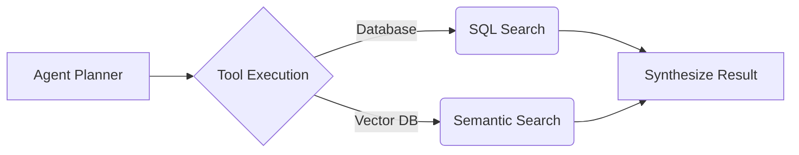

# Agentic Analytics

## Core Definition

Agentic Analytics represents the next frontier in business intelligence and data engineering. It moves beyond traditional generative AI (like ChatGPT), which simply answers questions based on pre-trained text, and introduces "Agents": autonomous AI systems equipped with specialized tools and the ability to execute complex, multi-step reasoning over live enterprise data.

In traditional analytics, a business user asks a question, a data engineer writes a SQL pipeline, an analyst builds a Tableau dashboard, and weeks later, the user gets an answer. In Agentic Analytics, the business user types a complex query ("Analyze our Q3 supply chain bottlenecks and forecast Q4 shortages based on current inventory"). The AI Agent autonomously breaks this request down into steps, writes the necessary SQL, executes it against the open data lakehouse, analyzes the resulting dataset, generates Python code to create predictive models and visualizations, and delivers a comprehensive, interactive report in seconds.

## Implementation and Operations

Building an Agentic Analytics ecosystem requires a modern, highly organized open data lakehouse. An AI agent is only as intelligent as the data it has access to. 

**Core Components:**
1.  **The Semantic Layer:** LLMs struggle to understand raw, chaotic database schemas (e.g., knowing that `col_xyz_12` means `revenue`). A Semantic Layer (like Dremio or dbt) provides a logical, business-friendly representation of the data, acting as a translation layer for the AI.
2.  **Tool Use (Function Calling):** Modern LLMs are trained to output structured commands (like JSON) that trigger external tools. An analytics agent is equipped with tools like `execute_sql`, `search_knowledge_base`, and `generate_chart`.
3.  **RAG (Retrieval-Augmented Generation):** To ensure accuracy and prevent "hallucinations," the agent is connected to a Vector Database. Before answering a question about company policy, it retrieves the exact policy documents and grounds its reasoning in actual corporate data.

The transition to Agentic Analytics fundamentally shifts the role of the data engineer. Instead of writing bespoke pipelines for every business request, the data engineer's primary job is to build robust, governed, and highly documented semantic layers and toolsets, letting the autonomous agents to serve the business directly.

## What an Agent Needs That an Analyst Does Not

An analyst approaching an unfamiliar warehouse asks colleagues which table is authoritative and what a column means. An agent has no such recourse, and its failure mode is worse: rather than stopping to ask, it produces a confident answer built on the wrong table.

This is why agentic analytics is mostly an argument about the layers beneath the agent rather than about the model.

**Discovery.** The agent must determine which tables exist and which are relevant. A catalog with descriptions and ownership supports this; a bucket of Parquet files does not.

**Meaning.** Given four columns plausibly named revenue, the agent must know which is governed. Column names cannot carry that. A semantic layer defining metrics is the mechanism that can.

**Permission.** The agent must be unable to read what the requesting user cannot read. Enforcing this in the prompt is not enforcement. It has to be the catalog, evaluated per query with the user's identity.

**Grain.** Whether a row is an order or an order line determines whether a sum is correct. Getting this wrong yields a plausible number that is wrong by a multiple, which is the hardest kind of error to notice.

### Text-to-SQL Is the Easy Part

Generating syntactically valid SQL from a question is largely solved. Generating SQL that is semantically correct against a specific schema is not, and the gap is where these systems fail.

The failures are rarely syntax errors, which surface immediately. They are joins at the wrong grain producing inflated totals, filters that omit an exclusion the business always applies, and date handling that misses a fiscal calendar. Each returns a result that looks reasonable.

The mitigations are structural rather than prompt engineering: expose curated models rather than raw tables, define metrics once so the agent selects a metric rather than composing one, and constrain the agent to a semantic layer that cannot express an incorrect join.

### Evaluation

An agentic analytics system needs a test suite in the same way a transformation pipeline does: a set of questions with known correct answers, run on every change to the model, the prompt, or the underlying tables.

Without it there is no way to know whether a change improved behavior, because the failure mode is a subtly wrong number rather than an exception. This is the least glamorous part of the work and the part that determines whether the system can be trusted.

### Where the Lakehouse Fits

The properties that make a lakehouse valuable to agents are the ones it already needed for humans: a catalog that governs access, table formats that give consistent snapshots so two queries in one session see the same state, and a semantic layer carrying meaning.

Time travel earns particular mention. An agent that produces an answer can record the snapshot it read, making the result reproducible later even after the table has changed. For any analysis subject to review, that provenance is worth more than the latency saved by querying live data.

## Visual Architecture

### Diagram 1: Conceptual Architecture

```mermaid
graph TD
    A[User Request: 'Why did sales drop?'] --> B[AI Agent (LLM)]
    B -->|Generate SQL| C[Query Engine: Dremio]
    C -->|Execute SQL| D[(Iceberg Lakehouse)]
    D -->|Return Data| B
    B -->|Analyze & Chart| E[Final Answer to User]
```

### Diagram 2: Operational Flow


