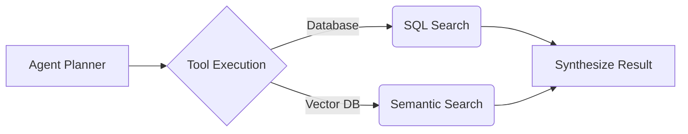

# Agentic Analytics


## Core Definition

Agentic Analytics represents the next frontier in business intelligence and data engineering. It moves beyond traditional generative AI (like ChatGPT), which simply answers questions based on pre-trained text, and introduces "Agents"—autonomous AI systems equipped with specialized tools and the ability to execute complex, multi-step reasoning over live enterprise data.

In traditional analytics, a business user asks a question, a data engineer writes a SQL pipeline, an analyst builds a Tableau dashboard, and weeks later, the user gets an answer. In Agentic Analytics, the business user types a complex query ("Analyze our Q3 supply chain bottlenecks and forecast Q4 shortages based on current inventory"). The AI Agent autonomously breaks this request down into steps, writes the necessary SQL, executes it against the open data lakehouse, analyzes the resulting dataset, generates Python code to create predictive models and visualizations, and delivers a comprehensive, interactive report in seconds.

## Implementation and Operations

Building an Agentic Analytics ecosystem requires a modern, highly organized open data lakehouse. An AI agent is only as intelligent as the data it has access to. 

**Core Components:**
1.  **The Semantic Layer:** LLMs struggle to understand raw, chaotic database schemas (e.g., knowing that `col_xyz_12` means `revenue`). A Semantic Layer (like Dremio or dbt) provides a logical, business-friendly representation of the data, acting as a translation layer for the AI.
2.  **Tool Use (Function Calling):** Modern LLMs are trained to output structured commands (like JSON) that trigger external tools. An analytics agent is equipped with tools like `execute_sql`, `search_knowledge_base`, and `generate_chart`.
3.  **RAG (Retrieval-Augmented Generation):** To ensure accuracy and prevent "hallucinations," the agent is connected to a Vector Database. Before answering a question about company policy, it retrieves the exact policy documents and grounds its reasoning in actual corporate data.

The transition to Agentic Analytics fundamentally shifts the role of the data engineer. Instead of writing bespoke pipelines for every business request, the data engineer's primary job is to build robust, governed, and highly documented semantic layers and toolsets, empowering the autonomous agents to serve the business directly.


## Extended Deep Dive: Modern Data Engineering Paradigms

To fully appreciate this concept, it is essential to understand the modern data engineering landscape, the challenges it solves, and the advanced architectural paradigms that support it. The transition from legacy monolithic architectures to modern, distributed open data lakehouses has fundamentally altered how data is modeled, orchestrated, and maintained.

### The Evolution of Data Architecture
Historically, data engineering was synonymous with Extract, Transform, Load (ETL). Teams used heavy, proprietary, on-premises tools like Informatica to pull data, transform it on specialized intermediate servers, and load it into rigid, heavily normalized Enterprise Data Warehouses (like Oracle or Teradata). This approach was brittle. If the business wanted a new column, it required weeks of database administration, schema alterations, and ETL pipeline rewrites.

The advent of cloud computing and the separation of compute and storage led to the Extract, Load, Transform (ELT) paradigm. Today, engineers extract raw data (JSON, CSV, API payloads) and load it directly into cheap cloud object storage (Amazon S3, Google Cloud Storage). The transformation happens *after* the load, utilizing the massive, elastic compute power of the cloud data warehouse (Snowflake) or lakehouse engine (Trino, Dremio, Spark). This allows teams to store everything and only pay for the compute required to transform the data when it is actually needed.

### The Critical Role of Orchestration
As pipelines grew from dozens of scripts to thousands of interdependent tasks, orchestration became the central nervous system of data engineering. A modern orchestrator (like Apache Airflow, Dagster, or Prefect) does far more than schedule jobs. It manages:
*   **Dependency Resolution:** Ensuring that a downstream sales dashboard does not update until *all* upstream data extraction and transformation tasks for that day have successfully completed.
*   **Idempotency and Backfilling:** Designing tasks so that if a pipeline fails and is rerun, it produces the exact same result without duplicating data. If a bug is discovered in last month's transformation logic, the orchestrator handles the "backfill," automatically rerunning the pipeline for the last 30 days of historical data.
*   **Alerting and Observability:** Integrating with PagerDuty, Slack, and Datadog to instantly notify on-call engineers when a data quality test fails or a source API goes down.

### Data Modeling in the Lakehouse Era
While the physical storage mechanisms have changed (from proprietary blocks on hard drives to open source Apache Parquet files on S3), the logical business requirements have not. Ralph Kimball's Dimensional Modeling techniques remain the absolute gold standard for analytical data presentation.

However, the implementation of these models has evolved. In an open data lakehouse utilizing Apache Iceberg:
1. **The Bronze Layer (Raw):** Data lands exactly as it arrived from the source. It is append-only and highly volatile.
2. **The Silver Layer (Cleaned & Normalized):** Data is parsed, deduplicated, and cast to correct data types. PII is masked. It resembles a normalized (3NF) operational database.
3. **The Gold Layer (Dimensional/Business):** Data is heavily denormalized into Star Schemas (Fact and Dimension tables) explicitly designed for high-performance querying by BI tools and executives.

### Best Practices for Pipeline Reliability
To maintain these complex systems, data engineers have adopted practices from traditional software engineering:
*   **Data Quality Testing:** Utilizing frameworks like Great Expectations or dbt tests to automatically assert that data is not null, primary keys are unique, and values fall within accepted ranges *before* the data is published to production.
*   **Write-Audit-Publish (WAP):** Utilizing the branching capabilities of formats like Apache Iceberg (similar to Git branching) to write data to a hidden branch, run audit queries against it, and only merge it to the main production branch if it passes all quality checks. This guarantees that consumers never see corrupted or partial data.
*   **CI/CD for Data:** Storing all SQL transformations (dbt models), Python orchestration code (Airflow DAGs), and infrastructure configuration (Terraform) in Git. Changes are reviewed via Pull Requests, and automated CI/CD pipelines deploy the changes to staging and production environments.

### Conclusion
The concepts explored in this article are not isolated techniques; they are interconnected components of a holistic data strategy. Whether you are designing a logical Star Schema, configuring the physical block size of a Parquet file, or writing the Python DAG to orchestrate the workflow, the ultimate goal remains identical: delivering high-quality, reliable, and performant data to the business to drive analytical insight and operational efficiency.

## Extended Deep Dive: Modern Data Engineering Paradigms

To fully appreciate this concept, it is essential to understand the modern data engineering landscape, the challenges it solves, and the advanced architectural paradigms that support it. The transition from legacy monolithic architectures to modern, distributed open data lakehouses has fundamentally altered how data is modeled, orchestrated, and maintained.

### The Evolution of Data Architecture
Historically, data engineering was synonymous with Extract, Transform, Load (ETL). Teams used heavy, proprietary, on-premises tools like Informatica to pull data, transform it on specialized intermediate servers, and load it into rigid, heavily normalized Enterprise Data Warehouses (like Oracle or Teradata). This approach was brittle. If the business wanted a new column, it required weeks of database administration, schema alterations, and ETL pipeline rewrites.

The advent of cloud computing and the separation of compute and storage led to the Extract, Load, Transform (ELT) paradigm. Today, engineers extract raw data (JSON, CSV, API payloads) and load it directly into cheap cloud object storage (Amazon S3, Google Cloud Storage). The transformation happens *after* the load, utilizing the massive, elastic compute power of the cloud data warehouse (Snowflake) or lakehouse engine (Trino, Dremio, Spark). This allows teams to store everything and only pay for the compute required to transform the data when it is actually needed.

### The Critical Role of Orchestration
As pipelines grew from dozens of scripts to thousands of interdependent tasks, orchestration became the central nervous system of data engineering. A modern orchestrator (like Apache Airflow, Dagster, or Prefect) does far more than schedule jobs. It manages:
*   **Dependency Resolution:** Ensuring that a downstream sales dashboard does not update until *all* upstream data extraction and transformation tasks for that day have successfully completed.
*   **Idempotency and Backfilling:** Designing tasks so that if a pipeline fails and is rerun, it produces the exact same result without duplicating data. If a bug is discovered in last month's transformation logic, the orchestrator handles the "backfill," automatically rerunning the pipeline for the last 30 days of historical data.
*   **Alerting and Observability:** Integrating with PagerDuty, Slack, and Datadog to instantly notify on-call engineers when a data quality test fails or a source API goes down.

### Data Modeling in the Lakehouse Era
While the physical storage mechanisms have changed (from proprietary blocks on hard drives to open source Apache Parquet files on S3), the logical business requirements have not. Ralph Kimball's Dimensional Modeling techniques remain the absolute gold standard for analytical data presentation.

However, the implementation of these models has evolved. In an open data lakehouse utilizing Apache Iceberg:
1. **The Bronze Layer (Raw):** Data lands exactly as it arrived from the source. It is append-only and highly volatile.
2. **The Silver Layer (Cleaned & Normalized):** Data is parsed, deduplicated, and cast to correct data types. PII is masked. It resembles a normalized (3NF) operational database.
3. **The Gold Layer (Dimensional/Business):** Data is heavily denormalized into Star Schemas (Fact and Dimension tables) explicitly designed for high-performance querying by BI tools and executives.

### Best Practices for Pipeline Reliability
To maintain these complex systems, data engineers have adopted practices from traditional software engineering:
*   **Data Quality Testing:** Utilizing frameworks like Great Expectations or dbt tests to automatically assert that data is not null, primary keys are unique, and values fall within accepted ranges *before* the data is published to production.
*   **Write-Audit-Publish (WAP):** Utilizing the branching capabilities of formats like Apache Iceberg (similar to Git branching) to write data to a hidden branch, run audit queries against it, and only merge it to the main production branch if it passes all quality checks. This guarantees that consumers never see corrupted or partial data.
*   **CI/CD for Data:** Storing all SQL transformations (dbt models), Python orchestration code (Airflow DAGs), and infrastructure configuration (Terraform) in Git. Changes are reviewed via Pull Requests, and automated CI/CD pipelines deploy the changes to staging and production environments.

### Conclusion
The concepts explored in this article are not isolated techniques; they are interconnected components of a holistic data strategy. Whether you are designing a logical Star Schema, configuring the physical block size of a Parquet file, or writing the Python DAG to orchestrate the workflow, the ultimate goal remains identical: delivering high-quality, reliable, and performant data to the business to drive analytical insight and operational efficiency.

## Extended Deep Dive: Modern Data Engineering Paradigms

To fully appreciate this concept, it is essential to understand the modern data engineering landscape, the challenges it solves, and the advanced architectural paradigms that support it. The transition from legacy monolithic architectures to modern, distributed open data lakehouses has fundamentally altered how data is modeled, orchestrated, and maintained.

### The Evolution of Data Architecture
Historically, data engineering was synonymous with Extract, Transform, Load (ETL). Teams used heavy, proprietary, on-premises tools like Informatica to pull data, transform it on specialized intermediate servers, and load it into rigid, heavily normalized Enterprise Data Warehouses (like Oracle or Teradata). This approach was brittle. If the business wanted a new column, it required weeks of database administration, schema alterations, and ETL pipeline rewrites.

The advent of cloud computing and the separation of compute and storage led to the Extract, Load, Transform (ELT) paradigm. Today, engineers extract raw data (JSON, CSV, API payloads) and load it directly into cheap cloud object storage (Amazon S3, Google Cloud Storage). The transformation happens *after* the load, utilizing the massive, elastic compute power of the cloud data warehouse (Snowflake) or lakehouse engine (Trino, Dremio, Spark). This allows teams to store everything and only pay for the compute required to transform the data when it is actually needed.

### The Critical Role of Orchestration
As pipelines grew from dozens of scripts to thousands of interdependent tasks, orchestration became the central nervous system of data engineering. A modern orchestrator (like Apache Airflow, Dagster, or Prefect) does far more than schedule jobs. It manages:
*   **Dependency Resolution:** Ensuring that a downstream sales dashboard does not update until *all* upstream data extraction and transformation tasks for that day have successfully completed.
*   **Idempotency and Backfilling:** Designing tasks so that if a pipeline fails and is rerun, it produces the exact same result without duplicating data. If a bug is discovered in last month's transformation logic, the orchestrator handles the "backfill," automatically rerunning the pipeline for the last 30 days of historical data.
*   **Alerting and Observability:** Integrating with PagerDuty, Slack, and Datadog to instantly notify on-call engineers when a data quality test fails or a source API goes down.

### Data Modeling in the Lakehouse Era
While the physical storage mechanisms have changed (from proprietary blocks on hard drives to open source Apache Parquet files on S3), the logical business requirements have not. Ralph Kimball's Dimensional Modeling techniques remain the absolute gold standard for analytical data presentation.

However, the implementation of these models has evolved. In an open data lakehouse utilizing Apache Iceberg:
1. **The Bronze Layer (Raw):** Data lands exactly as it arrived from the source. It is append-only and highly volatile.
2. **The Silver Layer (Cleaned & Normalized):** Data is parsed, deduplicated, and cast to correct data types. PII is masked. It resembles a normalized (3NF) operational database.
3. **The Gold Layer (Dimensional/Business):** Data is heavily denormalized into Star Schemas (Fact and Dimension tables) explicitly designed for high-performance querying by BI tools and executives.

### Best Practices for Pipeline Reliability
To maintain these complex systems, data engineers have adopted practices from traditional software engineering:
*   **Data Quality Testing:** Utilizing frameworks like Great Expectations or dbt tests to automatically assert that data is not null, primary keys are unique, and values fall within accepted ranges *before* the data is published to production.
*   **Write-Audit-Publish (WAP):** Utilizing the branching capabilities of formats like Apache Iceberg (similar to Git branching) to write data to a hidden branch, run audit queries against it, and only merge it to the main production branch if it passes all quality checks. This guarantees that consumers never see corrupted or partial data.
*   **CI/CD for Data:** Storing all SQL transformations (dbt models), Python orchestration code (Airflow DAGs), and infrastructure configuration (Terraform) in Git. Changes are reviewed via Pull Requests, and automated CI/CD pipelines deploy the changes to staging and production environments.

### Conclusion
The concepts explored in this article are not isolated techniques; they are interconnected components of a holistic data strategy. Whether you are designing a logical Star Schema, configuring the physical block size of a Parquet file, or writing the Python DAG to orchestrate the workflow, the ultimate goal remains identical: delivering high-quality, reliable, and performant data to the business to drive analytical insight and operational efficiency.

## Extended Deep Dive: Modern Data Engineering Paradigms

To fully appreciate this concept, it is essential to understand the modern data engineering landscape, the challenges it solves, and the advanced architectural paradigms that support it. The transition from legacy monolithic architectures to modern, distributed open data lakehouses has fundamentally altered how data is modeled, orchestrated, and maintained.

### The Evolution of Data Architecture
Historically, data engineering was synonymous with Extract, Transform, Load (ETL). Teams used heavy, proprietary, on-premises tools like Informatica to pull data, transform it on specialized intermediate servers, and load it into rigid, heavily normalized Enterprise Data Warehouses (like Oracle or Teradata). This approach was brittle. If the business wanted a new column, it required weeks of database administration, schema alterations, and ETL pipeline rewrites.

The advent of cloud computing and the separation of compute and storage led to the Extract, Load, Transform (ELT) paradigm. Today, engineers extract raw data (JSON, CSV, API payloads) and load it directly into cheap cloud object storage (Amazon S3, Google Cloud Storage). The transformation happens *after* the load, utilizing the massive, elastic compute power of the cloud data warehouse (Snowflake) or lakehouse engine (Trino, Dremio, Spark). This allows teams to store everything and only pay for the compute required to transform the data when it is actually needed.

### The Critical Role of Orchestration
As pipelines grew from dozens of scripts to thousands of interdependent tasks, orchestration became the central nervous system of data engineering. A modern orchestrator (like Apache Airflow, Dagster, or Prefect) does far more than schedule jobs. It manages:
*   **Dependency Resolution:** Ensuring that a downstream sales dashboard does not update until *all* upstream data extraction and transformation tasks for that day have successfully completed.
*   **Idempotency and Backfilling:** Designing tasks so that if a pipeline fails and is rerun, it produces the exact same result without duplicating data. If a bug is discovered in last month's transformation logic, the orchestrator handles the "backfill," automatically rerunning the pipeline for the last 30 days of historical data.
*   **Alerting and Observability:** Integrating with PagerDuty, Slack, and Datadog to instantly notify on-call engineers when a data quality test fails or a source API goes down.

### Data Modeling in the Lakehouse Era
While the physical storage mechanisms have changed (from proprietary blocks on hard drives to open source Apache Parquet files on S3), the logical business requirements have not. Ralph Kimball's Dimensional Modeling techniques remain the absolute gold standard for analytical data presentation.

However, the implementation of these models has evolved. In an open data lakehouse utilizing Apache Iceberg:
1. **The Bronze Layer (Raw):** Data lands exactly as it arrived from the source. It is append-only and highly volatile.
2. **The Silver Layer (Cleaned & Normalized):** Data is parsed, deduplicated, and cast to correct data types. PII is masked. It resembles a normalized (3NF) operational database.
3. **The Gold Layer (Dimensional/Business):** Data is heavily denormalized into Star Schemas (Fact and Dimension tables) explicitly designed for high-performance querying by BI tools and executives.

### Best Practices for Pipeline Reliability
To maintain these complex systems, data engineers have adopted practices from traditional software engineering:
*   **Data Quality Testing:** Utilizing frameworks like Great Expectations or dbt tests to automatically assert that data is not null, primary keys are unique, and values fall within accepted ranges *before* the data is published to production.
*   **Write-Audit-Publish (WAP):** Utilizing the branching capabilities of formats like Apache Iceberg (similar to Git branching) to write data to a hidden branch, run audit queries against it, and only merge it to the main production branch if it passes all quality checks. This guarantees that consumers never see corrupted or partial data.
*   **CI/CD for Data:** Storing all SQL transformations (dbt models), Python orchestration code (Airflow DAGs), and infrastructure configuration (Terraform) in Git. Changes are reviewed via Pull Requests, and automated CI/CD pipelines deploy the changes to staging and production environments.

### Conclusion
The concepts explored in this article are not isolated techniques; they are interconnected components of a holistic data strategy. Whether you are designing a logical Star Schema, configuring the physical block size of a Parquet file, or writing the Python DAG to orchestrate the workflow, the ultimate goal remains identical: delivering high-quality, reliable, and performant data to the business to drive analytical insight and operational efficiency.


## Visual Architecture

### Diagram 1: Conceptual Architecture

```mermaid
graph TD
    A[User Request: 'Why did sales drop?'] --> B[AI Agent (LLM)]
    B -->|Generate SQL| C[Query Engine: Dremio]
    C -->|Execute SQL| D[(Iceberg Lakehouse)]
    D -->|Return Data| B
    B -->|Analyze & Chart| E[Final Answer to User]
```

### Diagram 2: Operational Flow


