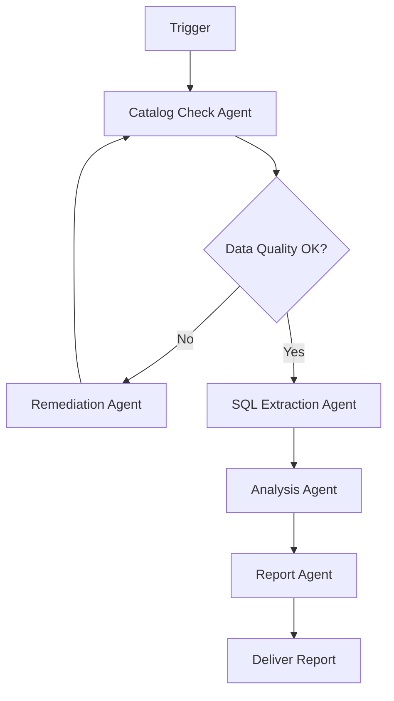
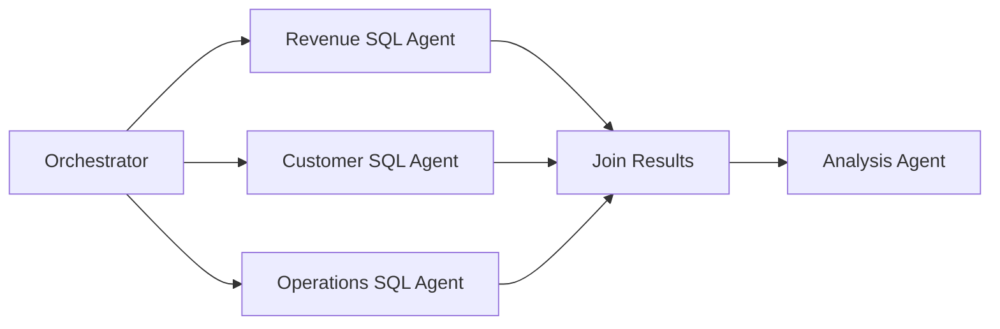

# Agentic Workflows

## Core Definition

An Agentic Workflow is a structured sequence of AI-driven steps in which one or more autonomous agents coordinate to accomplish a complex, multi-stage business or data task. Unlike traditional software workflows — which execute deterministic, pre-programmed sequences of operations — agentic workflows incorporate dynamic reasoning at each step, enabling the system to adapt its approach based on intermediate results, handle unexpected situations, and make context-sensitive decisions without explicit human programming of every possible scenario.

The term distinguishes AI-driven autonomous task execution from simpler automation. A traditional RPA (Robotic Process Automation) workflow executes a fixed script: click button A, fill field B, submit form C. An agentic workflow has goals rather than scripts: "Analyze last quarter's customer churn, identify the top three drivers, and generate an executive briefing with recommendations" — and the agent figures out the specific steps required at runtime.

## Workflow vs. Agent

A single AI agent executes within its own ReAct loop. An agentic workflow orchestrates one or many agents across a structured process with defined stages, handoffs, error recovery paths, and success criteria.

The workflow provides the guardrails. Without workflow structure, an unconstrained agent might pursue irrelevant sub-goals, get stuck in infinite loops, or consume excessive compute and API costs. A workflow defines: what stages must be completed, in what order (or in parallel), what each stage's inputs and outputs are, and under what conditions the workflow terminates successfully or escalates to a human.

## Workflow Patterns

**Sequential Workflow:** Each stage completes before the next begins. Stage 1 discovers relevant data assets, Stage 2 retrieves raw data, Stage 3 validates data quality, Stage 4 performs analysis, Stage 5 writes the report. Simple to reason about; easy to debug because failure is localized to a specific stage.

**Parallel Workflow:** Independent stages execute simultaneously and their results are joined before the next sequential stage begins. Retrieving Q3 data for three regions can happen in parallel rather than sequentially, reducing total latency to the time of the slowest parallel task rather than the sum of all tasks.

**Conditional Workflow:** Branching logic routes the workflow through different paths based on intermediate results. If the data quality check in Stage 3 finds critical errors, the workflow branches to a data remediation path before continuing to analysis. If quality is acceptable, it routes directly to the analysis stage.

**Iterative Workflow:** A refinement loop where the agent evaluates its own output and re-executes preceding stages with modifications until a quality threshold is met. The SQL agent generates a query, executes it, evaluates whether the result answers the user's question, and if not, refines the query and tries again.

**Human-in-the-Loop Workflow:** Specific stages pause execution and present intermediate results to a human reviewer for approval before proceeding. Essential for workflows with high business impact, regulatory exposure, or irreversible consequences (financial reports, compliance certifications, data deletion operations).

## Implementing Agentic Workflows

Major frameworks for building agentic workflows in 2025 include:

**LangGraph (LangChain):** A graph-based framework where workflow stages are nodes and transitions between stages are edges in a directed graph. Supports cycles for iterative refinement, human-in-the-loop interrupts via persistent checkpointing, and parallel execution via concurrent node dispatch.

**AutoGen (Microsoft):** A multi-agent conversation framework where agents communicate via structured messages. Workflows emerge from the conversation pattern: a User Proxy agent initiates tasks, specialized agents (AssistantAgent, CodeExecutorAgent) respond, and the framework manages turn-taking and termination.

**CrewAI:** A higher-level framework that defines agents with explicit roles, goals, and backstories (like a crew of specialists), and tasks with described inputs and expected outputs. The framework orchestrates agent collaboration using sequential or hierarchical delegation patterns.

**Prefect / Airflow with LLM Steps:** Traditional workflow orchestration tools can incorporate LLM-powered agentic steps as Python tasks, blending deterministic data pipeline stages with dynamic AI reasoning stages in a single unified workflow.

## Agentic Workflows in the Data Lakehouse

The most impactful enterprise agentic workflows operate directly over the open data lakehouse. A concrete example architecture:

**Monthly Executive Analytics Workflow:**
1. **Trigger:** First business day of each month at 8 AM.
2. **Stage 1 (Catalog Discovery Agent):** Query Apache Polaris catalog to confirm all required Iceberg tables are current and quality-certified for the previous month's data.
3. **Stage 2 (Parallel SQL Extraction):** Three parallel SQL agents query revenue, customer, and operations Iceberg tables via Dremio concurrently.
4. **Stage 3 (Validation Agent):** Compares extracted totals against known benchmarks and prior month values, flags statistical anomalies.
5. **Stage 4 (Human Gate):** If anomalies detected, pause and notify data engineering on-call via PagerDuty for review. If clean, auto-proceed.
6. **Stage 5 (Analysis Agent):** Statistical trend analysis, YoY and QoQ comparisons, driver identification using correlation analysis.
7. **Stage 6 (Narrative Agent):** Writes executive briefing in Markdown with charts embedded as base64 PNG images.
8. **Stage 7 (Delivery Agent):** Emails report to distribution list and posts summary to Slack #executive-analytics channel.

## State Management and Persistence

A critical requirement for reliable agentic workflows is state persistence. If a long-running workflow fails midway through, it should resume from the last successful checkpoint rather than restarting from the beginning.

LangGraph implements this via a persistent checkpointer (backed by PostgreSQL, Redis, or S3) that serializes the complete workflow state after every node execution. If the workflow crashes during Stage 5, it resumes at Stage 5 with all Stage 1-4 results already available in the checkpoint.

## Error Handling and Retries

Agentic workflows operating over real data infrastructure encounter real-world failures: network timeouts, SQL syntax errors, API rate limits, and data quality exceptions. Robust workflows implement:

**Per-Stage Retry Logic:** Each stage retries with exponential backoff on transient failures (network errors, rate limits) but fails fast on deterministic errors (invalid SQL, missing permissions).

**Self-Repair:** When an agent-generated SQL query fails with an error message, the error is fed back to the SQL agent, which reasons about the cause and generates a corrected query. This self-repair capability handles the majority of first-attempt SQL generation errors autonomously.

**Fallback Strategies:** If the primary data retrieval path fails, the workflow can fall back to a cached result from the previous execution, clearly flagging it as potentially stale.

## Visual Architecture

### Diagram 1: Conditional Agentic Workflow

### Diagram 2: Parallel Extraction Workflow

