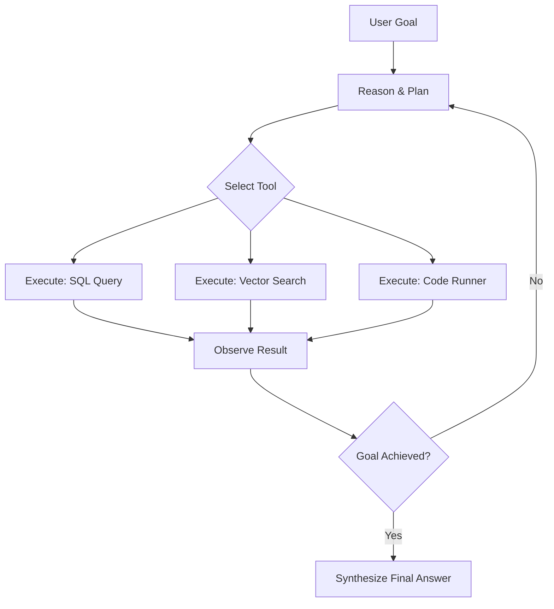
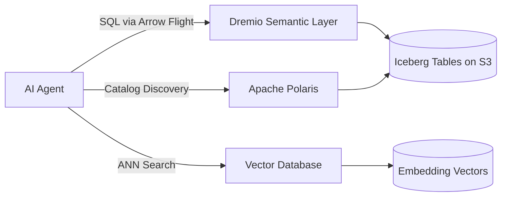

# AI Agents

## Core Definition

An AI Agent is an autonomous software system that uses a Large Language Model (LLM) as its core reasoning engine to perceive its environment, form plans, execute multi-step tasks using external tools, and adapt its behavior based on the results — all without requiring constant human intervention for each individual step.

The term "agent" specifically denotes autonomy and goal-directedness that goes far beyond a standard chatbot or generative AI assistant. Where a chatbot responds to a single prompt with a single response, an agent receives a high-level goal and autonomously executes a sequence of research, computation, and synthesis steps to deliver a complete answer.

The distinction matters enormously in the enterprise context. A business executive does not want to manually guide an AI system through ten separate queries to diagnose a revenue decline. They want to state the goal once and receive a comprehensive analytical report. That is the promise of the AI agent: a system intelligent enough to determine what information is needed, where to find it, how to retrieve it, and how to synthesize it into a coherent answer.

## Historical Context

The concept of an intelligent software agent predates modern LLMs by decades. Early AI research in the 1970s and 1980s produced rule-based expert systems like MYCIN (a medical diagnosis system) that could reason through structured decision trees. These systems were brittle — they could only function within their explicitly programmed domain and could not adapt to novel situations.

The reinforcement learning era of the 2010s produced agents like DeepMind's AlphaGo that could master specific, well-defined tasks (board games) through trial-and-error learning. These agents were powerful but highly specialized.

The emergence of capable LLMs (GPT-3 in 2020, GPT-4 in 2023, Claude, Gemini, and open-source models like Llama 3 subsequently) created a fundamentally different type of agent: one that can reason in natural language, understand context, use common sense, and adapt to virtually any domain. By equipping these models with tool-use capabilities and structured orchestration frameworks, engineers created the modern AI agent.

## The Agentic Loop (ReAct Architecture)

The foundational operational pattern of a modern AI agent is the **ReAct loop**, standing for Reasoning + Acting. This iterative cycle, introduced in the 2022 paper "ReAct: Synergizing Reasoning and Acting in Language Models," continues until the agent determines the goal has been achieved:

**Step 1 — Perceive:** The agent receives the initial goal from the user and any available context: database schemas, tool descriptions, prior conversation history, relevant retrieved documents.

**Step 2 — Reason and Plan:** The LLM reasons through the goal by generating an explicit "thought" about what needs to happen next. It decomposes the high-level objective into subtasks and selects the appropriate tool for the immediate next step. In Chain-of-Thought (CoT) prompting, this reasoning is explicit and visible.

**Step 3 — Act (Tool Use):** The agent executes the selected tool by generating a structured function call. The host system intercepts the function call, executes it against the real tool (a database, an API, a code interpreter), and captures the result.

**Step 4 — Observe:** The agent reads the result returned by the tool and incorporates it into its working context. If the SQL query returned a table of results, that table becomes part of the agent's next prompt.

**Step 5 — Evaluate:** The agent assesses whether the accumulated information is sufficient to satisfy the original goal. If not, it re-enters the loop at Step 2 with an updated plan. If yes, it synthesizes a final response.

This cycle enables agents to recover from errors (if a SQL query fails, the agent can diagnose the error message and write a corrected query), pivot their approach when initial strategies fail, and produce results that require multi-step reasoning across multiple data sources.

## Tool Use and Function Calling

The defining capability that separates an agent from a basic LLM is structured access to **tools**. Tools are registered functions the agent can call to interact with the external world. Common tool categories in an enterprise analytics context include:

**Database Query Tools:** Execute SQL against a semantic layer (Dremio), a query engine (Trino, Spark SQL), or a warehouse (Snowflake, BigQuery) and return tabular results. This is the primary mechanism by which agents interact with the open data lakehouse.

**Vector Search Tools:** Query a vector database (Pinecone, Weaviate, Qdrant) to retrieve semantically relevant document chunks for RAG.

**Code Execution Tools:** Run Python, R, or SQL code in a sandboxed environment to perform statistical computations, generate visualizations, or transform data.

**API Tools:** Call REST APIs to retrieve live operational data from external services, trigger pipeline runs, or send notifications.

**File System Tools:** Read structured files (CSV, JSON, Parquet) or write output reports to a shared storage location.

**Catalog Tools:** Query a data catalog (Apache Polaris, AWS Glue, Unity Catalog) to discover available tables, understand column definitions, and retrieve lineage information before formulating queries.

Modern LLMs implement tool use through **function calling**: the model is given a JSON schema describing all available tools and their parameters. When the reasoning loop determines a tool is needed, the model generates a structured JSON object specifying the tool name and arguments. The host system intercepts this JSON, validates the arguments, executes the real function, and returns the result as the next "observation" in the agent's context.

The **Model Context Protocol (MCP)**, developed by Anthropic and widely adopted in 2025, standardizes the interface between AI agents and external data sources. MCP defines a protocol for exposing tools and resources over a standard client-server interface, eliminating the need for custom integration code for every combination of agent framework and data system.

## Memory Architecture

Effective AI agents maintain memory across reasoning steps and across separate sessions. Memory is organized into four tiers:

**In-Context Memory (Working Memory):** The contents of the current context window. This includes the conversation so far, retrieved documents, recent tool outputs, and intermediate reasoning steps. It is ephemeral — it disappears when the session ends.

**External Short-Term Memory:** A temporary key-value store (like Redis or a session database) that persists facts across multiple sequential agent calls within a session. The agent can write intermediate results to short-term memory early in a workflow and retrieve them later without consuming context window space.

**Long-Term Episodic Memory:** A vector database storing summaries of past agent sessions. This allows the agent to recall relevant past analyses ("Last quarter when I investigated the APAC revenue decline, I found that currency exchange rates were the primary driver") and apply those lessons to current tasks.

**Long-Term Semantic Memory:** The enterprise knowledge base — data documentation, business glossaries, analytical playbooks, technical specifications — indexed as vector embeddings and retrieved via RAG when relevant to the current query. This is what allows an agent to know the business meaning of cryptic column names and metric definitions without requiring a human to explain them every time.

## Agents in the Open Data Lakehouse

The open data lakehouse architecture is the ideal data backbone for AI agent systems. A well-organized Iceberg lakehouse with a rich semantic layer, governed metadata catalog, and documented column descriptions provides everything an agent needs to autonomously generate and execute accurate analytical SQL queries.

Dremio's semantic layer, for example, exposes business-friendly metric definitions, pre-joined virtual datasets, and rich column documentation to query engines. An agent that discovers and consumes the semantic layer can generate valid SQL against well-defined business metrics, execute it via Dremio's Arrow Flight SQL interface, and deliver instant analytical insights to stakeholders.

The Iceberg table format's core features directly benefit agent-driven workflows. Schema evolution means agents can handle tables whose structure changes over time without breaking. Time travel allows agents to query historical snapshots for trend analysis. Partition pruning and file-skipping statistics ensure that agent-generated queries that filter by date or region execute efficiently even over massive datasets.

## Multi-Agent Systems

As task complexity grows, organizations deploy systems of cooperating specialized agents rather than a single monolithic agent. A **Planner Agent** decomposes the high-level goal and delegates subtasks to specialist agents. A **SQL Agent** formulates and executes database queries. A **Visualization Agent** generates charts from query results. A **Report Writing Agent** synthesizes all findings into a narrative document.

This mirrors how a human team of specialized analysts collaborates on a complex project, with the planner acting as the project manager coordinating the work. Multi-agent systems can tackle problems of far greater complexity than any single agent could address within the limits of its context window.

## Governance and Safety

Autonomous agents require strict governance guardrails. An agent running SQL queries against production systems without controls could accidentally consume massive compute resources, exfiltrate sensitive PII, or corrupt data if given write access.

Best practices include: running agents against read-only query endpoints; enforcing row-level and column-level security at the catalog level so the agent inherits the user's permission boundaries; implementing human-in-the-loop approval gates for expensive or irreversible operations; logging every tool call and intermediate reasoning step for full auditability; and rate-limiting agent-triggered query executions to prevent runaway cost.

## The Future of Agents in Analytics

The trajectory is clear: AI agents will progressively automate the analytical workflow. The data engineer's role shifts from writing bespoke pipelines for every business request to building well-governed, richly documented data products — semantic layers, Iceberg tables, metadata catalogs — that agents can consume autonomously. Organizations that invest in data governance and semantic layer quality today are building the foundation for the agentic analytics systems that will define the competitive landscape over the next decade.

## Extended Context: The Open Data Lakehouse Ecosystem

Understanding AI agents requires understanding the broader data infrastructure they operate on top of. The open data lakehouse combines infinitely scalable cloud object storage (Amazon S3, Google Cloud Storage, Azure Blob Storage) with open table formats (Apache Iceberg, Delta Lake, Apache Hudi) that provide ACID transactions, schema evolution, time travel, and partition management over raw files.

Query engines like Dremio, Trino, Apache Spark, and StarRocks execute massively parallel analytical SQL workloads over these Iceberg tables. The semantic layer abstracts the physical complexity of table joins, metric calculations, and business logic into clean, documented, queryable virtual datasets that both human analysts and AI agents can consume via standard SQL interfaces.

The combination of this infrastructure with capable LLMs and the ReAct agentic loop creates a system where a business user can ask a complex analytical question in natural language and receive a comprehensive, accurate, data-backed answer in seconds — with full auditability of every step the agent took to arrive at its conclusion.

Open governance platforms like Apache Polaris provide the catalog infrastructure that makes this possible at enterprise scale: centralized metadata management, fine-grained access control, cross-engine interoperability, and rich data discovery APIs that agents can use to understand the available data landscape before formulating their analytical strategies.

The maturation of AI agents as enterprise analytics tools will accelerate the adoption of open data lakehouse architectures, because well-governed, interoperable, richly documented open platforms give agents the most reliable foundation for autonomous analytical reasoning. Proprietary, siloed, undocumented systems are obstacles to agentic workflows; open, governed, semantic-layer-equipped lakehouses are enablers.

## Visual Architecture

### Diagram 1: The Agentic Loop

### Diagram 2: Agent Data Lakehouse Integration

