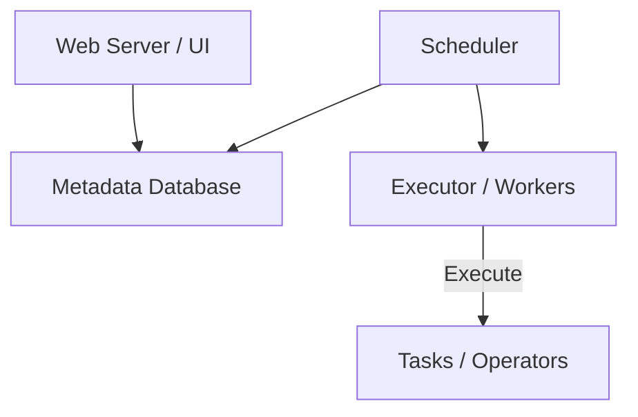
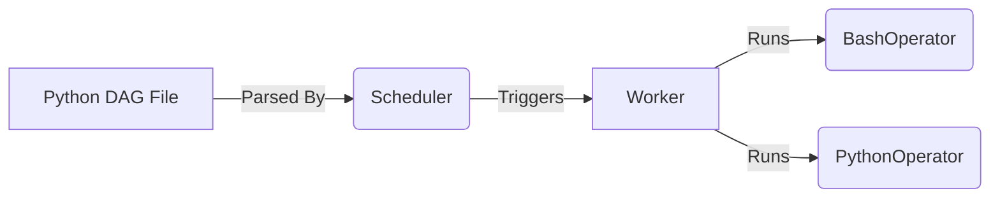

# Apache Airflow

## Core Definition

Apache Airflow is an open-source platform created by Airbnb in 2014 and later donated to the Apache Software Foundation. It is unequivocally the industry standard for programmatically authoring, scheduling, and monitoring workflows and data pipelines. 

Airflow defines workflows as code (specifically, Python code) using Directed Acyclic Graphs (DAGs). Because workflows are defined as Python code, they can be version-controlled, tested, and collaborated on just like any other software engineering artifact. This "Pipeline as Code" philosophy was revolutionary, moving the industry away from drag-and-drop enterprise ETL tools and into modern software development lifecycles.

## Implementation and Operations

Airflow relies on a few key concepts:
- **Operators:** The building blocks of Airflow. An operator determines what actually gets done. (e.g., `BashOperator` executes a bash command, `PythonOperator` executes a Python function, `PostgresOperator` runs a SQL query).
- **Sensors:** Special operators designed to wait for a certain event to occur before proceeding (e.g., waiting for a specific file to drop into an Amazon S3 bucket).
- **Hooks:** Interfaces to external platforms (like AWS, Google Cloud, or Snowflake) that manage credentials and connections securely.

Airflow's architecture consists of a Scheduler (which reads the DAG files and determines what needs to run), an Executor (which handles distributing the work to worker nodes), a Metadata Database (which tracks the state of all tasks), and a Web UI (which allows engineers to visually monitor the DAGs, inspect logs, and manually trigger workflows).

## The Architecture in Practice

Airflow separates three components, and most operational problems trace back to one of them specifically.

The **scheduler** parses DAG files, evaluates which task instances are due, and queues them. The **executor** decides where queued tasks actually run, whether as local subprocesses, Celery workers, or Kubernetes pods. The **metadata database** holds every task instance, run, and connection, and is the shared state all components coordinate through.

DAG files are Python, and the scheduler re-parses them on an interval. This is the source of a failure mode that surprises newcomers: any expensive work at module import level, such as a database query used to build the task list, runs on every parse cycle. A DAG file that queries a warehouse to decide its own shape will quietly load that warehouse continuously.

### What Changed in Recent Versions

Airflow 2 addressed the scheduler being a single point of failure by supporting multiple active schedulers, and introduced deferrable operators. A deferrable operator releases its worker slot while waiting on an external system and hands the wait to a separate triggerer process. For a pipeline whose tasks mostly wait on a Spark cluster or a warehouse query, this substantially reduces the number of workers required.

The TaskFlow API also made the common case less verbose, letting decorated Python functions pass data between tasks without explicit XCom handling.

Airflow 3 continued in this direction, notably separating task execution from direct metadata database access, which allows tasks to run in environments that do not need database credentials.

### Its Place in a Lakehouse

Airflow schedules work; it does not move data. In a lakehouse it typically triggers a Spark job, a dbt run, or a compaction procedure, and its value is dependency resolution, retries, backfills, and a record of what ran.

Routing actual data through Airflow tasks is an anti-pattern that appears regularly. XCom is backed by the metadata database and intended for small values such as identifiers and file paths. Passing dataframes through it turns the orchestrator's state store into an accidental data pipeline.

## Visual Architecture

### Diagram 1: Conceptual Architecture

### Diagram 2: Operational Flow

