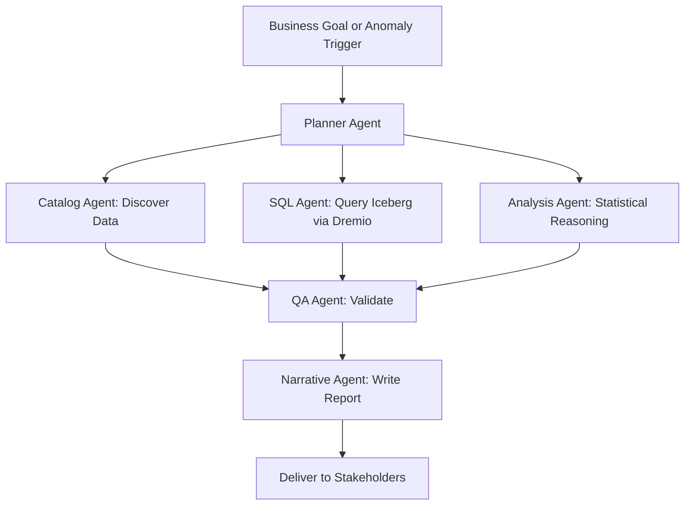
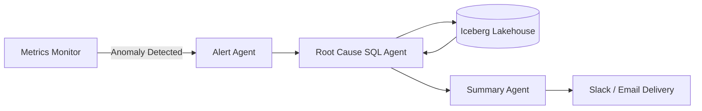

# Autonomous Analytics

## Core Definition

Autonomous Analytics is the discipline and set of technologies that enable AI systems to independently discover, retrieve, analyze, and interpret enterprise data — producing analytical insights, reports, and recommendations with minimal or no human intervention beyond the initial question or goal statement.

It represents the convergence of three previously separate technological domains: the open data lakehouse (governed, scalable, queryable data infrastructure), Large Language Models (reasoning engines capable of understanding natural language and generating code), and agentic AI frameworks (orchestration systems that equip LLMs with tools and memory to operate autonomously over extended multi-step workflows).

Autonomous Analytics is distinct from earlier generations of business intelligence automation. Automated reporting systems (like scheduled Tableau dashboards or SSRS reports) automate the delivery of pre-defined analyses. Self-service BI tools (like Looker or Power BI) automate the query interface for human analysts. Autonomous Analytics goes further: the AI system autonomously determines what analysis is needed, formulates the appropriate queries, executes them, interprets the results in business context, identifies anomalies or trends that were not anticipated by the human requester, and delivers a comprehensive narrative report.

## The Progression Toward Autonomy

**Level 0 — Manual Analytics:** Human analysts write SQL queries, build spreadsheets, and produce reports manually. The analyst must know what questions to ask, how to retrieve the data, and how to interpret results.

**Level 1 — Assisted Analytics:** BI tools provide drag-and-drop interfaces, pre-built dashboards, and natural language query interfaces. The human still defines the analysis; the tool automates the execution and visualization.

**Level 2 — Augmented Analytics:** AI-powered BI tools (Tableau Einstein, Qlik Insight Advisor) automatically surface insights, anomalies, and suggested analyses from available data. The human reviews and approves; the AI suggests.

**Level 3 — Agentic Analytics:** AI agents equipped with SQL tools, vector search, and multi-step reasoning autonomously answer complex natural language questions against live data. The human asks; the agent retrieves, analyzes, and answers.

**Level 4 — Autonomous Analytics:** AI systems proactively monitor data, detect anomalies and opportunities, generate analytical reports without being asked, distribute insights to relevant stakeholders, and trigger automated remediation workflows — all continuously and without human prompting.

## Core Technical Components

**The Semantic Layer:** The semantic layer is the most critical enabler of autonomous analytics. It translates raw, technical database schemas into business-friendly concepts — metrics, dimensions, and measures with clear business definitions. When an autonomous analytics system has access to a rich semantic layer (like Dremio's virtual dataset layer or dbt metrics), it can generate accurate, meaningful SQL queries without requiring a human to explain what each cryptic column name means.

**The Data Catalog:** Autonomous systems need to discover available data assets before they can analyze them. A governed data catalog (Apache Polaris, AWS Glue, Unity Catalog) with rich table and column descriptions, quality scores, lineage metadata, and ownership information gives the autonomous agent the situational awareness it needs to identify the right data for each analytical task.

**LLM Reasoning Engine:** A frontier LLM (GPT-4o, Claude 3.5 Sonnet, Gemini 1.5 Pro, or a specialized fine-tuned model) provides the core reasoning capability: understanding natural language goals, decomposing them into subtasks, generating SQL queries, interpreting results in business context, and producing narrative explanations.

**Tool Suite:** The agent's tool suite gives it "hands" to interact with data infrastructure: SQL execution via Arrow Flight or JDBC, vector database search for contextual knowledge retrieval, data catalog queries for asset discovery, code execution for statistical analysis, and output delivery via email, Slack, or BI platform APIs.

**Multi-Agent Orchestration:** For complex analytical tasks, multiple specialized agents collaborate: a discovery agent maps the available data landscape, a SQL agent retrieves quantitative data, a statistical agent identifies trends and anomalies, a narrative agent writes the executive summary, and a QA agent validates the accuracy of all claims before delivery.

## Proactive vs. Reactive Autonomy

**Reactive Autonomous Analytics** responds to explicit user requests. The user asks a question; the system answers it autonomously. This is the current dominant paradigm in enterprise deployments — essentially a very capable, autonomous BI assistant.

**Proactive Autonomous Analytics** monitors data continuously and surfaces insights without being asked. The system maintains a set of metrics and thresholds (revenue, customer churn rate, inventory levels, SLA compliance) and autonomously generates alerts and preliminary root-cause analyses when anomalies are detected. This is the direction the field is moving: AI systems that function as always-on business monitors.

## Data Quality as a Prerequisite

Autonomous analytics amplifies both the quality and the problems of the underlying data infrastructure. When an AI agent operates autonomously over high-quality, well-governed, accurately documented data, it produces insights that accelerate business decisions. When it operates over poorly governed, undocumented, or inconsistent data, it produces confident-sounding but incorrect analyses that can mislead decision-makers at scale.

This makes data quality not merely a nice-to-have but a prerequisite for safe autonomous analytics deployment. Organizations must invest in data quality frameworks (Great Expectations, dbt tests, Monte Carlo), complete column-level documentation in the catalog, and robust lineage tracking before autonomous agents are given direct access to production analytical systems.

## Governance of Autonomous Systems

Autonomous analytics systems require governance frameworks that go beyond traditional data governance:

**Query Governance:** All agent-generated SQL must be logged, attributed to the triggering user, and auditable. Row-level and column-level access controls must be enforced at the catalog and query engine level so that autonomous agents cannot retrieve data the requesting user is not authorized to see.

**Output Validation:** Agent-generated analytical conclusions should include confidence indicators and source citations linking each claim to the specific data rows that support it. A human reviewer should be able to verify any autonomous conclusion independently.

**Human-in-the-Loop Gates:** For high-stakes analytical conclusions (regulatory reports, financial projections used in investor communications), human review and approval gates must be built into the autonomous workflow before insights are delivered or acted upon.

## Visual Architecture

### Diagram 1: Autonomous Analytics Loop

### Diagram 2: Proactive Monitoring Architecture

