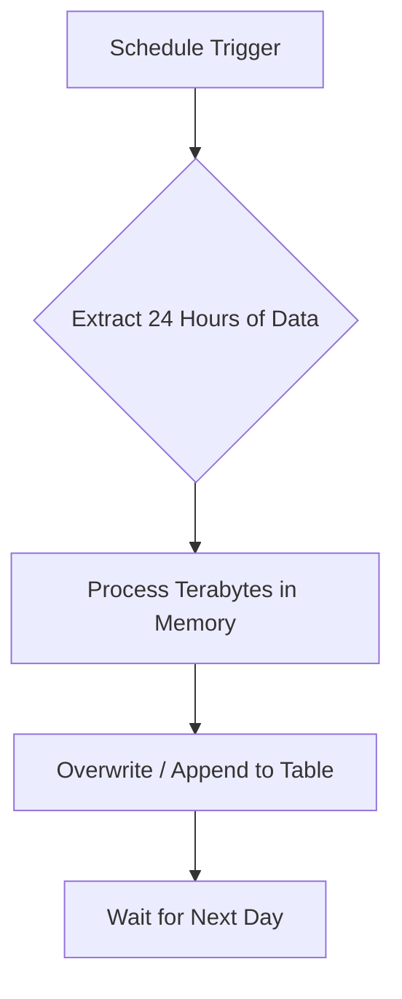
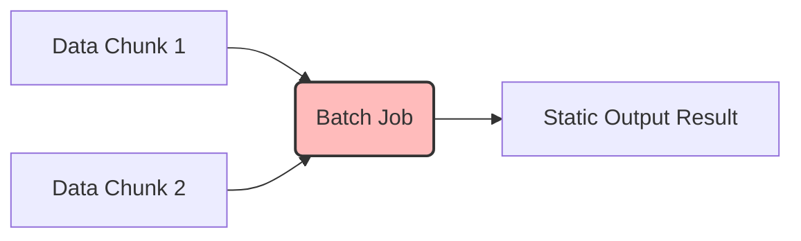

# Batch Processing

## Core Definition

Batch Processing is the execution of a series of jobs in a computer program without manual intervention (non-interactive). In data engineering, it refers to the paradigm of processing data in large, discrete chunks (or "batches") at scheduled intervals, rather than processing data continuously as it arrives.

It is the oldest, most battle-tested, and most prevalent data processing paradigm. A classic example is a bank executing a massive Apache Spark job at 2:00 AM every night to aggregate all the transactions that occurred during the previous day, calculate the new account balances, and generate the daily financial reports.

## Implementation and Operations

Batch processing operates on "bounded" datasets. When a batch job starts, it knows exactly how much data it needs to process (e.g., all files in the `s3://bucket/2026-05-17/` directory). 

**The Advantages of Batch Processing:**
1.  **Cost Efficiency:** Batch jobs can utilize ephemeral, spot-instance compute clusters. An organization can spin up 500 cheap cloud servers at 2:00 AM, process petabytes of data in one hour, and then instantly destroy all 500 servers. They only pay for one hour of compute. (Streaming systems, conversely, require servers to be running 24/7).
2.  **Simplicity and Debugging:** Batch jobs are highly deterministic. If a pipeline fails, the engineer can easily identify the exact chunk of historical data that caused the crash, fix the code, and simply rerun the job.
3.  **Complex Algorithms:** Certain machine learning algorithms and complex multi-table joins require a global view of the entire dataset to function correctly. This is incredibly difficult in a streaming context but trivial in a batch context where all data is available simultaneously.

**The Disadvantages:**
The sole disadvantage of batch processing is latency. The data in the destination lakehouse is always "stale." If a business runs batch jobs nightly, their dashboards will never reflect the events of the current day. For historical trend analysis, this is acceptable; for real-time fraud detection, it is useless.

## What Batch Still Does Better

Batch processing is often framed as the older approach that streaming will replace. It has kept a set of genuine advantages that follow from bounded input rather than from age.

**Correctness is easier to reason about.** A batch job over a complete day's data sees everything before producing output. Late arrivals are simply present. There is no watermark, no windowing policy, and no category of events silently dropped for arriving after a threshold.

**Reprocessing is ordinary.** Re-running yesterday's job is the same operation as running it the first time. In a streaming system, reprocessing requires either replaying a retained log or maintaining a separate path for the purpose.

**Resource use is efficient.** Batch jobs run against sorted, compacted, well-sized files and can use the whole cluster briefly, then release it. A streaming job holds resources continuously whether or not data is arriving.

**Failure handling is simpler.** A failed batch job is re-run. A failed streaming job must resume from a checkpoint with state intact and offsets aligned.

### When Latency Genuinely Matters

The case for streaming rests on latency, and it is worth being precise about whose latency. Data arriving continuously does not require streaming processing; it requires streaming ingestion. Those are separate decisions.

A common and effective arrangement is streaming ingestion into raw tables with continuous appends, followed by batch transformation on a schedule. Data lands within minutes and modeled tables are rebuilt every hour. This delivers freshness where it is observed while keeping transformation logic in the simpler execution model.

Reaching for end-to-end streaming is warranted when a decision must be made in seconds: fraud interception, operational alerting, live personalisation. For a dashboard refreshed each morning, streaming adds operational cost against a requirement nobody has.

### The Honest Comparison

The question is rarely batch or streaming as a platform choice. It is which parts of a specific pipeline need latency measured in seconds, and keeping the rest in the model that is easier to operate and reason about.

## Visual Architecture

### Diagram 1: Conceptual Architecture

### Diagram 2: Operational Flow

