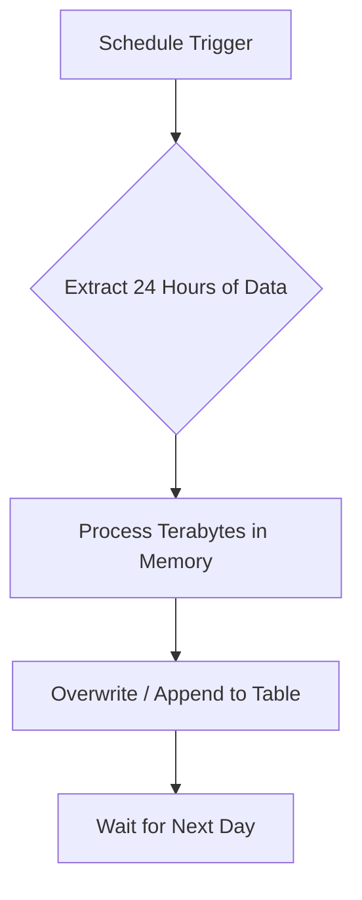
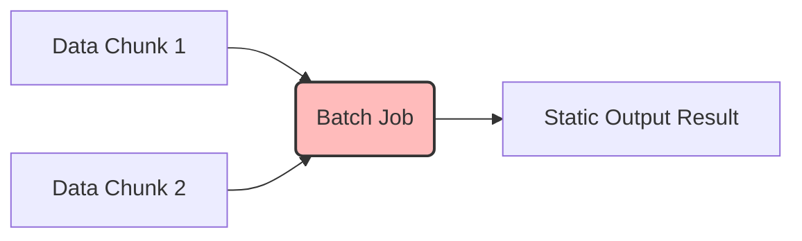

# Batch Processing

## Core Definition

Batch Processing is the execution of a series of jobs in a computer program without manual intervention (non-interactive). In data engineering, it refers to the paradigm of processing data in large, discrete chunks (or "batches") at scheduled intervals, rather than processing data continuously as it arrives.

It is the oldest, most battle-tested, and most prevalent data processing paradigm. A classic example is a bank executing a massive Apache Spark job at 2:00 AM every night to aggregate all the transactions that occurred during the previous day, calculate the new account balances, and generate the daily financial reports.

## Implementation and Operations

Batch processing operates on "bounded" datasets. When a batch job starts, it knows exactly how much data it needs to process (e.g., all files in the `s3://bucket/2026-05-17/` directory). 

**The Advantages of Batch Processing:**
1.  **Cost Efficiency:** Batch jobs can utilize ephemeral, spot-instance compute clusters. An organization can spin up 500 cheap cloud servers at 2:00 AM, process petabytes of data in one hour, and then instantly destroy all 500 servers. They only pay for one hour of compute. (Streaming systems, conversely, require servers to be running 24/7).
2.  **Simplicity and Debugging:** Batch jobs are highly deterministic. If a pipeline fails, the engineer can easily identify the exact chunk of historical data that caused the crash, fix the code, and simply rerun the job.
3.  **Complex Algorithms:** Certain machine learning algorithms and complex multi-table joins require a global view of the entire dataset to function correctly. This is incredibly difficult in a streaming context but trivial in a batch context where all data is available simultaneously.

**The Disadvantages:**
The sole disadvantage of batch processing is latency. The data in the destination lakehouse is always "stale." If a business runs batch jobs nightly, their dashboards will never reflect the events of the current day. For historical trend analysis, this is acceptable; for real-time fraud detection, it is useless.

## Extended Deep Dive: Modern Data Engineering Paradigms

To fully appreciate this concept, it is essential to understand the modern data engineering landscape, the challenges it solves, and the advanced architectural paradigms that support it. The transition from legacy monolithic architectures to modern, distributed open data lakehouses has fundamentally altered how data is modeled, orchestrated, and maintained.

### The Evolution of Data Architecture
Historically, data engineering was synonymous with Extract, Transform, Load (ETL). Teams used heavy, proprietary, on-premises tools like Informatica to pull data, transform it on specialized intermediate servers, and load it into rigid, heavily normalized Enterprise Data Warehouses (like Oracle or Teradata). This approach was brittle. If the business wanted a new column, it required weeks of database administration, schema alterations, and ETL pipeline rewrites.

The advent of cloud computing and the separation of compute and storage led to the Extract, Load, Transform (ELT) paradigm. Today, engineers extract raw data (JSON, CSV, API payloads) and load it directly into cheap cloud object storage (Amazon S3, Google Cloud Storage). The transformation happens *after* the load, utilizing the massive, elastic compute power of the cloud data warehouse (Snowflake) or lakehouse engine (Trino, Dremio, Spark). This allows teams to store everything and only pay for the compute required to transform the data when it is actually needed.

### The Critical Role of Orchestration
As pipelines grew from dozens of scripts to thousands of interdependent tasks, orchestration became the central nervous system of data engineering. A modern orchestrator (like Apache Airflow, Dagster, or Prefect) does far more than schedule jobs. It manages:
*   **Dependency Resolution:** Ensuring that a downstream sales dashboard does not update until *all* upstream data extraction and transformation tasks for that day have successfully completed.
*   **Idempotency and Backfilling:** Designing tasks so that if a pipeline fails and is rerun, it produces the exact same result without duplicating data. If a bug is discovered in last month's transformation logic, the orchestrator handles the "backfill," automatically rerunning the pipeline for the last 30 days of historical data.
*   **Alerting and Observability:** Integrating with PagerDuty, Slack, and Datadog to instantly notify on-call engineers when a data quality test fails or a source API goes down.

### Data Modeling in the Lakehouse Era
While the physical storage mechanisms have changed (from proprietary blocks on hard drives to open source Apache Parquet files on S3), the logical business requirements have not. Ralph Kimball's Dimensional Modeling techniques remain the absolute gold standard for analytical data presentation.

However, the implementation of these models has evolved. In an open data lakehouse utilizing Apache Iceberg:
1. **The Bronze Layer (Raw):** Data lands exactly as it arrived from the source. It is append-only and highly volatile.
2. **The Silver Layer (Cleaned & Normalized):** Data is parsed, deduplicated, and cast to correct data types. PII is masked. It resembles a normalized (3NF) operational database.
3. **The Gold Layer (Dimensional/Business):** Data is heavily denormalized into Star Schemas (Fact and Dimension tables) explicitly designed for high-performance querying by BI tools and executives.

### Best Practices for Pipeline Reliability
To maintain these complex systems, data engineers have adopted practices from traditional software engineering:
*   **Data Quality Testing:** Utilizing frameworks like Great Expectations or dbt tests to automatically assert that data is not null, primary keys are unique, and values fall within accepted ranges *before* the data is published to production.
*   **Write-Audit-Publish (WAP):** Utilizing the branching capabilities of formats like Apache Iceberg (similar to Git branching) to write data to a hidden branch, run audit queries against it, and only merge it to the main production branch if it passes all quality checks. This guarantees that consumers never see corrupted or partial data.
*   **CI/CD for Data:** Storing all SQL transformations (dbt models), Python orchestration code (Airflow DAGs), and infrastructure configuration (Terraform) in Git. Changes are reviewed via Pull Requests, and automated CI/CD pipelines deploy the changes to staging and production environments.

### Conclusion
The concepts explored in this article are not isolated techniques; they are interconnected components of a holistic data strategy. Whether you are designing a logical Star Schema, configuring the physical block size of a Parquet file, or writing the Python DAG to orchestrate the workflow, the ultimate goal remains identical: delivering high-quality, reliable, and performant data to the business to drive analytical insight and operational efficiency.

## Extended Deep Dive: Modern Data Engineering Paradigms

To fully appreciate this concept, it is essential to understand the modern data engineering landscape, the challenges it solves, and the advanced architectural paradigms that support it. The transition from legacy monolithic architectures to modern, distributed open data lakehouses has fundamentally altered how data is modeled, orchestrated, and maintained.

### The Evolution of Data Architecture
Historically, data engineering was synonymous with Extract, Transform, Load (ETL). Teams used heavy, proprietary, on-premises tools like Informatica to pull data, transform it on specialized intermediate servers, and load it into rigid, heavily normalized Enterprise Data Warehouses (like Oracle or Teradata). This approach was brittle. If the business wanted a new column, it required weeks of database administration, schema alterations, and ETL pipeline rewrites.

The advent of cloud computing and the separation of compute and storage led to the Extract, Load, Transform (ELT) paradigm. Today, engineers extract raw data (JSON, CSV, API payloads) and load it directly into cheap cloud object storage (Amazon S3, Google Cloud Storage). The transformation happens *after* the load, utilizing the massive, elastic compute power of the cloud data warehouse (Snowflake) or lakehouse engine (Trino, Dremio, Spark). This allows teams to store everything and only pay for the compute required to transform the data when it is actually needed.

### The Critical Role of Orchestration
As pipelines grew from dozens of scripts to thousands of interdependent tasks, orchestration became the central nervous system of data engineering. A modern orchestrator (like Apache Airflow, Dagster, or Prefect) does far more than schedule jobs. It manages:
*   **Dependency Resolution:** Ensuring that a downstream sales dashboard does not update until *all* upstream data extraction and transformation tasks for that day have successfully completed.
*   **Idempotency and Backfilling:** Designing tasks so that if a pipeline fails and is rerun, it produces the exact same result without duplicating data. If a bug is discovered in last month's transformation logic, the orchestrator handles the "backfill," automatically rerunning the pipeline for the last 30 days of historical data.
*   **Alerting and Observability:** Integrating with PagerDuty, Slack, and Datadog to instantly notify on-call engineers when a data quality test fails or a source API goes down.

### Data Modeling in the Lakehouse Era
While the physical storage mechanisms have changed (from proprietary blocks on hard drives to open source Apache Parquet files on S3), the logical business requirements have not. Ralph Kimball's Dimensional Modeling techniques remain the absolute gold standard for analytical data presentation.

However, the implementation of these models has evolved. In an open data lakehouse utilizing Apache Iceberg:
1. **The Bronze Layer (Raw):** Data lands exactly as it arrived from the source. It is append-only and highly volatile.
2. **The Silver Layer (Cleaned & Normalized):** Data is parsed, deduplicated, and cast to correct data types. PII is masked. It resembles a normalized (3NF) operational database.
3. **The Gold Layer (Dimensional/Business):** Data is heavily denormalized into Star Schemas (Fact and Dimension tables) explicitly designed for high-performance querying by BI tools and executives.

### Best Practices for Pipeline Reliability
To maintain these complex systems, data engineers have adopted practices from traditional software engineering:
*   **Data Quality Testing:** Utilizing frameworks like Great Expectations or dbt tests to automatically assert that data is not null, primary keys are unique, and values fall within accepted ranges *before* the data is published to production.
*   **Write-Audit-Publish (WAP):** Utilizing the branching capabilities of formats like Apache Iceberg (similar to Git branching) to write data to a hidden branch, run audit queries against it, and only merge it to the main production branch if it passes all quality checks. This guarantees that consumers never see corrupted or partial data.
*   **CI/CD for Data:** Storing all SQL transformations (dbt models), Python orchestration code (Airflow DAGs), and infrastructure configuration (Terraform) in Git. Changes are reviewed via Pull Requests, and automated CI/CD pipelines deploy the changes to staging and production environments.

### Conclusion
The concepts explored in this article are not isolated techniques; they are interconnected components of a holistic data strategy. Whether you are designing a logical Star Schema, configuring the physical block size of a Parquet file, or writing the Python DAG to orchestrate the workflow, the ultimate goal remains identical: delivering high-quality, reliable, and performant data to the business to drive analytical insight and operational efficiency.

## Extended Deep Dive: Modern Data Engineering Paradigms

To fully appreciate this concept, it is essential to understand the modern data engineering landscape, the challenges it solves, and the advanced architectural paradigms that support it. The transition from legacy monolithic architectures to modern, distributed open data lakehouses has fundamentally altered how data is modeled, orchestrated, and maintained.

### The Evolution of Data Architecture
Historically, data engineering was synonymous with Extract, Transform, Load (ETL). Teams used heavy, proprietary, on-premises tools like Informatica to pull data, transform it on specialized intermediate servers, and load it into rigid, heavily normalized Enterprise Data Warehouses (like Oracle or Teradata). This approach was brittle. If the business wanted a new column, it required weeks of database administration, schema alterations, and ETL pipeline rewrites.

The advent of cloud computing and the separation of compute and storage led to the Extract, Load, Transform (ELT) paradigm. Today, engineers extract raw data (JSON, CSV, API payloads) and load it directly into cheap cloud object storage (Amazon S3, Google Cloud Storage). The transformation happens *after* the load, utilizing the massive, elastic compute power of the cloud data warehouse (Snowflake) or lakehouse engine (Trino, Dremio, Spark). This allows teams to store everything and only pay for the compute required to transform the data when it is actually needed.

### The Critical Role of Orchestration
As pipelines grew from dozens of scripts to thousands of interdependent tasks, orchestration became the central nervous system of data engineering. A modern orchestrator (like Apache Airflow, Dagster, or Prefect) does far more than schedule jobs. It manages:
*   **Dependency Resolution:** Ensuring that a downstream sales dashboard does not update until *all* upstream data extraction and transformation tasks for that day have successfully completed.
*   **Idempotency and Backfilling:** Designing tasks so that if a pipeline fails and is rerun, it produces the exact same result without duplicating data. If a bug is discovered in last month's transformation logic, the orchestrator handles the "backfill," automatically rerunning the pipeline for the last 30 days of historical data.
*   **Alerting and Observability:** Integrating with PagerDuty, Slack, and Datadog to instantly notify on-call engineers when a data quality test fails or a source API goes down.

### Data Modeling in the Lakehouse Era
While the physical storage mechanisms have changed (from proprietary blocks on hard drives to open source Apache Parquet files on S3), the logical business requirements have not. Ralph Kimball's Dimensional Modeling techniques remain the absolute gold standard for analytical data presentation.

However, the implementation of these models has evolved. In an open data lakehouse utilizing Apache Iceberg:
1. **The Bronze Layer (Raw):** Data lands exactly as it arrived from the source. It is append-only and highly volatile.
2. **The Silver Layer (Cleaned & Normalized):** Data is parsed, deduplicated, and cast to correct data types. PII is masked. It resembles a normalized (3NF) operational database.
3. **The Gold Layer (Dimensional/Business):** Data is heavily denormalized into Star Schemas (Fact and Dimension tables) explicitly designed for high-performance querying by BI tools and executives.

### Best Practices for Pipeline Reliability
To maintain these complex systems, data engineers have adopted practices from traditional software engineering:
*   **Data Quality Testing:** Utilizing frameworks like Great Expectations or dbt tests to automatically assert that data is not null, primary keys are unique, and values fall within accepted ranges *before* the data is published to production.
*   **Write-Audit-Publish (WAP):** Utilizing the branching capabilities of formats like Apache Iceberg (similar to Git branching) to write data to a hidden branch, run audit queries against it, and only merge it to the main production branch if it passes all quality checks. This guarantees that consumers never see corrupted or partial data.
*   **CI/CD for Data:** Storing all SQL transformations (dbt models), Python orchestration code (Airflow DAGs), and infrastructure configuration (Terraform) in Git. Changes are reviewed via Pull Requests, and automated CI/CD pipelines deploy the changes to staging and production environments.

### Conclusion
The concepts explored in this article are not isolated techniques; they are interconnected components of a holistic data strategy. Whether you are designing a logical Star Schema, configuring the physical block size of a Parquet file, or writing the Python DAG to orchestrate the workflow, the ultimate goal remains identical: delivering high-quality, reliable, and performant data to the business to drive analytical insight and operational efficiency.

## Extended Deep Dive: Modern Data Engineering Paradigms

To fully appreciate this concept, it is essential to understand the modern data engineering landscape, the challenges it solves, and the advanced architectural paradigms that support it. The transition from legacy monolithic architectures to modern, distributed open data lakehouses has fundamentally altered how data is modeled, orchestrated, and maintained.

### The Evolution of Data Architecture
Historically, data engineering was synonymous with Extract, Transform, Load (ETL). Teams used heavy, proprietary, on-premises tools like Informatica to pull data, transform it on specialized intermediate servers, and load it into rigid, heavily normalized Enterprise Data Warehouses (like Oracle or Teradata). This approach was brittle. If the business wanted a new column, it required weeks of database administration, schema alterations, and ETL pipeline rewrites.

The advent of cloud computing and the separation of compute and storage led to the Extract, Load, Transform (ELT) paradigm. Today, engineers extract raw data (JSON, CSV, API payloads) and load it directly into cheap cloud object storage (Amazon S3, Google Cloud Storage). The transformation happens *after* the load, utilizing the massive, elastic compute power of the cloud data warehouse (Snowflake) or lakehouse engine (Trino, Dremio, Spark). This allows teams to store everything and only pay for the compute required to transform the data when it is actually needed.

### The Critical Role of Orchestration
As pipelines grew from dozens of scripts to thousands of interdependent tasks, orchestration became the central nervous system of data engineering. A modern orchestrator (like Apache Airflow, Dagster, or Prefect) does far more than schedule jobs. It manages:
*   **Dependency Resolution:** Ensuring that a downstream sales dashboard does not update until *all* upstream data extraction and transformation tasks for that day have successfully completed.
*   **Idempotency and Backfilling:** Designing tasks so that if a pipeline fails and is rerun, it produces the exact same result without duplicating data. If a bug is discovered in last month's transformation logic, the orchestrator handles the "backfill," automatically rerunning the pipeline for the last 30 days of historical data.
*   **Alerting and Observability:** Integrating with PagerDuty, Slack, and Datadog to instantly notify on-call engineers when a data quality test fails or a source API goes down.

### Data Modeling in the Lakehouse Era
While the physical storage mechanisms have changed (from proprietary blocks on hard drives to open source Apache Parquet files on S3), the logical business requirements have not. Ralph Kimball's Dimensional Modeling techniques remain the absolute gold standard for analytical data presentation.

However, the implementation of these models has evolved. In an open data lakehouse utilizing Apache Iceberg:
1. **The Bronze Layer (Raw):** Data lands exactly as it arrived from the source. It is append-only and highly volatile.
2. **The Silver Layer (Cleaned & Normalized):** Data is parsed, deduplicated, and cast to correct data types. PII is masked. It resembles a normalized (3NF) operational database.
3. **The Gold Layer (Dimensional/Business):** Data is heavily denormalized into Star Schemas (Fact and Dimension tables) explicitly designed for high-performance querying by BI tools and executives.

### Best Practices for Pipeline Reliability
To maintain these complex systems, data engineers have adopted practices from traditional software engineering:
*   **Data Quality Testing:** Utilizing frameworks like Great Expectations or dbt tests to automatically assert that data is not null, primary keys are unique, and values fall within accepted ranges *before* the data is published to production.
*   **Write-Audit-Publish (WAP):** Utilizing the branching capabilities of formats like Apache Iceberg (similar to Git branching) to write data to a hidden branch, run audit queries against it, and only merge it to the main production branch if it passes all quality checks. This guarantees that consumers never see corrupted or partial data.
*   **CI/CD for Data:** Storing all SQL transformations (dbt models), Python orchestration code (Airflow DAGs), and infrastructure configuration (Terraform) in Git. Changes are reviewed via Pull Requests, and automated CI/CD pipelines deploy the changes to staging and production environments.

### Conclusion
The concepts explored in this article are not isolated techniques; they are interconnected components of a holistic data strategy. Whether you are designing a logical Star Schema, configuring the physical block size of a Parquet file, or writing the Python DAG to orchestrate the workflow, the ultimate goal remains identical: delivering high-quality, reliable, and performant data to the business to drive analytical insight and operational efficiency.

## Visual Architecture

### Diagram 1: Conceptual Architecture

### Diagram 2: Operational Flow

