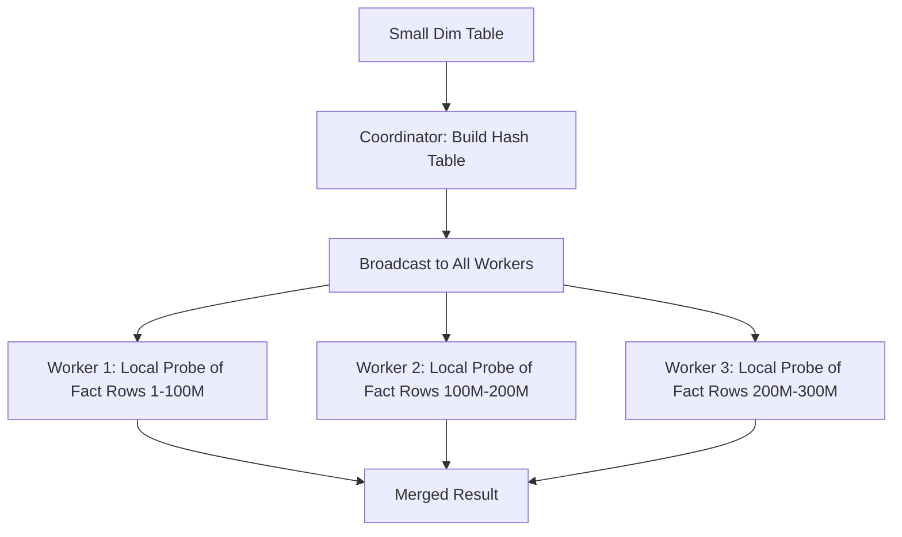
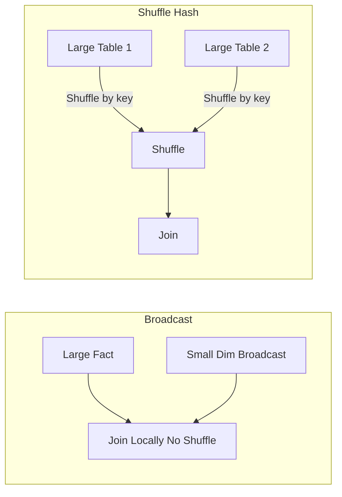

# Broadcast Join

## Core Definition

A Broadcast Join is a distributed join algorithm where the smaller of the two join inputs is completely replicated ("broadcast") to every worker node in the compute cluster, so that each worker can independently join its partition of the larger table against a local copy of the smaller table, without any network shuffle of the large table's data.

Broadcast joins are the most efficient join strategy when one join input is small enough to fit in each worker's memory and the other is very large. The paradigmatic use case is joining a large fact table (billions of rows) to a small dimension table (thousands or tens of thousands of rows). This pattern appears constantly in star schema analytics over data lakehouses.

## Mechanics of the Broadcast Join

**Phase 1, Build Side Scan:** The query engine identifies the smaller join input as the "build side." All workers coordinate to scan the build side table (or a partition of it assigned to a designated coordinator worker). The full contents of the build side are collected into a single in-memory data structure, typically a hash table keyed on the join column(s).

**Phase 2, Broadcast:** The completed build-side hash table is serialized and broadcast over the network to every worker node in the cluster. After broadcast completes, every worker holds an identical copy of the build table in its local memory.

**Phase 3, Probe Side Scan:** Each worker independently scans its assigned partition of the larger probe side table. For each probe row, the worker hashes the join key and looks it up in its local copy of the build-side hash table. If a match is found, the joined row is emitted to the output stream.

**No Shuffle Required:** Critically, the probe side (the large table) never shuffles. Each row in the probe table is joined locally on the worker that scanned it, because every worker has the complete build table. This eliminates the most expensive operation in distributed query execution, the network shuffle, for the large probe side.

## Broadcast Threshold

Query engines implement a configurable **broadcast threshold**: the maximum estimated size of the build side that the engine will attempt to broadcast. Typical defaults:

- **Trino:** 32MB (configurable via `join_distribution_type = BROADCAST`, or automatic if estimated size < threshold)
- **Apache Spark:** 10MB by default (configurable via `spark.sql.autoBroadcastJoinThreshold`)
- **Dremio:** Automatically determined by the CBO based on table statistics

If the build side exceeds the threshold, the engine falls back to a Shuffle Hash Join or Sort-Merge Join instead.

## When Broadcast Join is Most Beneficial

**Dimension Table Lookups:** In a star schema, every fact table query that joins to dimension tables (geography, product, customer, date) benefits from broadcast joins. The date dimension (365 rows/year × 20 years = 7,300 rows, ~200KB) is always broadcast. The product dimension (100,000 rows, ~5MB) is typically broadcast. The customer dimension (10M rows, ~500MB) may exceed the broadcast threshold and require a shuffle join.

**Small Lookup Tables:** Any query joining a large table to a small lookup table (country codes, currency conversion rates, business unit hierarchies) benefits from broadcast join, even if the small table is not a traditional "dimension table" in the dimensional modeling sense.

**Pre-Filtered Small Inputs:** If a subquery or CTE produces a small result set after filtering, that small result set can be broadcast even if the underlying table is large. `WHERE product_id IN (SELECT id FROM products WHERE category = 'Electronics')` can be evaluated by broadcasting the filtered Electronics product IDs.

## Broadcast Join with Apache Iceberg

Iceberg tables provide accurate row count statistics in their table metadata. Query engines use these statistics to make accurate broadcast join eligibility decisions. For small Iceberg dimension tables with up-to-date statistics, the optimizer reliably selects broadcast joins without requiring query hints.

When Iceberg statistics are stale or unavailable (e.g., for tables recently ingested without statistics), the optimizer may underestimate the build table size and attempt to broadcast a table that is actually too large: causing out-of-memory failures on worker nodes. Running `ANALYZE TABLE` to refresh Iceberg statistics prevents this failure mode.

## Forcing Broadcast Joins with Query Hints

When the optimizer incorrectly chooses a shuffle join for a small table, engineers can force a broadcast join using query hints:

```sql
-- Trino / Presto
SELECT /*+ BROADCAST(dim_product) */
  f.order_id, p.category, f.revenue
FROM fact_sales f
JOIN dim_product p ON f.product_id = p.product_id;

-- Apache Spark
SELECT /*+ BROADCAST(p) */
  f.order_id, p.category, f.revenue
FROM fact_sales f
JOIN dim_product p ON f.product_id = p.product_id;
```

Hints should be used judiciously: they override the optimizer's judgment and can cause OOM errors if the build side is actually larger than expected.

## Visual Architecture

### Diagram 1: Broadcast Join Execution



### Diagram 2: Broadcast vs Shuffle Join


