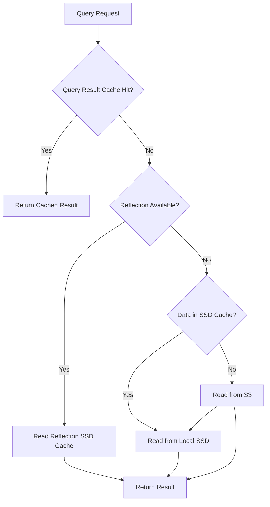
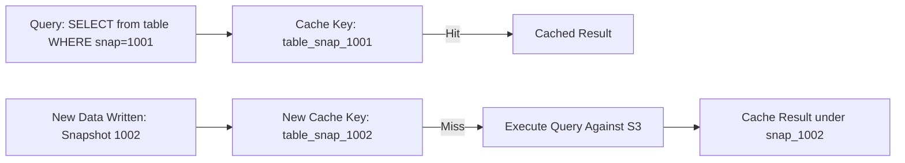

# Caching

## Core Definition

Caching in data systems is the practice of storing copies of frequently accessed data in a faster, closer storage layer so that subsequent requests for the same data can be served without repeating expensive operations like reading from remote object storage, executing complex queries, or making API calls to external services.

In the open data lakehouse ecosystem, caching operates at multiple levels simultaneously: file data caching on local SSD to reduce S3 read latency, metadata caching to avoid repeated catalog lookups, query result caching to serve repeated identical queries without re-execution, and semantic layer reflection caching (Dremio's approach) to serve complex aggregations from pre-computed materialized results.

The fundamental principle is the same at every layer: trade storage space (a cheap, plentiful resource in cloud environments) for reduced latency and reduced repeated computation (expensive in both time and money).

## The Cache Hierarchy in a Lakehouse

**Level 1 — Query Result Cache:** The highest-level cache. Stores the complete result set of recently executed queries, keyed by the normalized query string and relevant metadata (target catalog snapshot version). If an identical query is re-submitted and the underlying data has not changed (same Iceberg snapshot), the cached result is returned immediately with zero query execution. Effective for dashboard queries that are submitted thousands of times per day with no underlying data changes.

**Level 2 — Materialized View / Reflection Cache:** Pre-computed aggregations stored as physical Iceberg tables (in Dremio, as Reflections). Not strictly a "cache" in the traditional sense, but functionally equivalent: complex queries are transparently served from pre-computed results rather than scanning base tables. Discussed in depth in the Materialized Views article.

**Level 3 — Local Data File Cache (SSD Cache):** Query engines running on cloud compute instances read Parquet and ORC files from Amazon S3 over the network. Network I/O from S3 adds 5-20ms per file and limits throughput to the available network bandwidth. Caching frequently accessed data files on local NVMe SSD eliminates network round-trips for hot data. Dremio's distributed SSD cache, Trino's file system cache, and Alluxio (a dedicated distributed caching layer) all implement this pattern.

**Level 4 — File Metadata Cache:** Apache Iceberg queries require reading metadata files (metadata.json, manifest lists, manifest files) from S3 before reading any actual data files. A busy cluster querying an active Iceberg table might read the same manifest file thousands of times per hour. Caching the deserialized metadata objects in the coordinator's heap memory eliminates redundant S3 reads and JSON parsing for hot metadata.

**Level 5 — Catalog / Schema Cache:** The query engine caches table schema definitions and partition statistics retrieved from the data catalog (Polaris, Glue, Hive Metastore) to avoid repeated RPC calls for every query. Schema caches are typically short-lived (seconds to minutes) with TTL-based invalidation to remain consistent with schema changes.

## Cache Invalidation

Cache invalidation — determining when cached data is stale and must be refreshed — is famously "one of the hardest problems in computer science." Incorrect cache invalidation produces silent data consistency bugs where users see outdated results without being informed the data is stale.

**Time-To-Live (TTL):** The simplest invalidation strategy. Cached entries expire after a configured duration (e.g., query results cached for 5 minutes, metadata cached for 60 seconds). Simple to implement but can serve stale results during the TTL period and may unnecessarily invalidate still-valid entries.

**Event-Based Invalidation:** Cached entries are invalidated when a specific event occurs (a new Iceberg snapshot is committed to a table, a new data file is added). The most accurate invalidation strategy but requires tight integration between the caching layer and the event source.

**Snapshot-Keyed Caching (Iceberg):** Apache Iceberg's immutable snapshot model makes cache invalidation straightforward. Each snapshot has a globally unique numeric ID. Cache entries are keyed by the exact Iceberg snapshot ID, not by table name. When a new snapshot is created (new data is written), a new snapshot ID is generated, automatically creating a distinct cache key. Old snapshot-keyed cache entries can be evicted lazily when space is needed. No explicit invalidation is required — different snapshot IDs are different cache entries.

## Dremio's Multi-Layer Caching Architecture

Dremio implements caching at multiple layers simultaneously:

**Reflections:** Pre-computed materialized aggregations stored as Iceberg tables. Dremio's optimizer automatically routes matching queries to Reflections. Reflections are refreshed on a schedule or triggered by data changes.

**Distributed SSD Cache (C3):** Dremio's Coordinator Columnar Cache distributes frequently accessed Parquet row groups across the local NVMe SSDs of all executor nodes. Hot data served from local SSDs has 10-100x lower latency and 10x higher throughput than reading from S3.

**Metadata Cache:** Iceberg metadata files (manifests, manifest lists) are cached in the executor's JVM heap. This eliminates repeated S3 reads for hot table metadata during bursts of concurrent queries.

**Query Result Cache:** For identical parameterized queries (e.g., a dashboard submitting the same SQL for many users), Dremio can optionally cache the full result set in memory for a configurable TTL.

## Cache Efficiency Metrics

**Hit Rate:** Fraction of requests served from cache vs. requiring full recomputation. Target >80% hit rate for effectiveness.

**Eviction Rate:** Frequency at which cached entries are evicted before being hit. High eviction rates indicate undersized caches.

**Cache Warmup Time:** For data file caches, how long after a cluster starts before the cache becomes fully effective. Cluster restarts reset SSD caches, creating a cold-start performance degradation period.

## Visual Architecture

### Diagram 1: Lakehouse Cache Hierarchy

### Diagram 2: Snapshot-Keyed Iceberg Cache

