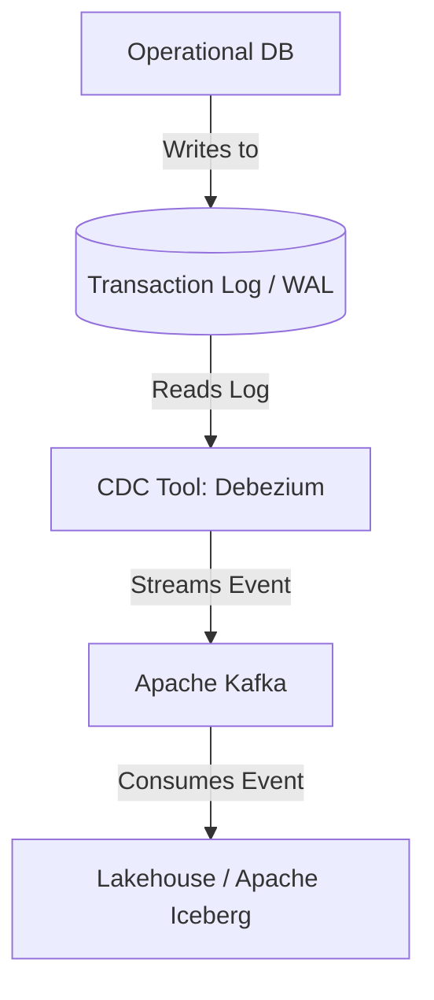
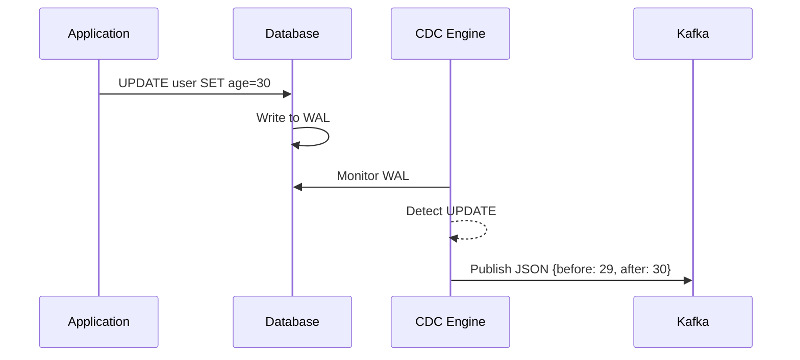

# Change Data Capture (CDC)

## Core Definition

Change Data Capture (CDC) is a set of software design patterns and technologies used to determine and track the data that has changed within a source database, so that action can be taken using the changed data. In modern data architectures, CDC is the mechanism that powers real-time and near-real-time data replication from transactional databases (like PostgreSQL, MySQL, or Oracle) into analytical data lakehouses (like Apache Iceberg).

Instead of running a heavy batch process every night at 2:00 AM that runs a massive `SELECT * FROM users` query to see what changed, a CDC system continuously monitors the database and emits a stream of tiny events every time an `INSERT`, `UPDATE`, or `DELETE` occurs.

## Implementation and Operations

There are several ways to implement CDC, but **Log-Based CDC** is the undisputed industry standard for enterprise architectures.

Every modern relational database utilizes a Write-Ahead Log (WAL) or transaction log. Before the database actually updates the physical tables on disk, it writes the exact details of the transaction to this sequential log file. This is how databases recover from sudden power failures.

Tools like **Debezium** (an open-source distributed platform built on top of Apache Kafka) act as "Log Readers." Debezium disguises itself as a replica database. It connects to the primary PostgreSQL database and asks to read the WAL. As the database writes to the log, Debezium instantly reads the log, translates the raw binary database events into standard JSON payloads (containing both the "before" state and the "after" state of the row), and publishes those payloads to an Apache Kafka topic.

**Tradeoffs and Benefits:**
The massive advantage of log-based CDC is that it has near-zero performance impact on the source operational database. Because Debezium reads the log file asynchronously, it doesn't execute any heavy SQL queries against the production tables. It provides true real-time streaming replication, allowing the data lakehouse to remain perfectly synchronized with production systems with only milliseconds of latency.

## Log-Based Versus Query-Based

Two approaches to capturing change differ in what they can guarantee, and the difference is not a matter of degree.

**Query-based** capture polls the source, selecting rows whose `updated_at` exceeds the last watermark. It requires no special database access and works against almost anything. It also cannot see deletes, since a deleted row does not appear in a query result, and it misses intermediate states when a row changes twice between polls. If any application updates a row without maintaining the timestamp column, the change is invisible.

**Log-based** capture reads the database's own transaction log: the WAL in PostgreSQL, the binlog in MySQL, the redo log in Oracle. Because the log is what the database uses to guarantee durability, everything committed appears in it, including deletes and every intermediate state, in commit order.

Log-based capture requires elevated privileges and adds a consumer to a critical subsystem. Query-based capture is easier to obtain permission for and gives weaker guarantees. Most of the difficulty in CDC projects is negotiating that trade rather than implementing either.

### Applying Changes to a Lakehouse Table

A CDC stream is a sequence of inserts, updates, and deletes that must be applied to a table that stores immutable files. The mechanism is `MERGE`:

```sql
MERGE INTO customers t
USING changes s
ON t.customer_id = s.customer_id
WHEN MATCHED AND s.op = 'D' THEN DELETE
WHEN MATCHED THEN UPDATE SET *
WHEN NOT MATCHED AND s.op <> 'D' THEN INSERT *
```

Two properties of the change set have to hold. Changes must be applied in commit order, since applying an update after the delete that followed it resurrects a deleted row. And the staged set must contain at most one row per key, because a `MERGE` cannot apply two changes to the same row in one statement. Collapsing multiple changes per key to the latest is a standard preparation step.

### The Physical Decision

CDC produces frequent small updates scattered across a table, which is the workload copy-on-write handles worst: changing one row rewrites the file containing it.

Merge-on-read suits CDC better, writing delete files alongside new data and resolving at read time. The cost moves to readers and accumulates until compaction runs. A CDC target table without a compaction schedule degrades steadily, and this is the most common operational failure in CDC pipelines.

### Schema Drift

Source schemas change without notice. A column added upstream appears in the change stream and must be handled: either evolved into the target automatically, or rejected loudly. The failure worth avoiding is silent discarding, where the pipeline continues, nobody is alerted, and the column is discovered to be missing months later.

## Visual Architecture

### Diagram 1: Conceptual Architecture



### Diagram 2: Operational Flow


