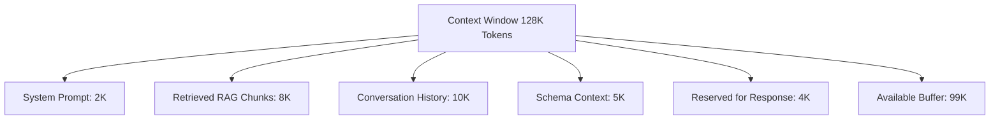
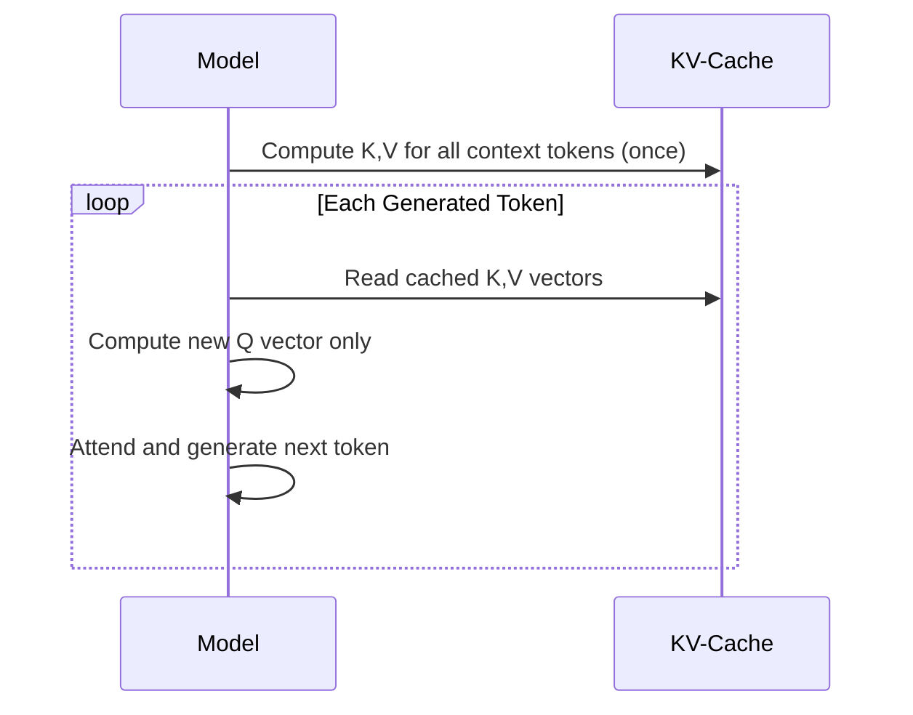

# Context Window

## Core Definition

The context window of a Large Language Model is the total amount of text — measured in tokens — that the model can process and reason about simultaneously during a single inference call. It encompasses everything the model can "see" when generating its next token: the system prompt, the conversation history, retrieved documents from RAG, tool call outputs, and the model's prior generated response tokens.

The context window is the working memory of the LLM. Just as a human can only hold a limited amount of information in active attention simultaneously, an LLM can only reason coherently over the text that fits within its context window. Information outside the window is completely invisible to the model.

Understanding context window mechanics is essential for architects building RAG systems, AI agents, Text-to-SQL pipelines, and any LLM-powered application over enterprise data — because context window management directly determines cost, latency, and answer quality.

## Tokens: The Unit of Context

Text is not measured in characters or words for LLMs — it is measured in tokens. A tokenizer converts raw text into a sequence of tokens using an algorithm like Byte Pair Encoding (BPE). BPE builds a vocabulary of common subword units by iteratively merging the most frequent adjacent pairs of characters in the training corpus.

In English text, a useful rule of thumb is that 1 token corresponds to approximately 0.75 words, or roughly 4 characters. A 1000-word document encodes to approximately 1333 tokens. Code, structured data, and non-English text tokenize differently — SQL queries and JSON structures typically use more tokens per character because they contain many special characters that are uncommon in natural language training data.

The context window limit applies to the total token count of the entire conversation, including all messages, system prompts, retrieved context, and the model's generated response. A model with a 128K token context window can process approximately 96,000 words — roughly the length of a typical novel.

## Context Window Size Progression

The rapid expansion of context windows has been one of the defining technical trends in LLM development:

- **2020 (GPT-3):** 4,096 tokens
- **2023 (GPT-4 Turbo):** 128,000 tokens
- **2024 (Claude 3.5 Sonnet):** 200,000 tokens
- **2024 (Gemini 1.5 Pro):** 1,000,000 tokens (1M tokens)
- **2025 (Gemini 2.0 Flash):** 1,000,000+ tokens

This expansion from 4K to 1M tokens in five years represents a 250x increase in the amount of information a model can consider at once. In practical terms, a 1M token context window can contain an entire enterprise codebase, multiple quarters of financial reports, or thousands of customer support tickets simultaneously.

## The Self-Attention Quadratic Scaling Problem

The fundamental challenge of large context windows is computational. The self-attention mechanism computes relationships between every pair of tokens in the sequence. For a sequence of n tokens, this requires computing n² attention scores. Doubling the context length quadruples the computational cost.

For 4K tokens: 16M attention scores.
For 128K tokens: ~16B attention scores — 1000x more computation.
For 1M tokens: ~1 trillion attention scores.

Several architectural innovations address this quadratic scaling:

**Grouped Query Attention (GQA):** Multiple query heads share a single key-value head, reducing the memory bandwidth required to load the KV-cache during inference. GQA makes long-context inference significantly more efficient without measurably degrading quality.

**Sliding Window Attention:** Instead of attending to all previous tokens, each token attends only to a local window of k previous tokens plus a few global "sink" tokens. Used in Mistral and Longformer architectures.

**Flash Attention:** A hardware-aware exact attention algorithm that tiles the attention computation to minimize GPU memory I/O, making full attention over long sequences significantly faster without approximation.

**Linear Attention:** Approximates self-attention with linear complexity O(n) rather than O(n²), enabling much longer sequences but with some quality tradeoffs for complex reasoning tasks.

## The KV-Cache

During auto-regressive text generation (producing one token at a time), the model re-reads the entire context at each generation step to compute attention. Without optimization, generating a 1000-token response over a 100K-token context would require 100K * 1000 = 100M attention computations.

The KV-Cache solves this by storing the computed Key (K) and Value (V) vectors for all tokens that have already been processed. When generating token n+1, only the Query vector for the new token needs to be computed fresh; the Keys and Values for all prior tokens are retrieved from the cache. This makes inference latency proportional to the response length rather than the full context length.

The KV-Cache is the primary memory bottleneck for serving long-context LLMs at scale. Storing the KV cache for a 128K-token context with a large model requires tens of gigabytes of GPU memory per active request. Efficient KV-cache management (paged attention, as used in vLLM) is critical for serving systems with concurrent users.

## The Lost-in-the-Middle Problem

Despite the availability of very long context windows, extensive research (Liu et al., 2023, "Lost in the Middle") demonstrates that LLM performance on information retrieval tasks degrades significantly when the critical information is positioned in the middle of the context window. Models attend reliably to information at the very beginning and very end of the context but systematically neglect information buried in between.

This has direct implications for RAG system design: retrieved context chunks must be ordered carefully, with the most critical information placed at the top or bottom of the context block, not in the middle. For long contexts with many retrieved documents, re-ranking by relevance and placing the highest-ranked documents first (not distributing them uniformly) improves answer quality.

## Context Engineering

Context engineering — the discipline of deciding exactly what information to put in the context window, in what format, and in what order — is emerging as a distinct skill set from prompt engineering.

**Selective context:** Do not fill the context window indiscriminately. Every token of context consumes attention capacity and increases cost and latency. Include only the information directly relevant to the current query.

**Compression:** Use an LLM (or extractive summarization) to compress large documents to their most relevant excerpts before injecting them as context. MapReduce patterns — summarize each section independently, then summarize the summaries — enable processing arbitrarily long documents within limited context windows.

**Structured context formats:** Presenting context in structured formats (numbered lists, labeled sections) makes it easier for the model to locate and reference specific pieces of information, improving both accuracy and citation quality.

**Context caching:** Cloud LLM providers (Anthropic, Google) now offer context caching — if the system prompt and retrieved context remain the same across multiple user turns, they can be cached on the server side, eliminating redundant token processing and dramatically reducing cost and latency for long-context applications.

## Implications for Data Lakehouse Applications

In Text-to-SQL systems over data lakehouses, the context window must contain the database schema (table definitions, column names, types, and descriptions), business glossary entries, example queries, and the user's question. For very large schemas with thousands of tables and columns, the entire schema may not fit within even a 128K context window.

Schema compression strategies include: dynamically retrieving only the tables relevant to the user's question using semantic search over the catalog, summarizing table descriptions rather than including full DDL, and partitioning the schema context across multiple agent calls.

## Visual Architecture

### Diagram 1: Context Window Composition

### Diagram 2: KV-Cache During Generation

