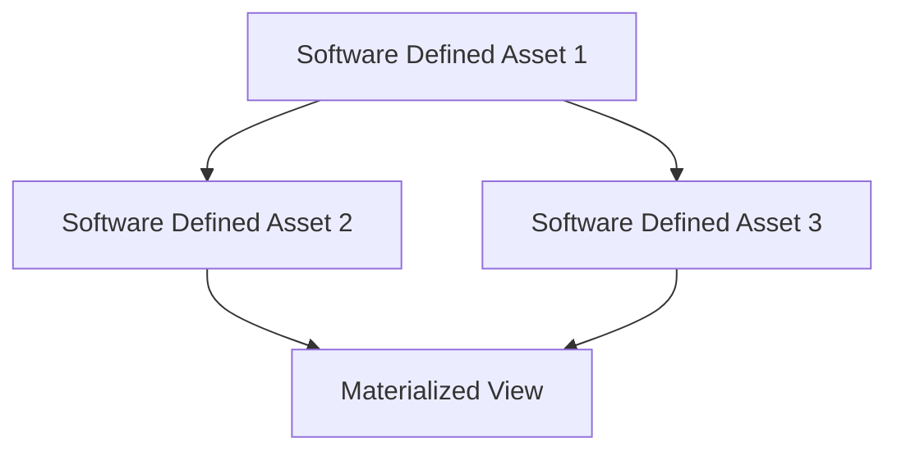
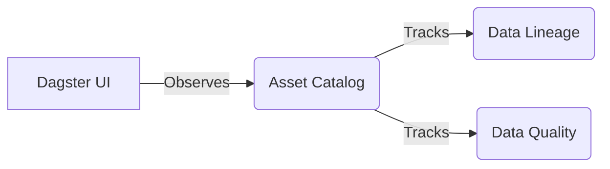

# Dagster

## Core Definition

Dagster is an open-source data orchestration platform designed to address some of the architectural limitations of Apache Airflow. While Airflow is primarily a "Task Orchestrator" (focused on simply running tasks in a specific order), Dagster is fundamentally an "Asset Orchestrator." 

In Dagster, the primary abstraction is the "Software-Defined Asset." An asset could be a machine learning model, a database table, or an Apache Iceberg dataset. Instead of writing a pipeline that says "Run script A, then script B," a Dagster engineer writes code that says "This Python function produces Asset B, and it requires Asset A as input."

## Implementation and Operations

By focusing on the assets rather than the tasks, Dagster provides a fundamentally different operational experience. 
First, it deeply integrates data lineage and observability. The Dagster UI doesn't just show you if a script ran successfully; it shows you the health and freshness of the actual database tables that the script was supposed to update.

Second, Dagster heavily emphasizes local development and testability. In older orchestrators, testing a pipeline often required deploying it to a live cloud environment. Dagster's architecture decouples the business logic (the asset definition) from the environment (I/O managers). This allows engineers to run and test massive, complex data pipelines entirely on their local laptops using mock data, drastically increasing developer velocity and pipeline reliability before code ever reaches production.

## Assets Rather Than Tasks

The distinction that matters between Dagster and task-based orchestrators is what the unit of definition is.

Airflow asks you to declare tasks and the order they run in. Dagster asks you to declare **assets**, the tables, files, and models that should exist, along with what each depends on. The execution graph is derived from those declarations rather than written directly.

The practical difference appears when something goes wrong. In a task graph, a failure tells you a task failed. In an asset graph, it tells you which tables are now stale, which downstream tables are therefore suspect, and what needs rematerializing to recover. For a lakehouse where the question is usually "is this table current and can I trust it", that framing maps more directly onto what an analyst wants to know.

### IO Managers

Dagster separates the computation that produces an asset from the code that reads and writes it, through an abstraction called an IO manager. A function returns a dataframe; an IO manager decides whether that becomes an Iceberg table, a Parquet file, or an in-memory value during a test.

This makes the same asset definition runnable against local storage in development and against object storage in production without conditional logic. It also means switching a table's storage layer is a configuration change rather than a rewrite of every function that touches it.

### Partitions as a First-Class Concept

Partitions are part of the asset definition rather than something reconstructed from execution dates. An asset can declare that it is partitioned daily, and Dagster tracks which partitions exist, which are missing, and which are stale.

Backfilling becomes a matter of asking for a range of partitions rather than manipulating scheduler state, which removes a category of operational awkwardness that task-based tools handle less directly.

### The Trade

Dagster's model requires more up-front structure. Declaring assets, types, and IO managers is more work than writing a script and scheduling it, and for a handful of simple jobs that overhead is not repaid. The model earns its keep as the number of interdependent tables grows and the cost of not knowing what is stale becomes the dominant problem.

## Visual Architecture

### Diagram 1: Conceptual Architecture

### Diagram 2: Operational Flow

