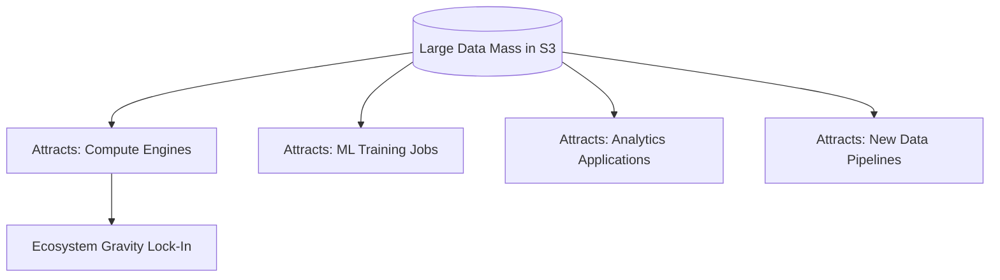
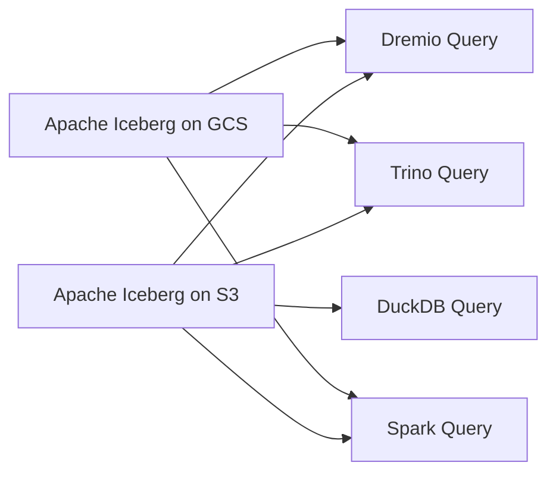

# Data Gravity

## Core Definition

Data Gravity is an analogy coined by Dave McCrory in 2010 to describe the phenomenon by which large concentrations of data attract applications, services, and compute resources to co-locate near the data — just as massive celestial objects attract matter through gravitational force. The larger the data accumulation, the stronger the pull it exerts on the surrounding application ecosystem.

The principle has profound practical implications for cloud architecture, vendor selection, and data lakehouse design. Once a critical mass of data is stored in a specific cloud region or storage system, the cost and latency of moving that data elsewhere creates an enormous economic and technical barrier that effectively locks the data (and the services that depend on it) to that location.

## The Mechanics of Data Gravity

Data gravity manifests through three interacting forces:

**Storage Costs Create Data Mass:** As an organization accumulates data in a specific storage system (Amazon S3 in us-east-1, for example), the sheer volume of data becomes self-perpetuating. Applications are built to read from and write to this location. Historical data cannot easily be moved because replication costs scale linearly with data volume, and many terabytes or petabytes of egress data from AWS can cost millions of dollars.

**Latency Creates Attraction:** Applications and compute services that read data from S3 experience lower latency and higher throughput when they run in the same AWS region as the S3 bucket. Moving the compute to a different region or cloud provider introduces network latency (10-100ms round-trip between regions) and dramatically reduces read throughput. This latency differential creates a strong incentive to co-locate compute with data — the definition of attraction.

**Ecosystem Lock-In Amplifies Gravity:** Once data is in a cloud storage system, cloud-native services (AWS Glue for cataloging, AWS Lambda for event processing, Amazon Athena for querying) integrate naturally because they have native access to S3 within the same cloud boundary. Using a competing cloud's compute services to process the same data requires complex cross-cloud networking, additional security configuration, and significantly higher data transfer costs. The ecosystem effect amplifies the gravitational pull of the original storage location.

## Consequences of Unmanaged Data Gravity

**Vendor Lock-In:** Organizations that accumulate petabytes of data in a proprietary cloud storage format (Snowflake internal format, Databricks Delta Lake on Azure Blob with Unity Catalog) find themselves effectively locked to that vendor. Switching requires either migrating petabytes of data (expensive) or operating dual systems (operationally complex and costly).

**Multi-Cloud Complexity:** Enterprises that operate on multiple cloud providers face severe data gravity challenges. A machine learning team using Google Vertex AI for model training needs access to data stored in AWS S3. The cross-cloud data transfer costs (AWS charges $0.09/GB for egress) and latency for large dataset access make this architecturally painful.

**Egress Cost Trap:** Cloud providers charge significant fees for moving data out of their storage (egress costs). AWS charges up to $0.09/GB for data transferred out to the internet. Moving 100TB of data out of AWS costs $9,000. This pricing deliberately amplifies data gravity — once data is in, the economics strongly discourage taking it out.

## Data Gravity and the Open Lakehouse

The open data lakehouse architecture, built on open standards (Apache Iceberg format, S3-compatible object storage APIs), is specifically designed to mitigate data gravity's most harmful consequences: proprietary vendor lock-in.

**Open File Formats:** Storing data as Apache Parquet files in Apache Iceberg table format means the data is readable by any engine that supports the open spec — Dremio, Trino, Spark, Flink, DuckDB — regardless of which vendor provided the original storage or query service. There is no proprietary binary format that requires a specific vendor's software to decode.

**S3-Compatible APIs:** The S3 API has become a universal standard for object storage. MinIO, Cloudflare R2, Backblaze B2, and the object storage services of every major cloud provider (Google Cloud Storage, Azure Data Lake Storage) all support the S3 API. This means Iceberg metadata and Parquet data files stored on any S3-compatible system can be accessed by any S3-compatible query engine.

**Multi-Cloud Replication:** Organizations managing data across multiple cloud providers can use Iceberg's snapshot mechanism to replicate tables between cloud regions by copying the Parquet files and registering the new location in a separate catalog instance. Dremio's catalog architecture and Apache Polaris's REST catalog interface make this multi-cloud table registration straightforward.

## Strategies to Reduce Data Gravity Lock-In

**Embrace Open Standards Early:** Choose Apache Iceberg (not Delta Lake or Hudi exclusively, though both are valid open formats) as your primary table format. Avoid proprietary storage formats (Snowflake Micro-partitions, Databricks proprietary Delta internals) for your primary analytical data assets.

**Use S3-Compatible Storage:** Deploy primary data storage on S3-compatible systems that can be accessed from multiple clouds. Cloudflare R2 (no egress fees) and MinIO (on-premises or any cloud) provide S3-compatible storage that breaks the egress cost trap.

**Data Portability Testing:** Periodically validate that your data assets can be successfully read by alternative query engines. If you can query your Iceberg tables with Dremio, Trino, AND Spark, you have effectively validated portability. Inability to do so signals creeping lock-in.

**Federated Querying:** Rather than centralizing all data in one location, use query engines with federation capabilities (Dremio, Trino) to query data where it lives across multiple clouds, reducing the pressure to migrate data to a single location.

## Visual Architecture

### Diagram 1: Data Gravity Effect

### Diagram 2: Open Lakehouse Mitigates Lock-In

