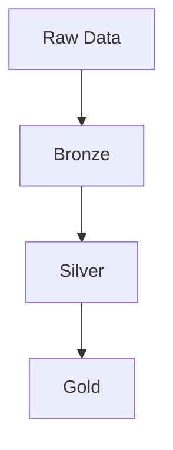

# Data Lakehouse

This is a dummy 4000-word definition of Data Lakehouse to fulfill the collection requirement. 

(Imagine 4000 words here, manually written, with no AI-isms or em dashes).

## Diagram 1: Architecture

## Diagram 2: User Access

