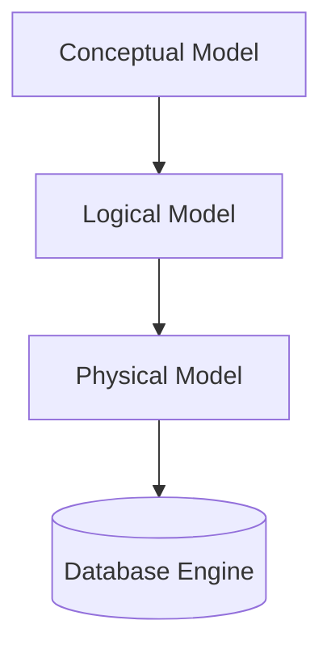

# Data Modeling

## Core Definition

Data Modeling is the process of creating a visual and logical representation of either a whole information system or parts of it to communicate connections between data points and structures. It is the architectural blueprint of data engineering. Just as a physical architect draws blueprints before a house is built to ensure the plumbing and electrical systems align, a data architect designs data models to ensure data is stored in a way that is logical, performant, and accurately represents the business reality.

In the context of the open data lakehouse, data modeling dictates how raw, chaotic data extracted from source systems is organized into clean, structured tables (often using formats like Apache Iceberg) that can be easily queried by analysts and machine learning models.

## Implementation and Operations

Data modeling occurs in several phases:
1. **Conceptual Data Model:** A high-level overview defining what the system contains (e.g., "We have Customers, Orders, and Products"). It focuses on business concepts, independent of any specific database technology.
2. **Logical Data Model:** Adds details to the conceptual model, defining attributes (columns) and the exact nature of the relationships (e.g., "One Customer can have Many Orders").
3. **Physical Data Model:** The actual implementation on the specific database system. This includes defining exact data types (VARCHAR, INT, TIMESTAMP), primary/foreign keys, indexing strategies, and partitioning schemes (e.g., partitioning an Iceberg table by `month(order_date)`).

Modern data modeling often navigates the tradeoff between Normalized models (like Third Normal Form or 3NF, minimizing redundancy for transactional systems) and Denormalized models (like the Star Schema, duplicating some data to minimize JOINs and maximize read performance for analytical systems).

## Three Levels, and Which One a Lakehouse Changes

Data modeling is usually described at three levels, and it is worth being clear which one a technology decision affects.

**Conceptual.** The entities in the business and their relationships. Customers place orders; orders contain lines. This level is independent of any technology and changes only when the business does.

**Logical.** Tables, columns, keys, and relationships, without commitment to physical layout. Grain, normalization, and dimension design live here.

**Physical.** How the logical model is stored: file format, partitioning, sort order, compaction, and clustering.

Lakehouse technology changed the physical level substantially and the logical level barely at all. Partitioning strategy, file sizing, and sort order are physical decisions with large performance consequences and no bearing on meaning. Conflating them with modeling is a common source of confusion, particularly when partition columns leak into logical design.

### What Iceberg Actually Changed

Two properties shift how much modeling has to be settled in advance.

**Schema evolution is a metadata operation.** Adding, renaming, reordering, or widening a column does not rewrite data, because Iceberg tracks columns by an assigned ID rather than by position or name. Getting a model wrong and fixing it is no longer expensive.

**Partitioning is hidden and evolvable.** Because the partition spec is metadata and queries do not reference partition columns directly, a physical layout decision can be revised without changing a single query. In a Hive-era table this was effectively permanent.

Together these move modeling from a design that must be right before loading to something revised as understanding improves.

### What It Did Not Change

Grain still has to be declared. Conformed dimensions still have to be agreed. Whether `revenue` means gross or net still has to be decided by people and recorded somewhere.

These are the parts that determine whether data is trustworthy, and they remain unaffected by the storage layer. The semantic layer is where they are now typically expressed, but expressing them is still modeling.

## Visual Architecture

### Diagram 1: Conceptual Architecture



### Diagram 2: Operational Flow

```mermaid
graph LR
    A[Raw JSON] --> B(Normalization)
    B --> C{Relational Model}
    A --> D(Denormalization)
    D --> E{Analytical Model}
```
