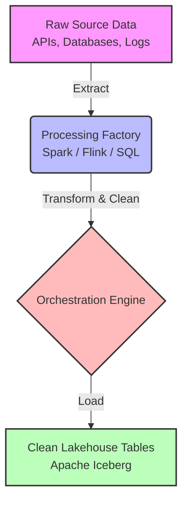
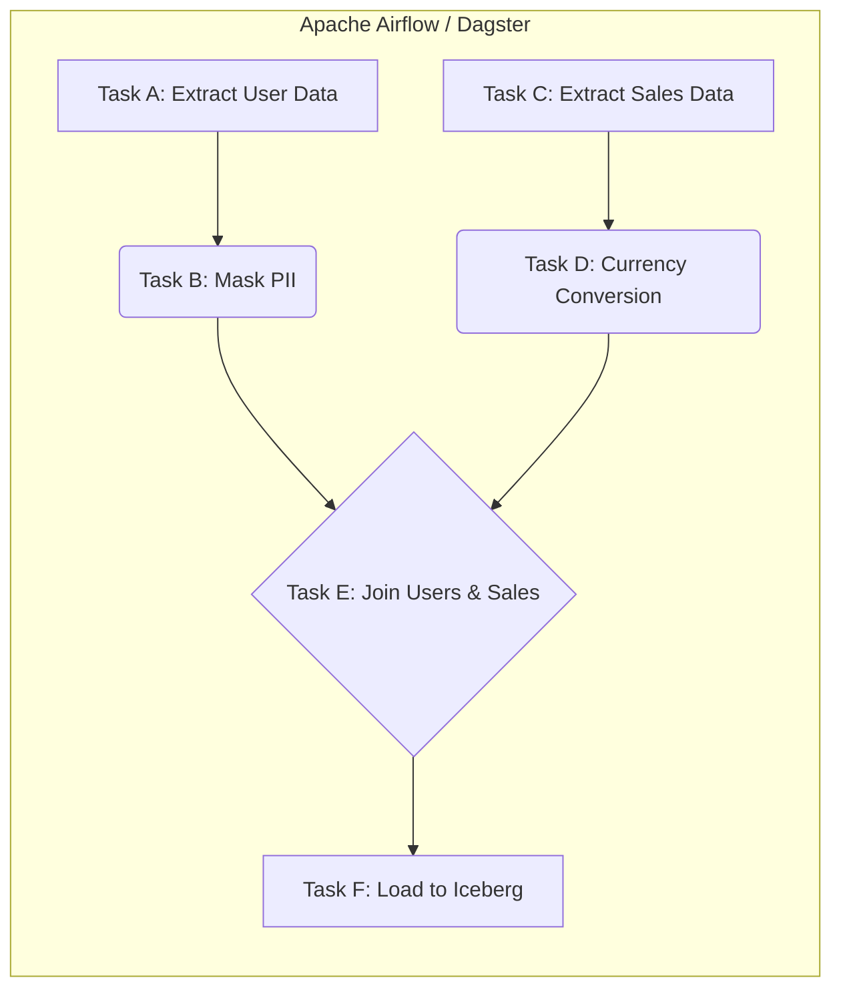

# Data Pipeline

## Core Definition

A Data Pipeline is an automated set of processes and infrastructure that extracts data from various source systems, transforms it into a clean and usable state, and loads it into a central repository (such as a data warehouse or open data lakehouse) where it can be queried by analysts and machine learning models. 

In the context of data engineering, the pipeline is the circulatory system of the enterprise. It replaces manual data dumps and ad-hoc scripts with robust, scheduled, and monitored workflows. The ultimate goal of a data pipeline is to ensure that high-quality, reliable data arrives at its destination in a timely manner, enabling data-driven decision-making.

## Diagram 1: Conceptual Architecture

## Implementation and Operations

Data pipelines traditionally follow the ETL (Extract, Transform, Load) or ELT (Extract, Load, Transform) paradigms.

1. **Extraction:** The pipeline connects to source systems. This could be pulling nightly CSV dumps from an SFTP server, querying a transactional PostgreSQL database via JDBC, or subscribing to a real-time stream of JSON clickstream events from Apache Kafka.
2. **Transformation:** The raw data is rarely ready for analysis. The pipeline executes code (often using Apache Spark, SQL, or Python) to clean the data. This involves dropping null values, masking PII (Personally Identifiable Information), joining tables, converting timezones, and enforcing data quality rules.
3. **Loading:** Finally, the cleaned data is written to the destination. In a modern lakehouse, this involves writing the data to Amazon S3 in Apache Parquet format and updating the Apache Iceberg metadata catalog to expose the new data to query engines like Dremio or Snowflake.

Modern data pipelines are highly complex, often involving dozens of interdependent steps. To manage this complexity, organizations use Orchestration tools like Apache Airflow, Dagster, or Prefect. These tools define the pipeline as a Directed Acyclic Graph (DAG), ensuring that Step B only runs after Step A has successfully completed, and providing alerting and automatic retry mechanisms if a step fails due to a network timeout or bad data.

## Diagram 2: Operational Flow

## Summary and Tradeoffs

The primary tradeoff when designing a data pipeline is choosing between Batch Processing and Streaming (Real-Time) Processing. Batch pipelines (e.g., running a massive Spark job every night at 2 AM) are significantly cheaper, easier to build, and easier to debug. However, the data in the lakehouse is always hours old. Streaming pipelines (using tools like Apache Flink) process data instantly as it arrives, providing sub-second latency for dashboards, but they are dramatically more complex to engineer, operate, and maintain, and they consume significantly more expensive constant compute resources.

## The Properties That Separate a Pipeline From a Script

The difference between a script that moves data and a pipeline is a set of properties that only matter once something fails, which is why they are usually added after the first incident rather than before.

**Idempotency.** Running the same step twice produces the same result as running it once. This is the precondition for retries, backfills, and recovery. On a lakehouse it is achieved by replacing a partition wholesale, by `MERGE` on a natural key, or by write-audit-publish so a failed attempt never becomes visible.

**Atomicity of publication.** Consumers see either the previous state or the complete new state, never a partial write. Table formats provide this through the commit; pipelines writing files directly do not have it and tend to discover the gap when a job fails at 80 percent.

**Explicit boundaries.** Each step declares what it reads and writes. Steps that reach into shared mutable state cannot be reasoned about independently, and their failure modes involve other steps.

**Observable outcomes.** Not just whether a step succeeded, but how many rows moved, how long it took, and whether that is normal. A pipeline that succeeds while processing zero rows is failing silently, and silent failure is the expensive kind.

### The Failure Modes Worth Designing For

Three cause most production incidents:

1. **Late-arriving data.** The window closed before everything arrived. Reprocessing a wider window on a slower cadence is the usual defense.
2. **Schema drift.** An upstream column changed type or disappeared. The choice is to fail loudly or to evolve deliberately; the failure to avoid is continuing while dropping the field.
3. **Partial failure with side effects.** A step wrote some output, then failed. Without atomic publication, the next run sees inconsistent input.

### Contracts Between Stages

As a pipeline grows, the useful discipline is treating the boundary between stages as an interface: agreed schema, agreed grain, agreed freshness, agreed behavior on missing data.

Without that, every stage is coupled to the current implementation of the one before it, and changing anything requires understanding everything downstream. With it, stages can be modified independently as long as the contract holds, which is the property that keeps a pipeline maintainable past a handful of steps.

## Visual Architecture

### Diagram 1: Data Pipeline Concept

### Diagram 2: Data Pipeline Flow (DAG)

