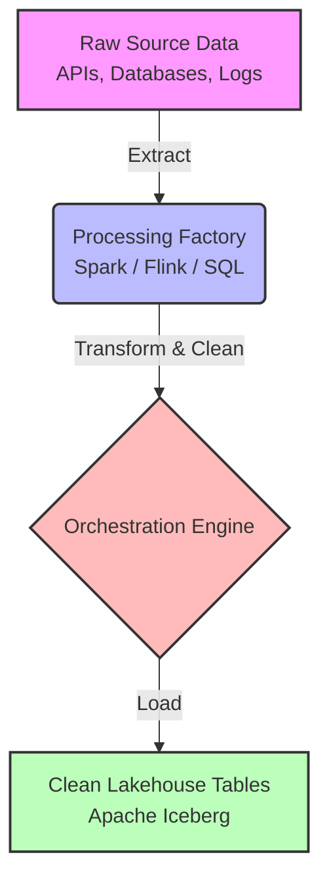
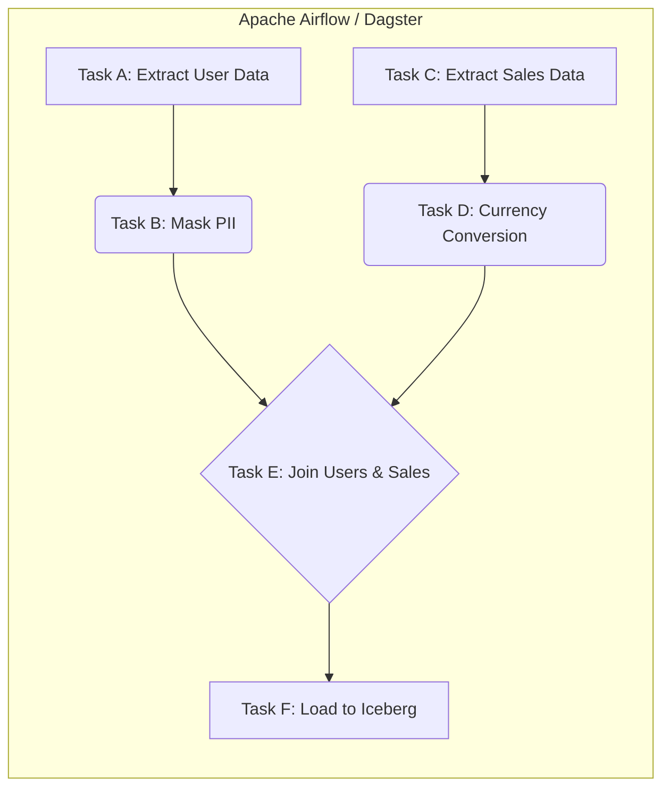

# Data Pipeline

## Core Definition

A Data Pipeline is an automated set of processes and infrastructure that extracts data from various source systems, transforms it into a clean and usable state, and loads it into a central repository (such as a data warehouse or open data lakehouse) where it can be queried by analysts and machine learning models. 

In the context of data engineering, the pipeline is the circulatory system of the enterprise. It replaces manual data dumps and ad-hoc scripts with robust, scheduled, and monitored workflows. The ultimate goal of a data pipeline is to ensure that high-quality, reliable data arrives at its destination in a timely manner, enabling data-driven decision-making.

## Diagram 1: Conceptual Architecture

## Implementation and Operations

Data pipelines traditionally follow the ETL (Extract, Transform, Load) or ELT (Extract, Load, Transform) paradigms.

1. **Extraction:** The pipeline connects to source systems. This could be pulling nightly CSV dumps from an SFTP server, querying a transactional PostgreSQL database via JDBC, or subscribing to a real-time stream of JSON clickstream events from Apache Kafka.
2. **Transformation:** The raw data is rarely ready for analysis. The pipeline executes code (often using Apache Spark, SQL, or Python) to clean the data. This involves dropping null values, masking PII (Personally Identifiable Information), joining tables, converting timezones, and enforcing data quality rules.
3. **Loading:** Finally, the cleaned data is written to the destination. In a modern lakehouse, this involves writing the data to Amazon S3 in Apache Parquet format and updating the Apache Iceberg metadata catalog to expose the new data to query engines like Dremio or Snowflake.

Modern data pipelines are highly complex, often involving dozens of interdependent steps. To manage this complexity, organizations use Orchestration tools like Apache Airflow, Dagster, or Prefect. These tools define the pipeline as a Directed Acyclic Graph (DAG), ensuring that Step B only runs after Step A has successfully completed, and providing alerting and automatic retry mechanisms if a step fails due to a network timeout or bad data.

## Diagram 2: Operational Flow

## Summary and Tradeoffs

The primary tradeoff when designing a data pipeline is choosing between Batch Processing and Streaming (Real-Time) Processing. Batch pipelines (e.g., running a massive Spark job every night at 2 AM) are significantly cheaper, easier to build, and easier to debug. However, the data in the lakehouse is always hours old. Streaming pipelines (using tools like Apache Flink) process data instantly as it arrives, providing sub-second latency for dashboards, but they are dramatically more complex to engineer, operate, and maintain, and they consume significantly more expensive constant compute resources.

## In More Depth: The Data Engineering Ecosystem

To truly understand this concept, it must be placed within the broader context of the modern data engineering ecosystem. The evolution from traditional, monolithic on-premises data warehouses to decoupled, cloud-native open data lakehouses represents one of the most significant shifts in approach in software architecture over the last two decades.

### The Problem with Legacy Data Warehouses
Historically, organizations relied on proprietary appliances from vendors like Teradata, Oracle, or IBM. These systems were characterized by a tight coupling of compute and storage. The data physically resided on the hard drives of the specific servers that executed the SQL queries. While incredibly fast for structured, relational data, this architecture suffered from fatal scalability flaws. If an organization needed more storage for historical logs, they were forced to purchase expensive, proprietary servers that included compute power they did not actually need. Furthermore, these systems struggled to ingest unstructured data (like raw JSON, images, or massive IoT streams), creating impenetrable data silos.

### The Rise and Fall of the Data Lake (Hadoop)
To solve the volume and variety problem, the industry pivoted to the Data Lake, pioneered by Apache Hadoop. Organizations began dumping all raw data (structured, semi-structured, and unstructured) into the Hadoop Distributed File System (HDFS). Because HDFS ran on cheap commodity hardware, storage became essentially free. 
However, the data lake lacked the basic governance, transactional guarantees, and performance optimization of the data warehouse. Without ACID (Atomicity, Consistency, Isolation, Durability) transactions, concurrent reads and writes frequently corrupted data. Without schema enforcement, the data lake quickly devolved into an unmanageable, unqueryable "data swamp."

### The Open Data Lakehouse Paradigm
The open data lakehouse merges the best of both worlds. It utilizes the infinitely scalable, low-cost storage of the cloud (like Amazon S3 or Google Cloud Storage) but overlays the management and performance features of a traditional data warehouse. 

This is achieved through a multi-layered architecture:
1. **The Storage Layer:** Cloud object storage provides the infinite hard drive.
2. **The File Format Layer:** Open columnar formats like Apache Parquet and ORC provide extreme compression and analytical read efficiency.
3. **The Table Format Layer:** Technologies like Apache Iceberg, Delta Lake, and Apache Hudi sit on top of the physical files. They provide the metadata layer that enables ACID transactions, schema evolution, and time travel, bringing warehouse-level reliability to the raw object storage.
4. **The Compute Layer:** Decoupled, highly elastic engines like Trino, Dremio, Apache Spark, and Snowflake sit at the top. They can be scaled up or down independently of the storage, providing massive parallel processing power only when queries are actively running.

### Performance Optimization Strategies
In this decoupled architecture, network bandwidth between the compute engine and the object storage is the primary bottleneck. Data engineers employ a variety of advanced strategies to minimize this I/O:
*   **Partitioning:** Organizing data into distinct directories based on a frequently queried column (e.g., separating data by `year/month/day`). When an analyst queries a specific date, the engine simply ignores all directories that do not match, massively reducing data reads.
*   **Z-Ordering and Space-Filling Curves:** Advanced sorting techniques that cluster multi-dimensional data physically close together on the disk. This dramatically improves the effectiveness of file-skipping statistics (Min/Max filtering) in formats like Iceberg, allowing engines to read highly targeted, microscopic subsets of massive tables.
*   **Compaction:** Over time, streaming ingestions create millions of tiny, inefficient files. Data engineers run scheduled compaction jobs (often utilizing bin-packing algorithms) to merge these tiny files into optimally sized, large columnar blocks (typically 128MB to 512MB), restoring query performance and reducing S3 API overhead.

### Security and Governance
As data is democratized across the enterprise, governance becomes paramount. The open lakehouse relies on centralized metadata catalogs (like AWS Glue, Apache Polaris, or Unity Catalog) to manage access. Fine-Grained Access Control (FGAC) allows administrators to mask specific columns (like Social Security Numbers) or restrict specific rows based on the user's role, ensuring that a single, unified dataset can be securely queried by marketing, finance, and engineering teams simultaneously without violating compliance regulations like GDPR or CCPA.

### Conclusion
The architecture described above is not static. The industry is rapidly moving toward real-time streaming ingestion, automated "agentic" data modeling, and universal cross-engine compatibility via projects like Apache XTable. Understanding the foundational layers (how data is serialized, compressed, stored, and transported) is the absolute prerequisite for architecting systems that can handle the exabyte-scale analytics demands of the future.

## Visual Architecture

### Diagram 1: Data Pipeline Concept

### Diagram 2: Data Pipeline Flow (DAG)

