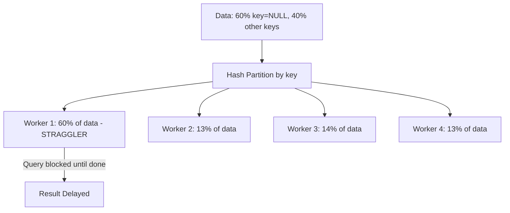
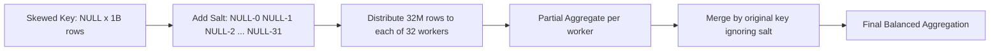

# Data Skew

## Core Definition

Data Skew in distributed query execution is the unequal distribution of data or computational work across the worker nodes of a cluster, where some workers process significantly more data than others. The worker(s) receiving the most data become "stragglers" that delay the entire query, because the query cannot complete until all workers finish — and the straggler worker finishes last.

Data skew is one of the most insidious performance problems in distributed analytics because its impact scales with the degree of imbalance. In a perfectly balanced cluster of 100 workers where all workers receive 1% of the data, the query completes in 1/100th of the serial execution time. If skew causes 80% of the data to route to a single worker, that worker does 80x more work than the others, and the query effectively runs at the speed of a single worker for most of its execution.

## Causes of Data Skew

**High-Cardinality Key Imbalance (Value Skew):** When a join or GROUP BY operation distributes data by hashing the key column, keys with very high frequency will map all their rows to the same worker. A web analytics table where 60% of sessions originate from `user_id = NULL` (anonymous users) will route 60% of rows to whichever worker handles the NULL hash bucket.

**Partition Imbalance (Physical Skew):** When Iceberg tables are partitioned by date and data ingestion is not uniform (e.g., end-of-quarter spikes in financial transactions), some date partitions are vastly larger than others. Queries that scan multiple date partitions may assign the large Q4 partition to one worker and the small Q1 partition to another, creating severe work imbalance.

**Hot Key Joins:** In e-commerce and SaaS analytics, a small number of extremely large customers (enterprise accounts) may generate millions of transactions each, while most customers generate hundreds. A join on customer_id routes all enterprise customer rows to the same workers, creating hot spots.

**Low Cardinality Aggregations:** GROUP BY on a boolean column (true/false) routes all true rows to one worker and all false rows to another — creating exactly two workers doing all the work regardless of cluster size.

## Detection

**Query Execution UI:** Most distributed query engines expose per-task metrics in their execution UI. In Spark's Stage Detail view, look at the Task distribution for `Duration` and `Input Data Size` columns. Severe skew shows up as one task taking 100x longer than the median. In Dremio's query profile, operator-level metrics show data processed per thread.

**Spilling Correlation:** A specific worker experiencing data skew often shows spilling-to-disk behavior (because its oversized hash table exceeds memory) while other workers complete in memory. Seeing spill on only one or two workers in a cluster is a strong indicator of skew.

**Query Explain Analysis:** `EXPLAIN ANALYZE` output shows estimated vs. actual row counts at each stage. Large discrepancies between estimated and actual row counts at the join or aggregation stage indicate the optimizer was not aware of the key imbalance.

## Mitigation Techniques

**Salting (Key Randomization):** The most universally applicable technique. For aggregations on skewed keys, append a random salt value (0 to N-1) to the group key, distribute across N workers, compute partial aggregations, then aggregate across salt values in a second pass. This spreads the NULL or hot-key rows across multiple workers.

```sql
-- Salted aggregation for skewed key
SELECT key, SUM(partial_sum) FROM (
  SELECT key, SUM(value) AS partial_sum, FLOOR(RANDOM() * 32) AS salt
  FROM large_table
  GROUP BY key, salt
) GROUP BY key;
```

**Skewed Join Optimization (Spark AQE):** Apache Spark's Adaptive Query Execution (AQE) detects skew during execution. When it identifies that a join partition on one side is significantly larger than the median partition, it automatically splits the large partition into multiple sub-partitions and replicates the corresponding partition from the other side to join each sub-partition independently. This happens transparently without query changes.

**Broadcast Join for Skewed Dimensions:** If a dimension table has highly skewed keys (e.g., a product dimension with 80% of transactions pointing to a few popular products), replacing the hash join with a broadcast join eliminates the skew problem — all rows are joined locally regardless of key distribution.

**Custom Partitioning on Iceberg Tables:** Write Iceberg tables with explicit DISTRIBUTE BY clauses that more evenly distribute the key space. For tables with known hot keys (e.g., always excluding NULL from the distribution key), custom partition functions can assign NULL rows to a balanced distribution.

**NULL Handling:** NULL values often cause extreme skew because they all hash to the same value. For outer joins where the NULL side is the large table, use `COALESCE(key, RANDOM_UUID())` to spread NULL rows across partitions, then handle the NULL semantics in the final result.

## Visual Architecture

### Diagram 1: Skewed vs Balanced Distribution



### Diagram 2: Salting Mitigation


