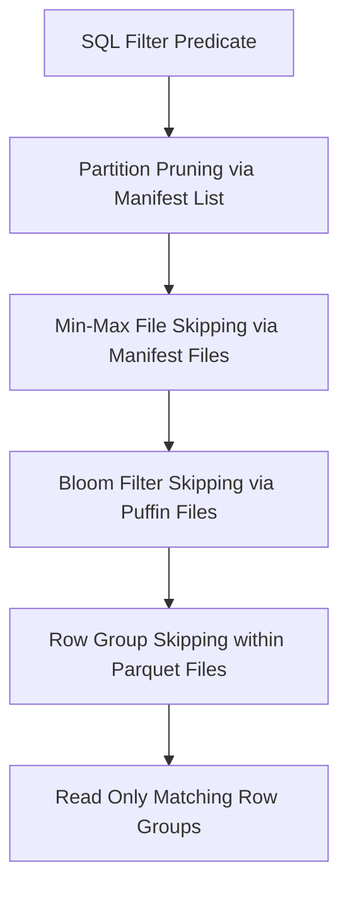
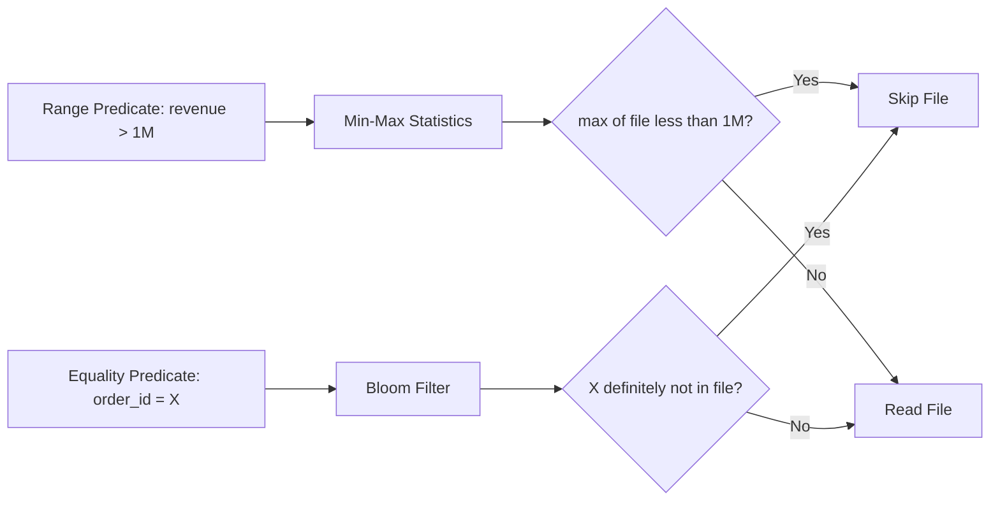

# Data Skipping

## Core Definition

Data Skipping is a query optimization technique in which a query engine uses pre-computed metadata statistics about data files to determine, at planning time, which files cannot possibly contain rows that satisfy the query's filter predicates — and therefore skips reading those files entirely, without transferring any data from object storage.

In a lakehouse with trillions of rows distributed across millions of Parquet files on Amazon S3, data skipping is often the single most important performance optimization. Reading even a single 512MB Parquet file from S3 takes hundreds of milliseconds. Skipping 99% of files for a highly selective query reduces query latency from minutes to seconds and reduces S3 API call costs proportionally.

Data skipping is distinct from caching (which serves previously computed results) and from partitioning (which physically organizes files by value ranges). Data skipping works alongside partitioning using column-level statistics to skip files within partitions that still cannot contain relevant rows.

## Mechanisms of Data Skipping

**Partition Pruning (Coarse-Grained Skipping):** The first and broadest form of data skipping. If a table is partitioned by `year` and `month`, a query filtering `WHERE year = 2026 AND month = 5` can instantly exclude all files from all other year-month partitions. Apache Iceberg's manifest files record partition values for each data file, enabling the planner to identify matching partitions in milliseconds without opening any data files.

**Column-Level Min/Max Statistics (File-Level Skipping):** Apache Iceberg stores the minimum and maximum value of each column within each data file in the manifest file metadata. A filter `WHERE revenue > 5000000` can skip any file where `max(revenue) < 5000000` — because that file provably contains no row with revenue exceeding 5 million. This skipping happens entirely in metadata without reading any column data from the file.

Similarly, `WHERE event_date = '2026-05-18'` skips any file where `min(event_date) > '2026-05-18'` or `max(event_date) < '2026-05-18'`.

**Bloom Filter Indexes (Value-Level Skipping):** Min/max statistics work well for range predicates but poorly for high-cardinality equality predicates. `WHERE order_id = 'ORD-9876543'` would not skip many files based on min/max alone because order IDs are distributed randomly across files.

Apache Iceberg supports Bloom Filter indexes (stored in Puffin files alongside the table) for specific columns. A bloom filter is a probabilistic data structure that answers "Is value X definitely NOT in this file?" with zero false negatives (if the filter says "not present," the value is guaranteed absent) and a small configured false positive rate (if the filter says "possibly present," the value might or might not actually be there). For equality predicates on high-cardinality columns (UUIDs, transaction IDs, order numbers), bloom filters typically skip 99%+ of files.

**Z-Ordering and Hilbert Curve Clustering (Spatial Co-location):** Min/max statistics are most effective when the values of the filtered column are tightly clustered within individual files. If `customer_id` values are randomly distributed across files (each file contains all possible customer IDs), min/max statistics provide no skipping benefit. Z-ordering and Hilbert curve sorting organize rows so that similar multi-dimensional values end up in the same files, creating tight min/max ranges that enable effective skipping.

**Row Group-Level Statistics (Parquet Internal):** Within a single Parquet file, data is organized into Row Groups of typically 128MB. Each Row Group has its own column statistics (min/max, null count). A query engine reading a Parquet file can skip Row Groups within the file whose statistics eliminate the filter predicate, further reducing data read volume below the file level.

## Statistics Collection and Maintenance

For min/max and bloom filter statistics to be available, they must be computed during write time or collected afterward via an analyze operation.

**Write-Time Statistics Collection:** When Dremio, Spark, or Trino writes data files to an Iceberg table, column-level statistics (min, max, null count, distinct count) are automatically computed for each file and recorded in the Iceberg manifest. No separate analysis step is required.

**Post-Write Statistics Refresh:** For tables ingested by tools that do not automatically compute statistics (e.g., raw file ingestion), Iceberg supports the `ANALYZE TABLE` operation that scans existing data files and updates their statistics metadata.

**Bloom Filter Index Creation:** Bloom filter indexes must be explicitly enabled per-column in the Iceberg table's write properties. Creating a bloom filter index on an existing column requires a one-time rewrite of all data files.

## Data Skipping Effectiveness

Data skipping effectiveness depends on the alignment between the query's filter predicates and the physical organization of the data:

- **Partitioned column filters:** Near-100% file elimination for highly selective partition filters.
- **Sorted/Z-ordered column filters:** 80-99% file elimination for well-clustered columns.
- **Random distribution columns (no sort/Z-order):** Minimal skipping from min/max; rely on bloom filters for equality predicates.
- **Low-cardinality columns (e.g., status enum with 5 values):** Min/max provides no skipping benefit; bloom filters provide modest benefit.

Measuring `files_skipped / files_total` from query execution statistics directly quantifies data skipping effectiveness for each query and guides optimization decisions about partitioning, sorting, and bloom filter indexes.

## Visual Architecture

### Diagram 1: Iceberg Data Skipping Layers

### Diagram 2: Min-Max vs Bloom Filter

