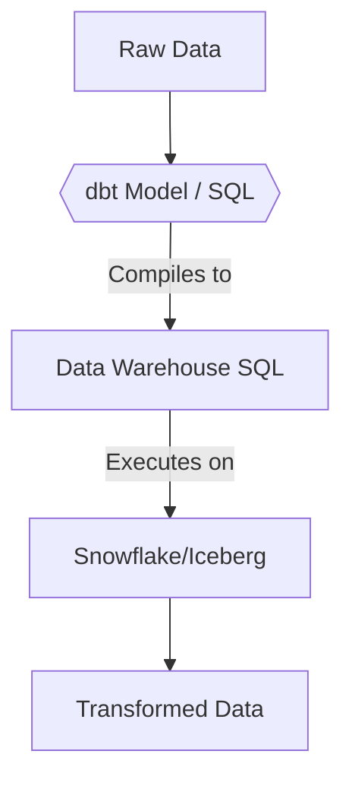
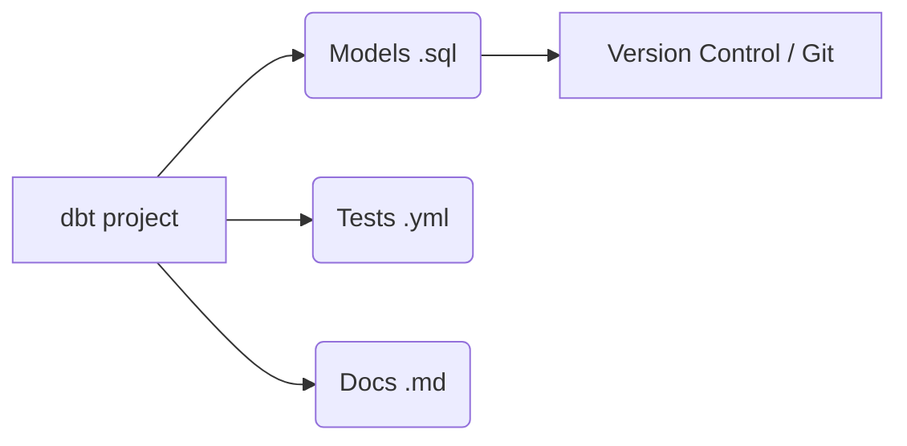

# dbt (data build tool)

## Core Definition

dbt (data build tool) is an open-source command-line tool (with a commercial cloud offering) that reshaped the "Transform" step of the ELT (Extract, Load, Transform) pipeline. It enables data analysts and analytics engineers to transform data in their warehouses or lakehouses by simply writing `SELECT` statements in SQL.

Before dbt, data transformations were either buried in heavy, proprietary drag-and-drop GUI tools, or scattered across thousands of unmanageable, unversioned SQL scripts and stored procedures. dbt essentially applies software engineering best practices (such as version control (Git), modularity, automated testing, and CI/CD) to SQL data transformations.

## Implementation and Operations

In dbt, a "model" is simply a `.sql` file containing a `SELECT` statement. dbt handles the heavy lifting of wrapping that `SELECT` statement in the necessary Data Definition Language (DDL) to actually create or update the table in the data warehouse (e.g., `CREATE TABLE AS...` or `MERGE INTO...`).

Key features of dbt include:
- **Jinja Templating:** dbt uses the Jinja templating language inside SQL files. This allows engineers to write logic (like `if/else` statements, loops, and macros) directly into SQL, making the code incredibly modular and reusable (DRY - Don't Repeat Yourself).
- **The `ref()` function:** Instead of hardcoding table names, engineers use `{{ ref('upstream_model') }}`. dbt uses these references to automatically infer the dependencies between all models, dynamically generating the execution DAG and running independent transformations in parallel.
- **Automated Testing:** Engineers can define simple YAML tests (e.g., asserting that a `user_id` column is `not_null` and `unique`). dbt runs these tests as part of the pipeline, catching data quality issues before they reach business dashboards.

## What dbt Does and Does Not Do

dbt occupies the transformation step and nothing else. It does not extract, does not load, and does not schedule itself. It compiles SQL and hands it to a warehouse or query engine for execution.

This narrowness is the design. dbt assumes data has already landed in a system that can query it, and concerns itself with turning raw tables into modeled ones in a way that is version controlled, tested, and documented.

### How the Graph Is Built

A model is a SELECT statement in a `.sql` file. When one model refers to another it uses `ref()` rather than naming the table directly:

```sql
select * from {{ ref('stg_orders') }}
```

That indirection is what makes the tool work. dbt parses every `ref()` call, builds a dependency graph, determines a safe execution order, and resolves each reference to the correct physical name for the target environment. The same project builds into a development schema or a production one without edits, because the model never hardcodes where anything lives.

### Materializations

A model's materialization determines what physically exists:

- **view**: no storage, recomputed on every query. Good for thin transformations.
- **table**: fully rebuilt each run. Simple and predictable, expensive on large data.
- **incremental**: only new or changed rows are processed, with the rest left in place.
- **ephemeral**: inlined into downstream models as a CTE, producing nothing of its own.

Incremental models are where most of the operational complexity lives. The model must define what "new" means, and that predicate is a correctness boundary. If late-arriving data falls outside the window, it is silently never processed. Reprocessing a wider window periodically is the usual defense.

### On a Lakehouse

Against Iceberg tables, incremental models typically compile to a `MERGE`, which the table format executes as either copy-on-write or merge-on-read depending on table configuration. The dbt model does not express that choice; the table's properties do.

This is worth knowing because performance problems attributed to dbt are frequently a table-level setting. A merge-heavy incremental model on a copy-on-write table rewrites entire files for a handful of changed rows, and the fix is at the table layer rather than in the SQL.

## Visual Architecture

### Diagram 1: Conceptual Architecture



### Diagram 2: Operational Flow


