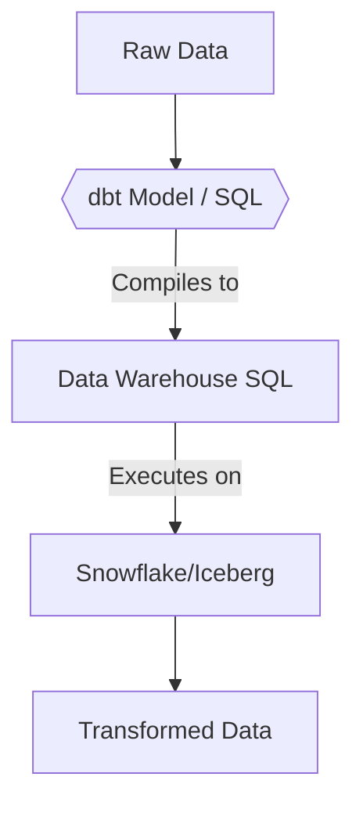
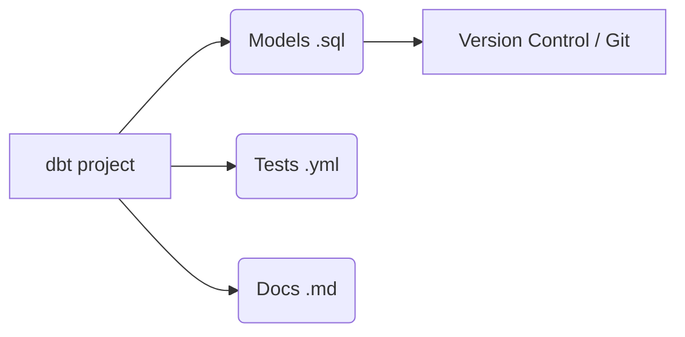

# dbt (data build tool)

## Core Definition

dbt (data build tool) is an open-source command-line tool (with a commercial cloud offering) that revolutionized the "Transform" step of the ELT (Extract, Load, Transform) pipeline. It enables data analysts and analytics engineers to transform data in their warehouses or lakehouses by simply writing `SELECT` statements in SQL.

Before dbt, data transformations were either buried in heavy, proprietary drag-and-drop GUI tools, or scattered across thousands of unmanageable, unversioned SQL scripts and stored procedures. dbt essentially applies software engineering best practices—such as version control (Git), modularity, automated testing, and CI/CD—to SQL data transformations.

## Implementation and Operations

In dbt, a "model" is simply a `.sql` file containing a `SELECT` statement. dbt handles the heavy lifting of wrapping that `SELECT` statement in the necessary Data Definition Language (DDL) to actually create or update the table in the data warehouse (e.g., `CREATE TABLE AS...` or `MERGE INTO...`).

Key features of dbt include:
- **Jinja Templating:** dbt uses the Jinja templating language inside SQL files. This allows engineers to write logic (like `if/else` statements, loops, and macros) directly into SQL, making the code incredibly modular and reusable (DRY - Don't Repeat Yourself).
- **The `ref()` function:** Instead of hardcoding table names, engineers use `{{ ref('upstream_model') }}`. dbt uses these references to automatically infer the dependencies between all models, dynamically generating the execution DAG and running independent transformations in parallel.
- **Automated Testing:** Engineers can define simple YAML tests (e.g., asserting that a `user_id` column is `not_null` and `unique`). dbt runs these tests as part of the pipeline, catching data quality issues before they reach business dashboards.

## Extended Deep Dive: Modern Data Engineering Paradigms

To fully appreciate this concept, it is essential to understand the modern data engineering landscape, the challenges it solves, and the advanced architectural paradigms that support it. The transition from legacy monolithic architectures to modern, distributed open data lakehouses has fundamentally altered how data is modeled, orchestrated, and maintained.

### The Evolution of Data Architecture
Historically, data engineering was synonymous with Extract, Transform, Load (ETL). Teams used heavy, proprietary, on-premises tools like Informatica to pull data, transform it on specialized intermediate servers, and load it into rigid, heavily normalized Enterprise Data Warehouses (like Oracle or Teradata). This approach was brittle. If the business wanted a new column, it required weeks of database administration, schema alterations, and ETL pipeline rewrites.

The advent of cloud computing and the separation of compute and storage led to the Extract, Load, Transform (ELT) paradigm. Today, engineers extract raw data (JSON, CSV, API payloads) and load it directly into cheap cloud object storage (Amazon S3, Google Cloud Storage). The transformation happens *after* the load, utilizing the massive, elastic compute power of the cloud data warehouse (Snowflake) or lakehouse engine (Trino, Dremio, Spark). This allows teams to store everything and only pay for the compute required to transform the data when it is actually needed.

### The Critical Role of Orchestration
As pipelines grew from dozens of scripts to thousands of interdependent tasks, orchestration became the central nervous system of data engineering. A modern orchestrator (like Apache Airflow, Dagster, or Prefect) does far more than schedule jobs. It manages:
*   **Dependency Resolution:** Ensuring that a downstream sales dashboard does not update until *all* upstream data extraction and transformation tasks for that day have successfully completed.
*   **Idempotency and Backfilling:** Designing tasks so that if a pipeline fails and is rerun, it produces the exact same result without duplicating data. If a bug is discovered in last month's transformation logic, the orchestrator handles the "backfill," automatically rerunning the pipeline for the last 30 days of historical data.
*   **Alerting and Observability:** Integrating with PagerDuty, Slack, and Datadog to instantly notify on-call engineers when a data quality test fails or a source API goes down.

### Data Modeling in the Lakehouse Era
While the physical storage mechanisms have changed (from proprietary blocks on hard drives to open source Apache Parquet files on S3), the logical business requirements have not. Ralph Kimball's Dimensional Modeling techniques remain the absolute gold standard for analytical data presentation.

However, the implementation of these models has evolved. In an open data lakehouse utilizing Apache Iceberg:
1. **The Bronze Layer (Raw):** Data lands exactly as it arrived from the source. It is append-only and highly volatile.
2. **The Silver Layer (Cleaned & Normalized):** Data is parsed, deduplicated, and cast to correct data types. PII is masked. It resembles a normalized (3NF) operational database.
3. **The Gold Layer (Dimensional/Business):** Data is heavily denormalized into Star Schemas (Fact and Dimension tables) explicitly designed for high-performance querying by BI tools and executives.

### Best Practices for Pipeline Reliability
To maintain these complex systems, data engineers have adopted practices from traditional software engineering:
*   **Data Quality Testing:** Utilizing frameworks like Great Expectations or dbt tests to automatically assert that data is not null, primary keys are unique, and values fall within accepted ranges *before* the data is published to production.
*   **Write-Audit-Publish (WAP):** Utilizing the branching capabilities of formats like Apache Iceberg (similar to Git branching) to write data to a hidden branch, run audit queries against it, and only merge it to the main production branch if it passes all quality checks. This guarantees that consumers never see corrupted or partial data.
*   **CI/CD for Data:** Storing all SQL transformations (dbt models), Python orchestration code (Airflow DAGs), and infrastructure configuration (Terraform) in Git. Changes are reviewed via Pull Requests, and automated CI/CD pipelines deploy the changes to staging and production environments.

### Conclusion
The concepts explored in this article are not isolated techniques; they are interconnected components of a holistic data strategy. Whether you are designing a logical Star Schema, configuring the physical block size of a Parquet file, or writing the Python DAG to orchestrate the workflow, the ultimate goal remains identical: delivering high-quality, reliable, and performant data to the business to drive analytical insight and operational efficiency.

## Extended Deep Dive: Modern Data Engineering Paradigms

To fully appreciate this concept, it is essential to understand the modern data engineering landscape, the challenges it solves, and the advanced architectural paradigms that support it. The transition from legacy monolithic architectures to modern, distributed open data lakehouses has fundamentally altered how data is modeled, orchestrated, and maintained.

### The Evolution of Data Architecture
Historically, data engineering was synonymous with Extract, Transform, Load (ETL). Teams used heavy, proprietary, on-premises tools like Informatica to pull data, transform it on specialized intermediate servers, and load it into rigid, heavily normalized Enterprise Data Warehouses (like Oracle or Teradata). This approach was brittle. If the business wanted a new column, it required weeks of database administration, schema alterations, and ETL pipeline rewrites.

The advent of cloud computing and the separation of compute and storage led to the Extract, Load, Transform (ELT) paradigm. Today, engineers extract raw data (JSON, CSV, API payloads) and load it directly into cheap cloud object storage (Amazon S3, Google Cloud Storage). The transformation happens *after* the load, utilizing the massive, elastic compute power of the cloud data warehouse (Snowflake) or lakehouse engine (Trino, Dremio, Spark). This allows teams to store everything and only pay for the compute required to transform the data when it is actually needed.

### The Critical Role of Orchestration
As pipelines grew from dozens of scripts to thousands of interdependent tasks, orchestration became the central nervous system of data engineering. A modern orchestrator (like Apache Airflow, Dagster, or Prefect) does far more than schedule jobs. It manages:
*   **Dependency Resolution:** Ensuring that a downstream sales dashboard does not update until *all* upstream data extraction and transformation tasks for that day have successfully completed.
*   **Idempotency and Backfilling:** Designing tasks so that if a pipeline fails and is rerun, it produces the exact same result without duplicating data. If a bug is discovered in last month's transformation logic, the orchestrator handles the "backfill," automatically rerunning the pipeline for the last 30 days of historical data.
*   **Alerting and Observability:** Integrating with PagerDuty, Slack, and Datadog to instantly notify on-call engineers when a data quality test fails or a source API goes down.

### Data Modeling in the Lakehouse Era
While the physical storage mechanisms have changed (from proprietary blocks on hard drives to open source Apache Parquet files on S3), the logical business requirements have not. Ralph Kimball's Dimensional Modeling techniques remain the absolute gold standard for analytical data presentation.

However, the implementation of these models has evolved. In an open data lakehouse utilizing Apache Iceberg:
1. **The Bronze Layer (Raw):** Data lands exactly as it arrived from the source. It is append-only and highly volatile.
2. **The Silver Layer (Cleaned & Normalized):** Data is parsed, deduplicated, and cast to correct data types. PII is masked. It resembles a normalized (3NF) operational database.
3. **The Gold Layer (Dimensional/Business):** Data is heavily denormalized into Star Schemas (Fact and Dimension tables) explicitly designed for high-performance querying by BI tools and executives.

### Best Practices for Pipeline Reliability
To maintain these complex systems, data engineers have adopted practices from traditional software engineering:
*   **Data Quality Testing:** Utilizing frameworks like Great Expectations or dbt tests to automatically assert that data is not null, primary keys are unique, and values fall within accepted ranges *before* the data is published to production.
*   **Write-Audit-Publish (WAP):** Utilizing the branching capabilities of formats like Apache Iceberg (similar to Git branching) to write data to a hidden branch, run audit queries against it, and only merge it to the main production branch if it passes all quality checks. This guarantees that consumers never see corrupted or partial data.
*   **CI/CD for Data:** Storing all SQL transformations (dbt models), Python orchestration code (Airflow DAGs), and infrastructure configuration (Terraform) in Git. Changes are reviewed via Pull Requests, and automated CI/CD pipelines deploy the changes to staging and production environments.

### Conclusion
The concepts explored in this article are not isolated techniques; they are interconnected components of a holistic data strategy. Whether you are designing a logical Star Schema, configuring the physical block size of a Parquet file, or writing the Python DAG to orchestrate the workflow, the ultimate goal remains identical: delivering high-quality, reliable, and performant data to the business to drive analytical insight and operational efficiency.

## Extended Deep Dive: Modern Data Engineering Paradigms

To fully appreciate this concept, it is essential to understand the modern data engineering landscape, the challenges it solves, and the advanced architectural paradigms that support it. The transition from legacy monolithic architectures to modern, distributed open data lakehouses has fundamentally altered how data is modeled, orchestrated, and maintained.

### The Evolution of Data Architecture
Historically, data engineering was synonymous with Extract, Transform, Load (ETL). Teams used heavy, proprietary, on-premises tools like Informatica to pull data, transform it on specialized intermediate servers, and load it into rigid, heavily normalized Enterprise Data Warehouses (like Oracle or Teradata). This approach was brittle. If the business wanted a new column, it required weeks of database administration, schema alterations, and ETL pipeline rewrites.

The advent of cloud computing and the separation of compute and storage led to the Extract, Load, Transform (ELT) paradigm. Today, engineers extract raw data (JSON, CSV, API payloads) and load it directly into cheap cloud object storage (Amazon S3, Google Cloud Storage). The transformation happens *after* the load, utilizing the massive, elastic compute power of the cloud data warehouse (Snowflake) or lakehouse engine (Trino, Dremio, Spark). This allows teams to store everything and only pay for the compute required to transform the data when it is actually needed.

### The Critical Role of Orchestration
As pipelines grew from dozens of scripts to thousands of interdependent tasks, orchestration became the central nervous system of data engineering. A modern orchestrator (like Apache Airflow, Dagster, or Prefect) does far more than schedule jobs. It manages:
*   **Dependency Resolution:** Ensuring that a downstream sales dashboard does not update until *all* upstream data extraction and transformation tasks for that day have successfully completed.
*   **Idempotency and Backfilling:** Designing tasks so that if a pipeline fails and is rerun, it produces the exact same result without duplicating data. If a bug is discovered in last month's transformation logic, the orchestrator handles the "backfill," automatically rerunning the pipeline for the last 30 days of historical data.
*   **Alerting and Observability:** Integrating with PagerDuty, Slack, and Datadog to instantly notify on-call engineers when a data quality test fails or a source API goes down.

### Data Modeling in the Lakehouse Era
While the physical storage mechanisms have changed (from proprietary blocks on hard drives to open source Apache Parquet files on S3), the logical business requirements have not. Ralph Kimball's Dimensional Modeling techniques remain the absolute gold standard for analytical data presentation.

However, the implementation of these models has evolved. In an open data lakehouse utilizing Apache Iceberg:
1. **The Bronze Layer (Raw):** Data lands exactly as it arrived from the source. It is append-only and highly volatile.
2. **The Silver Layer (Cleaned & Normalized):** Data is parsed, deduplicated, and cast to correct data types. PII is masked. It resembles a normalized (3NF) operational database.
3. **The Gold Layer (Dimensional/Business):** Data is heavily denormalized into Star Schemas (Fact and Dimension tables) explicitly designed for high-performance querying by BI tools and executives.

### Best Practices for Pipeline Reliability
To maintain these complex systems, data engineers have adopted practices from traditional software engineering:
*   **Data Quality Testing:** Utilizing frameworks like Great Expectations or dbt tests to automatically assert that data is not null, primary keys are unique, and values fall within accepted ranges *before* the data is published to production.
*   **Write-Audit-Publish (WAP):** Utilizing the branching capabilities of formats like Apache Iceberg (similar to Git branching) to write data to a hidden branch, run audit queries against it, and only merge it to the main production branch if it passes all quality checks. This guarantees that consumers never see corrupted or partial data.
*   **CI/CD for Data:** Storing all SQL transformations (dbt models), Python orchestration code (Airflow DAGs), and infrastructure configuration (Terraform) in Git. Changes are reviewed via Pull Requests, and automated CI/CD pipelines deploy the changes to staging and production environments.

### Conclusion
The concepts explored in this article are not isolated techniques; they are interconnected components of a holistic data strategy. Whether you are designing a logical Star Schema, configuring the physical block size of a Parquet file, or writing the Python DAG to orchestrate the workflow, the ultimate goal remains identical: delivering high-quality, reliable, and performant data to the business to drive analytical insight and operational efficiency.

## Extended Deep Dive: Modern Data Engineering Paradigms

To fully appreciate this concept, it is essential to understand the modern data engineering landscape, the challenges it solves, and the advanced architectural paradigms that support it. The transition from legacy monolithic architectures to modern, distributed open data lakehouses has fundamentally altered how data is modeled, orchestrated, and maintained.

### The Evolution of Data Architecture
Historically, data engineering was synonymous with Extract, Transform, Load (ETL). Teams used heavy, proprietary, on-premises tools like Informatica to pull data, transform it on specialized intermediate servers, and load it into rigid, heavily normalized Enterprise Data Warehouses (like Oracle or Teradata). This approach was brittle. If the business wanted a new column, it required weeks of database administration, schema alterations, and ETL pipeline rewrites.

The advent of cloud computing and the separation of compute and storage led to the Extract, Load, Transform (ELT) paradigm. Today, engineers extract raw data (JSON, CSV, API payloads) and load it directly into cheap cloud object storage (Amazon S3, Google Cloud Storage). The transformation happens *after* the load, utilizing the massive, elastic compute power of the cloud data warehouse (Snowflake) or lakehouse engine (Trino, Dremio, Spark). This allows teams to store everything and only pay for the compute required to transform the data when it is actually needed.

### The Critical Role of Orchestration
As pipelines grew from dozens of scripts to thousands of interdependent tasks, orchestration became the central nervous system of data engineering. A modern orchestrator (like Apache Airflow, Dagster, or Prefect) does far more than schedule jobs. It manages:
*   **Dependency Resolution:** Ensuring that a downstream sales dashboard does not update until *all* upstream data extraction and transformation tasks for that day have successfully completed.
*   **Idempotency and Backfilling:** Designing tasks so that if a pipeline fails and is rerun, it produces the exact same result without duplicating data. If a bug is discovered in last month's transformation logic, the orchestrator handles the "backfill," automatically rerunning the pipeline for the last 30 days of historical data.
*   **Alerting and Observability:** Integrating with PagerDuty, Slack, and Datadog to instantly notify on-call engineers when a data quality test fails or a source API goes down.

### Data Modeling in the Lakehouse Era
While the physical storage mechanisms have changed (from proprietary blocks on hard drives to open source Apache Parquet files on S3), the logical business requirements have not. Ralph Kimball's Dimensional Modeling techniques remain the absolute gold standard for analytical data presentation.

However, the implementation of these models has evolved. In an open data lakehouse utilizing Apache Iceberg:
1. **The Bronze Layer (Raw):** Data lands exactly as it arrived from the source. It is append-only and highly volatile.
2. **The Silver Layer (Cleaned & Normalized):** Data is parsed, deduplicated, and cast to correct data types. PII is masked. It resembles a normalized (3NF) operational database.
3. **The Gold Layer (Dimensional/Business):** Data is heavily denormalized into Star Schemas (Fact and Dimension tables) explicitly designed for high-performance querying by BI tools and executives.

### Best Practices for Pipeline Reliability
To maintain these complex systems, data engineers have adopted practices from traditional software engineering:
*   **Data Quality Testing:** Utilizing frameworks like Great Expectations or dbt tests to automatically assert that data is not null, primary keys are unique, and values fall within accepted ranges *before* the data is published to production.
*   **Write-Audit-Publish (WAP):** Utilizing the branching capabilities of formats like Apache Iceberg (similar to Git branching) to write data to a hidden branch, run audit queries against it, and only merge it to the main production branch if it passes all quality checks. This guarantees that consumers never see corrupted or partial data.
*   **CI/CD for Data:** Storing all SQL transformations (dbt models), Python orchestration code (Airflow DAGs), and infrastructure configuration (Terraform) in Git. Changes are reviewed via Pull Requests, and automated CI/CD pipelines deploy the changes to staging and production environments.

### Conclusion
The concepts explored in this article are not isolated techniques; they are interconnected components of a holistic data strategy. Whether you are designing a logical Star Schema, configuring the physical block size of a Parquet file, or writing the Python DAG to orchestrate the workflow, the ultimate goal remains identical: delivering high-quality, reliable, and performant data to the business to drive analytical insight and operational efficiency.

## Visual Architecture

### Diagram 1: Conceptual Architecture

### Diagram 2: Operational Flow

