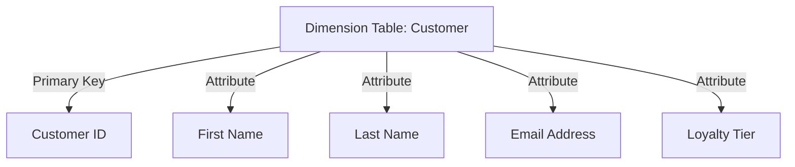
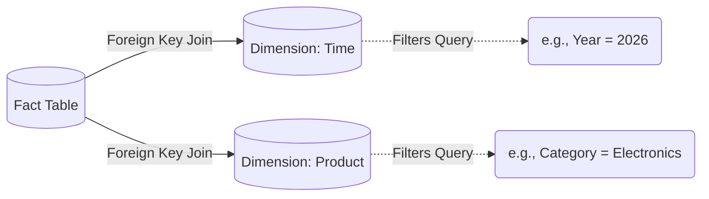

# Dimension Table

## Core Definition

In dimensional modeling, a Dimension Table is a companion table to a Fact Table. While fact tables contain the quantitative numbers (the "how much"), dimension tables contain the descriptive, textual context (the "who, what, where, when, and why"). Dimension tables provide the labels used by business users to slice, dice, filter, and group the numerical data in their BI dashboards.

A typical Dimension Table contains:
1.  **A Primary Key (Surrogate Key):** A unique, auto-incrementing integer assigned by the data warehouse specifically for this table. It is strongly recommended *not* to use the operational source system's key (the "Natural Key," like a Social Security Number or a legacy database ID) as the primary key in the data warehouse. 
2.  **Attributes:** Wide, descriptive columns containing text. A `dim_customer` table might have 50 or 100 columns, including `first_name`, `last_name`, `address`, `city`, `state`, `zip_code`, `income_bracket`, and `loyalty_status`.

## Implementation and Operations

Dimension tables are typically heavily denormalized. This means that data redundancy is intentionally introduced to avoid `JOIN` operations. For example, instead of having a `dim_city` table that joins to a `dim_state` table, all of that information is flattened into a single, wide `dim_location` table. This allows query engines to filter data using blazing-fast, single-table table scans.

One of the most critical and universally implemented dimensions is the **Date Dimension**. Instead of relying on SQL date functions (which are notoriously slow and difficult to standardize across different database vendors), data engineers generate a massive table where every single day for the next 50 years is a distinct row. This table includes columns like `is_weekend`, `is_holiday`, `fiscal_quarter`, and `day_of_week`. When analysts need to run a report for "Total Sales on Weekends in Q3," they simply join the fact table to the Date dimension and filter where `is_weekend = TRUE`. 

Unlike fact tables, which are narrow and contain billions of rows, dimension tables are typically very wide (many columns) but relatively short (thousands or millions of rows).

## Keys in a Lakehouse

Traditional dimensional modeling uses surrogate keys, integers generated by the warehouse and independent of the source system's natural key. The reasons were solid: source keys can be reused, natural keys may be composite or wide, and Type 2 history requires distinguishing several rows describing the same real entity.

Lakehouse storage complicates the generation step. Iceberg has no sequence generator, and distributed writers cannot cheaply agree on a monotonic counter without coordination that defeats the point of distributed writes.

The common approaches:

- **Hash surrogate keys.** Deterministically hash the natural key with the effective date. Requires no coordination, is reproducible across reruns, and makes backfills idempotent. Costs more bytes than an integer and carries a negligible collision risk with a wide enough hash.
- **Natural keys with an effective date.** Skip surrogates and key rows on the natural key plus validity range. Simpler, and pushes composite join logic into every query.
- **Generated keys from a single writer.** Retains the classic model at the cost of a serialized step in the pipeline.

Hash keys have become the common default, mostly because they survive reruns unchanged, which matters when pipelines are retried.

### Junk Dimensions

Low-cardinality flags and indicators tend to accumulate: order priority, a gift-wrap flag, a channel code. Each is too small to justify a dimension and cluttering the fact with all of them is unappealing.

A junk dimension holds the observed combinations of these attributes as one table, with the fact carrying a single key into it. Twenty flags with a few values each rarely produce anything close to the theoretical number of combinations, since most combinations do not occur in practice.

### Keeping Dimensions Broadcastable

The performance property that makes stars fast is dimensions small enough to broadcast. That is worth protecting deliberately: keeping rarely used wide text out of the main dimension, splitting rapidly changing attributes into a mini-dimension, and expiring rows that no fact references any longer.

A dimension that grows past the broadcast threshold changes the query plan for every query that touches it, which tends to be noticed as a general slowdown rather than traced to the dimension.

## Visual Architecture

### Diagram 1: Conceptual Architecture

### Diagram 2: Operational Flow

