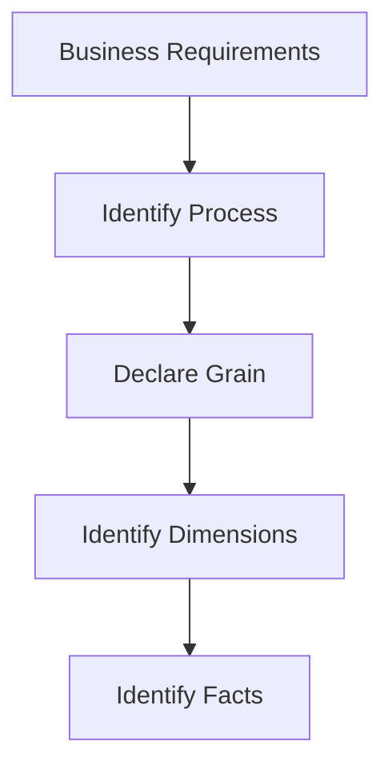
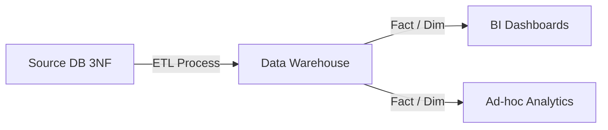

# Dimensional Modeling

## Core Definition

Dimensional Modeling is a specialized data design methodology primarily utilized for data warehouses, data marts, and modern data lakehouses. Pioneered by Ralph Kimball in the 1990s, it represents a radical departure from the Entity-Relationship (3NF) modeling used by software developers for operational, transactional applications.

The fundamental philosophy of dimensional modeling is that data must be structured explicitly to be fast for analytical queries and easily understandable by non-technical business users. It completely abandons the goal of eliminating data redundancy (normalization) in favor of query simplicity and speed, resulting in structures like the Star Schema.

## Implementation and Operations

Kimball defined a rigorous, 4-step process for designing a dimensional model:
1. **Identify the Business Process:** What is the business doing? (e.g., processing an order, handling an insurance claim, logging a website click). The model must focus on a specific process, not a department.
2. **Declare the Grain:** This is the most critical step. The grain is the exact level of detail represented by a single row in the Fact table. (e.g., "One row represents one item scanned at the register," or "One row represents the total daily sales for a store"). Mixing grains in a single fact table is catastrophic.
3. **Identify the Dimensions:** How do business users describe the data resulting from the process? This defines the dimension tables (e.g., Date, Product, Customer, Store, Employee). These are the nouns of the business.
4. **Identify the Facts:** What is the process measuring? This defines the numeric columns in the fact table (e.g., Quantity Sold, Dollar Amount, Discount). These must be measurable and aggregatable.

By strictly adhering to this methodology, data engineering teams create systems where business analysts can drag-and-drop fields in BI tools with absolute confidence that the `SUM(Revenue)` will always be mathematically accurate, regardless of which dimensions they are filtering by.

## Declaring the Grain First

The first decision in dimensional modeling is the grain: what exactly one row of the fact table represents. Everything else follows, and most modeling failures trace back to this step being skipped or left ambiguous.

"One row per order" and "one row per order line" are different grains producing different tables. Mixing them, so that some rows are orders and some are lines, produces a table where no aggregation is correct, because summing a measure double counts for some rows and not others.

The grain should be stateable in one sentence without conjunctions. "One row per shipment per item" is a grain. "One row per order, and also summary rows per customer" is two tables described as one.

### Conformed Dimensions

The property that makes a warehouse coherent rather than a collection of tables is conformed dimensions: the same dimension, with the same keys and the same meaning, shared across multiple facts.

When `dim_date` and `dim_customer` are conformed, a sales fact and a support fact can be compared by customer and period, because both mean the same thing by those terms. When each fact carries its own idea of a customer, the comparison requires reconciliation that is done differently by each person who attempts it.

This is the part of Kimball's method that survives most intact into the lakehouse era, and it is essentially what a semantic layer formalises.

### Does It Still Apply

The counter-argument is that dimensional modeling was shaped by constraints that no longer bind. Storage was expensive, joins were slow, schema changes were painful, and modeling was partly a response to those.

Two things kept the method relevant. First, the constraints that produced it were only partly technical; declaring the grain and conforming dimensions are about agreeing what the data means, which no storage format resolves. Second, the arrival of agents raised the value of explicit structure. A model that can tell an agent which table holds revenue, at what grain, and which customer dimension is authoritative is more useful than a lake of tables with plausible names.

### What Changed

Schema evolution being cheap means models can be revised rather than designed exhaustively up front. Adding a column to an Iceberg table is a metadata operation, so the cost of getting a model slightly wrong and correcting it later has fallen substantially. Modeling has moved from a design phase to an ongoing practice.

## Visual Architecture

### Diagram 1: Conceptual Architecture

### Diagram 2: Operational Flow

