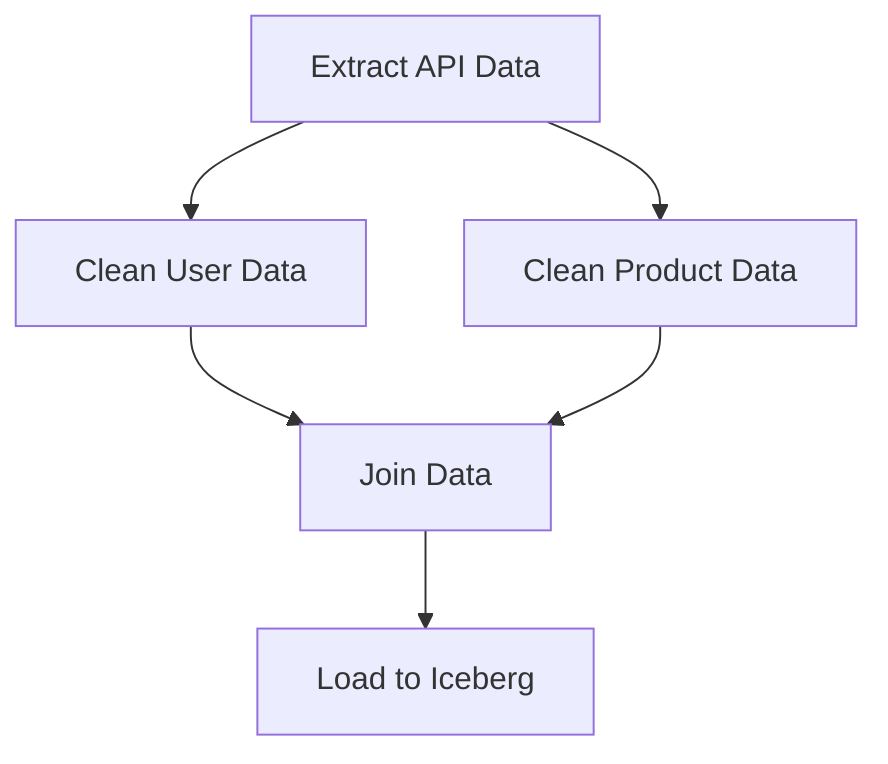
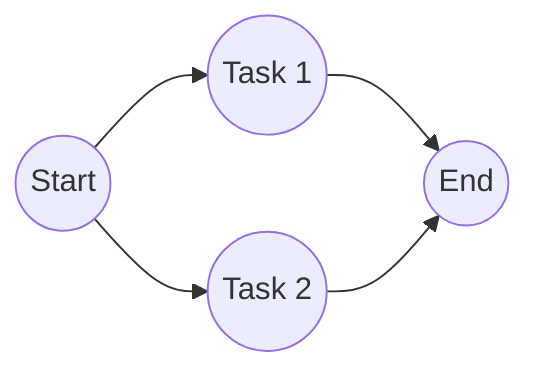

# Directed Acyclic Graph (DAG)

## Core Definition

A Directed Acyclic Graph (DAG) is a conceptual mathematical model heavily utilized in computer science, specifically within the area of data engineering and workflow orchestration. Breaking down the term:
- **Graph:** A collection of nodes (representing tasks or data entities) connected by edges (relationships).
- **Directed:** The edges have a specific direction. They are not two-way streets. An arrow points from Node A to Node B, indicating that A must happen before B.
- **Acyclic:** There are no cycles or loops. If you follow the arrows from any node, you can never return to that same node.

In the context of the open data lakehouse and modern data pipelines, a DAG represents a data workflow. Each node in the DAG is a specific computational task (e.g., "Extract CSV from S3," "Run Spark SQL Transform," "Publish to Apache Iceberg table"). The directed edges represent the dependencies between these tasks. The acyclic nature guarantees that the pipeline has a clear beginning and end, preventing infinite execution loops.

## Implementation and Operations

When an orchestration engine like Apache Airflow, Dagster, or Prefect executes a data pipeline, it essentially traverses the DAG. The engine identifies nodes that have no incoming dependencies (the "Start" tasks) and executes them in parallel. As those tasks complete, the engine traverses the directed edges, enabling and executing the subsequent dependent tasks.

If a task in the DAG fails (for example, due to a network timeout when connecting to a database), the orchestrator marks that node as "Failed." Because it is a directed graph, the orchestrator instantly knows exactly which downstream tasks rely on that failed node, and it halts their execution (often marking them "Upstream Failed") while allowing unrelated, parallel branches of the DAG to continue running to completion.

## Why Acyclic Is the Load-Bearing Word

The value of a DAG comes from the prohibition on cycles rather than from the graph structure itself.

A graph without cycles can be topologically sorted, meaning its nodes can be arranged in a linear order where every node appears after everything it depends on. That guarantee is what makes the rest possible: an executor can determine a valid execution order, identify which nodes are independent and therefore parallelisable, and know that the work terminates.

Introduce one cycle and all of that fails at once. There is no valid ordering, no way to decide what runs first, and no guarantee of termination. This is why orchestrators reject cycles at definition time rather than discovering them during a run.

### The Cost of the Restriction

The restriction is real and occasionally inconvenient. Iteration until a condition is met, such as "retry the model until quality passes", is not directly expressible, because that is a cycle.

The usual accommodations are to move the loop inside a single node, so the graph sees one task that internally iterates, or to unroll the loop into a fixed number of nodes, or to have a run conditionally trigger a subsequent run, which makes each individual run acyclic even though the overall behavior repeats.

### DAGs Elsewhere in the Stack

The same structure appears at several layers, which is worth noticing because the vocabulary carries across:

- **Orchestration.** Nodes are tasks, edges are ordering dependencies.
- **Query planning.** A query plan is a DAG of relational operators, and the optimizer rewrites it while preserving semantics.
- **Transformation tools.** dbt derives a DAG from `ref()` calls between models.
- **Distributed execution.** Spark builds a DAG of stages separated by shuffle boundaries.

In every case the reasoning is identical: express the dependencies, forbid cycles, and let the system derive a valid order rather than requiring one to be specified.

## Visual Architecture

### Diagram 1: Conceptual Architecture

### Diagram 2: Operational Flow

