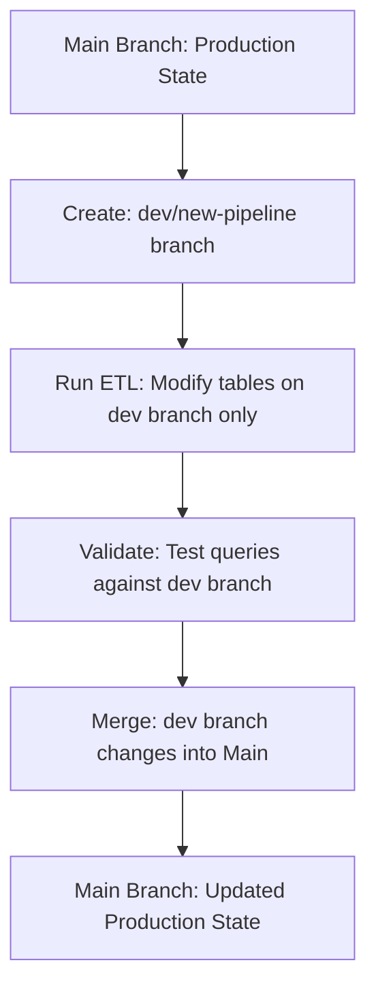
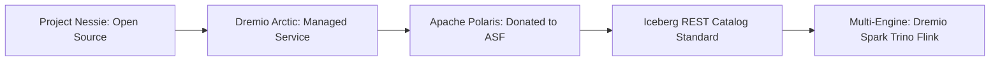

# Dremio Arctic

## Core Definition

Dremio Arctic was a managed data catalog service offered by Dremio, built on the open-source Project Nessie, that provided Git-for-data capabilities for Apache Iceberg tables. Arctic enabled data engineers to create isolated branches of their data lakehouse for development and testing, merge changes back to production with full audit trails, and tag specific table states for reproducibility — bringing software engineering best practices like branching, merging, and tagging directly to data management.

Arctic represented Dremio's pioneering entry into the multi-table transaction and catalog-level versioning space, and its concepts became foundational to the broader Iceberg catalog ecosystem. In 2024, Dremio donated the Polaris Catalog project to the Apache Software Foundation, evolving the Arctic philosophy into the open-standard Apache Polaris REST catalog, which has become the emerging industry standard for Iceberg catalog management.

## Historical Context

The concept of "Git for data" — applying source code version control paradigms to data assets — had been discussed in the data engineering community for years. While Apache Iceberg provided snapshot-level versioning within individual tables (enabling time travel and rollback on a per-table basis), there was no standard mechanism for coordinating multi-table transactions or creating isolated "branches" that contained consistent versions of many related tables simultaneously.

Dremio Arctic (powered by Project Nessie, an open-source implementation of the Git-for-data concept co-created by Alex Merced and the Dremio engineering team) solved this by making the catalog itself versionable. Rather than tables being independent entities with their own snapshot histories, the catalog state — the complete view of all tables, their schemas, and their current snapshot pointers — could be branched, modified in isolation, and merged back to the main branch.

## Core Capabilities

**Branching:** Data engineers could create named branches of the Arctic catalog — `development`, `feature/new-etl-pipeline`, `testing/ml-training-2026-Q1` — that initially pointed to the same table snapshots as the main branch. Operations on a branch (inserting data, running ETL, updating table statistics) modified only the branch's catalog state, leaving main and other branches completely unaffected.

**Isolation:** Work in progress on a development branch was completely invisible to production queries running against the main branch. This eliminated the operational risk of in-flight data transformations impacting live dashboards and reports — a major pain point in traditional data engineering workflows.

**Merging:** After validating new data or schema changes on a development branch, engineers could merge the branch back to main. The merge operation updated main's catalog state to reflect all the changes made on the development branch — analogous to a Git pull request merge.

**Tagging:** Specific catalog states could be tagged for permanent reference: `v2025-Q3-close` would forever point to the exact table snapshots corresponding to the Q3 fiscal close. AI models trained against a tagged snapshot could be reproduced months later using the same data, even after the underlying tables had been updated.

**Time Travel Across Tables:** Arctic's branching model enabled consistent cross-table time travel — querying all tables as they existed at a specific past point in time, with guaranteed consistency across the entire query. This was impossible with Iceberg's per-table snapshot isolation alone, which could produce inconsistent results when joining tables whose snapshots were advanced at different times.

## Evolution to Apache Polaris

In 2024, Dremio open-sourced and donated the Polaris Catalog — an Iceberg-native REST catalog with a governance and multi-catalog federation model — to the Apache Software Foundation. Apache Polaris represents the next generation of the Arctic philosophy: a fully open-source, standard Iceberg REST catalog implementation with catalog-level access control, credential vending, and multi-engine interoperability.

The REST catalog standard (part of the Apache Iceberg REST specification) defines a vendor-neutral HTTP API that any Iceberg-compatible engine can use to discover and interact with Iceberg tables. Apache Polaris implements this API with enterprise-grade governance features, making it the natural successor to Arctic for organizations building open data lakehouses.

## Project Nessie: The Open-Source Foundation

Project Nessie (nessie.projectnessie.org) remains an active open-source project providing a transactional catalog server with Git-like branching semantics. Nessie is available as:

- A standalone server deployable on Kubernetes or as a Docker container.
- An integration within Dremio for Git-for-data workflows.
- The catalog backend for various data lakehouse deployments.

Nessie uses a version store (backed by DynamoDB, MongoDB, JDBC, or RocksDB) to record catalog states as a Directed Acyclic Graph (DAG) of commits, analogous to Git's object model.

## Legacy and Impact

Dremio Arctic and Project Nessie were early validators of the Git-for-data paradigm that is now becoming mainstream across the lakehouse ecosystem. The concepts they pioneered — catalog branching, multi-table transactions, tagged snapshots, and isolated development environments for data — are now present in or being adopted by Delta Lake (with Unity Catalog's multi-table transaction support), Apache Iceberg REST catalogs, and Apache Polaris.

The data engineering field owes a significant debt to Arctic's vision of treating data infrastructure with the same engineering rigor applied to software development: version control, isolation, reproducibility, and merge-based collaboration.

## Visual Architecture

### Diagram 1: Arctic Git-for-Data Branching

### Diagram 2: Evolution from Arctic to Polaris

