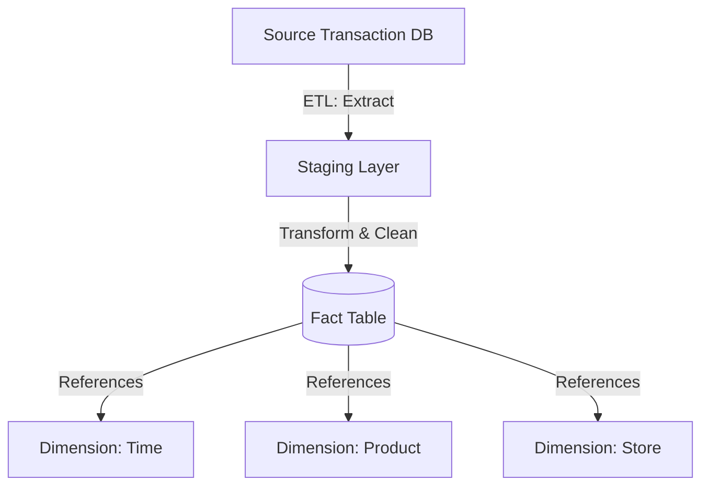
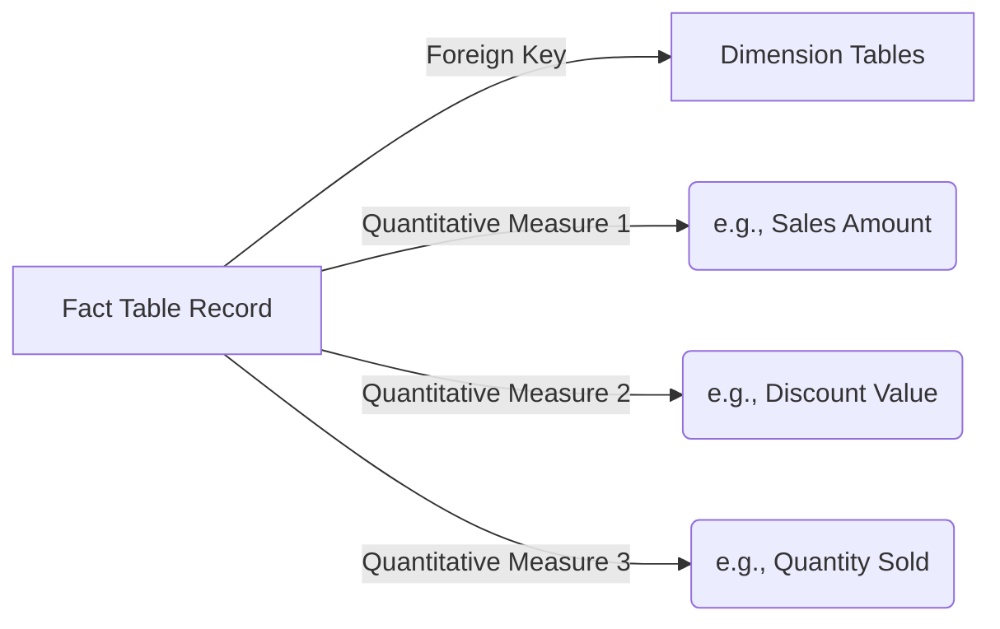

# Fact Table

## Core Definition

In dimensional modeling and data warehousing (specifically within a Star Schema or Snowflake Schema), a Fact Table is the central table that stores the quantitative, measurable data about a business event. If dimensions are the "nouns" of a business (who, what, where, when), the facts are the "verbs" (how much, how many). 

A Fact Table is characterized by two primary types of columns:
1.  **Foreign Keys:** These columns link back to the primary keys of the surrounding Dimension tables. For example, a `time_id`, `product_id`, and `customer_id`. The combination of these foreign keys often acts as the composite primary key for the fact table itself.
2.  **Measures (Facts):** These are the numerical, quantitative values associated with the event. For example, `quantity_sold`, `total_revenue`, or `tax_amount`. 

## Implementation and Operations

Fact tables generally fall into three distinct architectural categories based on how they record business processes:
1.  **Transaction Fact Tables:** The most common type. A row is inserted for every single atomic event that occurs (e.g., one row for every item scanned at a grocery store checkout). These tables are massive, often containing billions of rows, but they provide the highest level of granular detail, allowing analysts to aggregate data in any conceivable way.
2.  **Periodic Snapshot Fact Tables:** These tables take a "picture" of a business process at a specific interval. For example, a bank might use a periodic snapshot table to record the exact balance of every checking account at 11:59 PM every single night. Even if no transactions occurred that day, a row is still recorded. This is critical for trend analysis over time.
3.  **Accumulating Snapshot Fact Tables:** Used for processes that have a defined beginning, middle, and end (e.g., order fulfillment). A single row is created when the order is placed. As the order moves through the pipeline (Packed, Shipped, Delivered), that *same* row is updated with new timestamps and metrics. 

The cardinal rule of fact tables is additive behavior. Measures should ideally be fully additive (like `revenue`, which can be summed across any dimension). Semi-additive measures (like `account_balance`, which can be summed across accounts but *not* across time) or non-additive measures (like `profit_margin_percentage`) require significantly more careful handling by analysts.

## Measures and Their Additivity

A fact table's measures divide into three kinds, and knowing which is which prevents a category of quietly wrong results.

**Additive** measures can be summed across every dimension. Sales amount and quantity sold are additive: summing across products, stores, and dates all produce meaningful numbers.

**Semi-additive** measures can be summed across some dimensions but not time. Account balance and inventory on hand are the standard examples. Summing balances across accounts gives total balance; summing the same account's balance across days gives a number with no meaning. These are usually averaged or taken at a period end over time.

**Non-additive** measures cannot be summed at all. Ratios, percentages, and unit prices fall here. The correct approach is to store the components and compute the ratio after aggregating, since the average of ratios is not the ratio of averages.

Storing a non-additive measure without recording that it is non-additive is one of the most reliable ways to produce a dashboard that is confidently wrong. This is precisely the kind of fact a semantic layer exists to record.

### Degenerate Dimensions

Some attributes belong on the fact and have no dimension table: order numbers, invoice numbers, transaction references. They are dimensional in character, being used for grouping and filtering, but there is nothing to describe beyond the identifier itself.

Creating a dimension table containing only a key and the same key as an attribute adds a join and no information. Keeping the value on the fact is the accepted approach.

### Factless Fact Tables

Some facts record that something happened without any measure. Attendance, eligibility, and promotional coverage are events worth counting where there is nothing to sum.

These tables hold only keys, and questions are answered by counting rows or by identifying absence. Coverage questions, such as which products were on promotion but sold nothing, require a factless table alongside the sales fact, because the sales fact has no rows for what did not sell.

### Sizing on a Lakehouse

Fact tables are where the volume lives, and their physical treatment matters more than dimensions. Partitioning on a date derived from the fact's own timestamp, sorting on the highest-selectivity filter column, and keeping compaction current are the three settings that most affect query cost.

## Visual Architecture

### Diagram 1: Conceptual Architecture

### Diagram 2: Operational Flow

