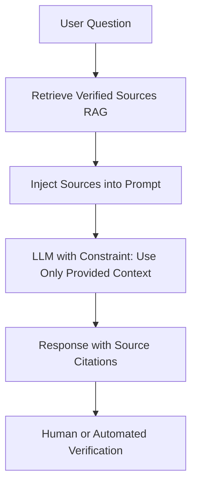
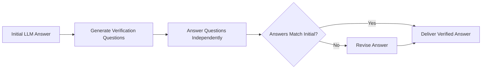

# Hallucination Mitigation

## Core Definition

Hallucination in Large Language Models refers to the generation of content that is factually incorrect, unverifiable, or entirely fabricated, but presented with the same fluent, confident tone as accurate information. An LLM that "hallucinates" might cite a research paper that does not exist, state that a company's revenue was $2.4 billion when it was actually $1.8 billion, or claim that Apache Iceberg supports a specific API that was never implemented.

Hallucination is not a bug in the traditional software sense: it is an emergent property of how LLMs are trained. LLMs are probabilistic text generators trained to predict the next most likely token given all previous tokens. When the model encounters a question whose answer is not well-represented in its training data, it does not stop and say "I don't know": it continues generating the statistically most likely continuation, which may be plausible but wrong.

Hallucination mitigation is therefore not about fixing a bug but about architectural and operational choices that constrain LLM outputs to verified, retrievable facts.

## Types of Hallucinations

**Factual Hallucinations:** The model states a verifiably false fact. "Dremio was founded in 2010" (it was 2012). "Apache Iceberg was created by Netflix" (it was Apache Software Foundation, originated at Netflix).

**Fabricated Citations:** The model cites non-existent research papers, articles, or documentation with plausible-sounding authors, titles, and publication venues. Extremely common and dangerous in analytical contexts where cited sources are expected to be verifiable.

**Intrinsic Hallucinations:** The model contradicts information provided in its own context window. If the retrieved document states "Q3 revenue was $4.2 billion" and the model summarizes it as "$4.8 billion," it has contradicted the source document.

**Extrinsic Hallucinations:** The model adds information not present in the source context without indicating it is going beyond what was provided. The source says "revenue increased"; the model says "revenue increased by 15%, driven primarily by APAC electronics sales."

**Confabulation:** The model produces a coherent, internally consistent narrative that is entirely fictional. Most dangerous when it involves confident statements about specific data values, dates, or individuals.

## Root Causes

**Training Data Gaps:** For topics underrepresented in training data, the model has weak, inconsistent signal about the correct answer and resorts to statistical interpolation of related patterns.

**Knowledge Cutoff:** Events after the training cutoff date are completely unknown to the model. Any question about recent events will either be deflected or, more dangerously, confidently hallucinated.

**Context-Knowledge Conflict:** When the model's training data conflicts with context provided in the prompt, the model must balance the two signals. Imperfect attention mechanisms sometimes cause the model to default to training knowledge rather than the explicitly provided context.

**Decoding Temperature:** Higher temperature settings (which increase randomness in token sampling) increase creative generation but also increase hallucination rates. Production analytical systems should use low temperature (0.0-0.3) to maximize factual fidelity.

## Mitigation Strategies

**Retrieval-Augmented Generation (RAG):** The most widely deployed mitigation. Ground every LLM response in explicitly retrieved, verifiable source documents. Instruct the model to use only the provided context and to explicitly state when it cannot find the answer in the context rather than generating from training knowledge. RAG does not eliminate hallucination but dramatically reduces factual errors by providing authoritative source material.

**Source Citation Requirements:** Require the model to cite the specific source document, table row, or data record that supports each factual claim. Claims without citable sources are flagged as uncertain or omitted. This forces the model to link each assertion to retrievable evidence and gives human reviewers a direct path to verification.

**Chain-of-Verification (CoVe):** A post-generation verification loop: (1) Generate an initial answer. (2) Generate a list of factual questions that could verify the claims in the answer. (3) Answer each verification question independently (without seeing the original answer). (4) If verification answers contradict the original answer, revise. CoVe dramatically reduces intrinsic hallucinations.

**Self-Consistency Decoding:** Generate multiple independent responses to the same question at higher temperature, then take a majority vote of the factual claims across responses. Claims that appear consistently across many independent generations are more likely to be accurate than claims that appear in only one response.

**Constitutional AI and RLHF Alignment:** Fine-tune models with reinforcement learning from human feedback to penalize hallucinations and reward appropriate expressions of uncertainty ("I don't know," "The provided data does not contain this information"). Well-aligned models like Claude 3.5 Sonnet have substantially lower hallucination rates than less aligned models.

**Structured Output Constraints:** Require the model to produce structured JSON outputs with a `confidence` field and `sources` array for each factual claim. Low-confidence claims are automatically flagged for human review before being surfaced to end users.

**Grounding with SQL Results:** For numerical claims about enterprise data, require the model to generate and execute a SQL query that retrieves the exact figure from the data lakehouse, rather than relying on training data or even retrieved documents. A SQL query against Dremio over an Iceberg table returns an exact, auditable number with zero hallucination risk.

## Detection Methods

**LLM-as-Judge:** A separate, independent LLM evaluates the first LLM's output against the source context, scoring each factual claim for faithfulness (Is this claim supported by the provided context?) and relevance (Is this claim related to the question asked?). Automated faithfulness scoring using models like RAGAS enables continuous hallucination monitoring in production RAG systems.

**Fact-Checking Pipelines:** Extracted factual claims are checked against structured data sources (databases, knowledge graphs) and authoritative external APIs programmatically. Discrepancies trigger alerts and revision requests.

**Human-in-the-Loop Review:** For high-stakes analytical outputs (regulatory reports, financial projections, external communications), human expert review of AI-generated content before publication remains the gold standard for hallucination prevention.

## Visual Architecture

### Diagram 1: RAG-Grounded Generation to Reduce Hallucination

### Diagram 2: Chain-of-Verification Loop

