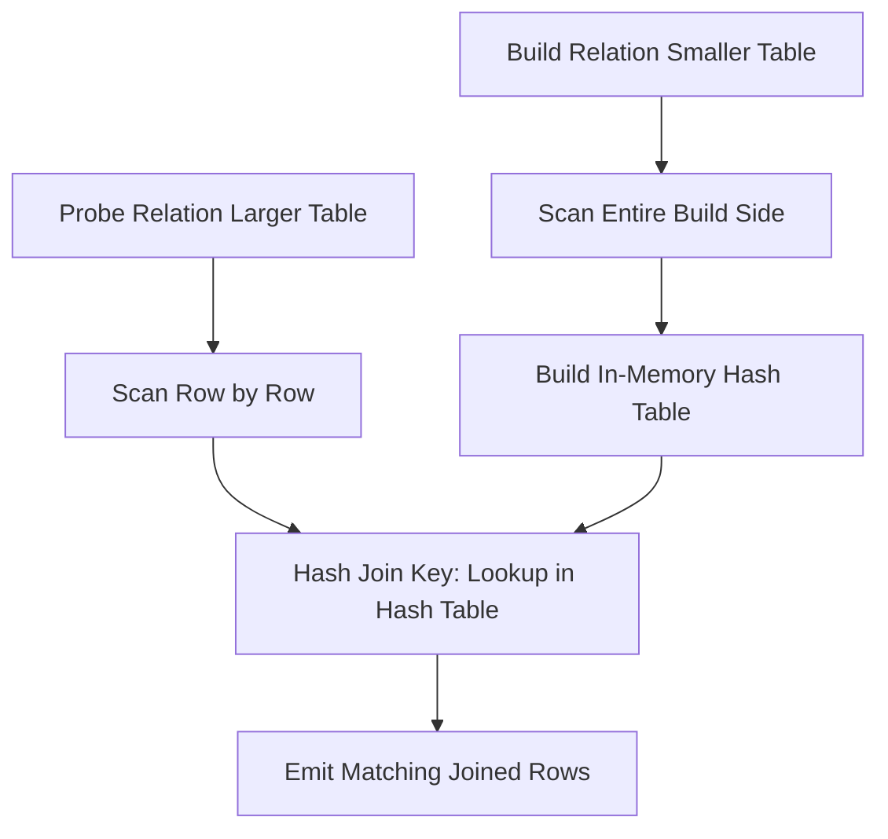
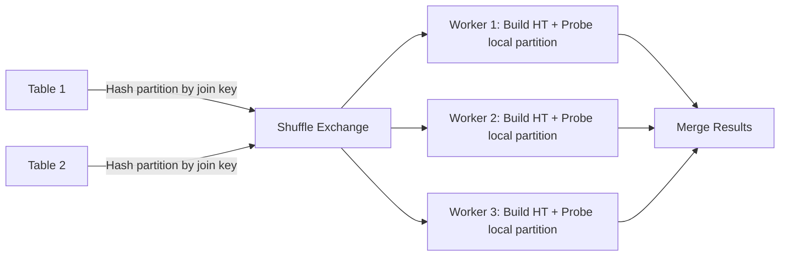

# Hash Join

## Core Definition

A Hash Join is a join algorithm that uses a hash table to match rows from two input relations based on their join key values. It is the dominant join algorithm for equi-joins (joins using the `=` operator) in analytical databases and distributed query engines when neither input is small enough for a broadcast join and the inputs are not pre-sorted on the join key.

Hash joins offer O(n+m) expected complexity (linear in the total input size) with an O(min(n,m)) space requirement for the hash table, making them efficient for large joins that do not fit the specialized conditions of broadcast or sort-merge joins.

## The Classic Two-Phase Algorithm

**Phase 1 — Build Phase:** The smaller of the two join inputs (the "build relation" or "inner relation") is scanned entirely and loaded into an in-memory hash table. For each row, the join key columns are hashed to produce a bucket index, and the row is inserted into that bucket.

The hash function must distribute keys uniformly across buckets to minimize collision chains. Modern hash join implementations use 64-bit hash functions (xxHash, MurmurHash3) that produce low collision rates even for structured keys like integers and UUIDs.

**Phase 2 — Probe Phase:** The second (larger) input relation (the "probe relation" or "outer relation") is scanned row by row. For each probe row, the join key is hashed using the same hash function, the corresponding hash table bucket is located, and all rows in that bucket are compared with the probe row for key equality. Matching rows are joined and emitted to the output.

After probing all probe rows, the join is complete. The hash table is discarded.

**Complexity:**
- Build phase: O(n) time, O(n) space where n = build relation rows
- Probe phase: O(m) time where m = probe relation rows
- Total: O(n+m) time, O(n) space

## Distributed Hash Join (Shuffle Hash Join)

In a distributed query engine, a naive hash join can only work within a single machine's memory. To join tables larger than a single node's RAM, distributed engines use a Shuffle Hash Join:

**Step 1 — Partition Shuffle:** Both input relations are partitioned by hashing each row's join key to a partition ID (from 0 to num_workers-1). Each row is sent to the worker responsible for its partition ID. After the shuffle, all rows with the same join key value are guaranteed to be on the same worker.

**Step 2 — Local Hash Join:** Each worker independently performs a classic hash join on its locally received partition of both inputs. Workers do not need to communicate with each other during this phase.

The shuffle step is the most expensive part of a distributed hash join — it requires serializing all rows, sending them over the network, and deserializing them on receiving workers. For large tables, this network transfer dominates query latency.

## Hash Table Memory Management

The build phase requires fitting the entire build relation into the hash table in memory. For very large build relations, this is infeasible. Modern query engines handle oversized hash tables through **grace hash join**:

**Grace Hash Join:** Before building the hash table, both inputs are partitioned into smaller files on disk using the join key hash. Only one file pair (build partition + probe partition) is loaded into memory at a time, joined, and written to output. The next file pair is loaded, joined, and so on. This requires 2-3 disk passes over the data but bounds memory usage to the partition size rather than the total relation size.

In distributed systems, "spilling to disk" — writing hash table partitions that don't fit in RAM to local SSD — enables graceful handling of data larger than available memory at the cost of significantly increased query latency.

## Semi-Join and Anti-Join Variants

**Semi-Join:** Returns rows from the left table that have at least one matching row in the right table (`WHERE EXISTS` or `IN` subquery). The hash table only needs to store join keys (not full rows), halving memory usage compared to a full join.

**Anti-Join:** Returns rows from the left table that have no matching row in the right table (`WHERE NOT EXISTS` or `NOT IN`). Useful for finding customers who have never placed an order, or for identifying orphaned records in data quality workflows.

**Hash Semi/Anti Join in Iceberg DELETE:** Apache Iceberg's position delete optimization uses a hash join internally: the delete file (containing positions of rows to delete) is loaded into a hash table, and the data file is probed to mark matching positions for deletion during merge-on-read operations.

## Optimizing Hash Joins in the Lakehouse

**Accurate Statistics:** The optimizer must correctly identify the smaller input as the build side. If statistics are stale and the optimizer chooses the larger relation as the build side, the hash table may exceed available memory and spill to disk unnecessarily. Maintaining accurate Iceberg table statistics via periodic `ANALYZE TABLE` prevents this.

**Pre-Aggregation on Build Side:** For joins followed by aggregations, pushing partial aggregation before the shuffle reduces the volume of data that must be shuffled. Aggregating 1 billion rows down to 1 million distinct keys before shuffling reduces network traffic 1000x.

**Hash Table Sharing:** For queries joining the same build table multiple times (star schema queries joining one fact table to 5 dimension tables all using the same dimension), some query engines share a single broadcast hash table across all join probes rather than building it separately for each.

## Visual Architecture

### Diagram 1: Two-Phase Hash Join

### Diagram 2: Distributed Shuffle Hash Join

