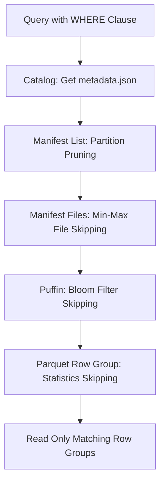
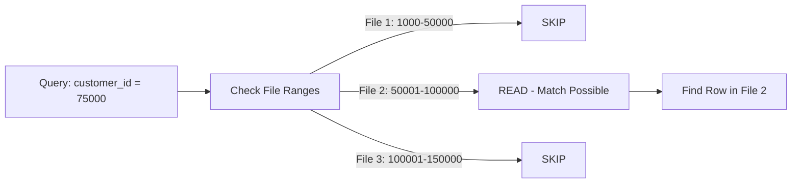

# Indexing (Data Lakes)

## Core Definition

Indexing in the context of data lakes and lakehouses refers to the set of auxiliary data structures that enable query engines to quickly locate relevant data without scanning the entire dataset. Unlike traditional relational databases where indexes are built on heap-organized row data, data lake indexing operates over large collections of columnar Parquet files organized as open table format tables (Apache Iceberg, Delta Lake, Apache Hudi), using metadata structures that guide the query engine to the specific files and row groups containing relevant rows.

Data lake indexing is fundamentally different from B-tree or hash indexing in OLTP databases. OLTP indexes provide O(log n) point lookups into row-level data structures. Data lake indexes provide file-level or row-group-level pruning: skipping large chunks of data at the granularity of files and row groups, not individual rows. This coarser granularity is appropriate because data lake files are immutable and queries scan large ranges rather than seeking individual rows.

## Iceberg's Native Index Architecture

Apache Iceberg provides a layered metadata architecture that functions as a multi-level index:

**Layer 1, Catalog (Table Location):** The catalog (Apache Polaris, AWS Glue, Hive Metastore) stores the current `metadata.json` pointer for each table. This is the entry point for all queries: the catalog lookup takes milliseconds to retrieve the table's current state location.

**Layer 2: Metadata.json (Snapshot Registry):** The `metadata.json` file lists all snapshots of the table and their associated manifest lists. The current snapshot's manifest list pointer is the starting point for query planning.

**Layer 3, Manifest List (Partition-Level Index):** The manifest list enumerates all manifest files for the current snapshot, along with partition statistics (partition value ranges) for each manifest. The query planner uses partition predicates to filter out manifests whose partition ranges cannot contain relevant rows.

**Layer 4, Manifest Files (File-Level Index):** Each manifest file lists data files with column-level statistics: min value, max value, null count, and distinct count for each column in each data file. The query planner evaluates WHERE clause predicates against these per-file statistics to identify files that can be skipped: this is the primary data skipping mechanism.

**Layer 5, Puffin Files (Advanced Indexes):** Optional auxiliary index files (Puffin format) stored alongside data files contain bloom filter indexes for specific columns. These enable equality predicate skipping for high-cardinality columns that don't benefit from min/max statistics.

**Layer 6, Parquet Row Group Statistics:** Within each Parquet file, Row Group metadata in the file footer provides column statistics at the 128MB row-group granularity. Row groups are the finest level of data skipping without reading actual column data.

## Bloom Filter Indexes

Bloom filter indexes are the most powerful optional index type in Apache Iceberg for high-cardinality equality predicates. A bloom filter is a probabilistic data structure that compactly represents a set of values with a configurable false positive rate (typically 1-5%) and zero false negatives.

For a column like `order_id` (a UUID with high cardinality), a bloom filter index tells the query engine for each data file: "order_id X is definitely NOT in this file" (no false negatives) or "order_id X might be in this file" (possible false positive, file must be read to confirm). With a 1% false positive rate, queries filter by `WHERE order_id = 'specific-uuid'` will skip 99% of files, reading only the handful that the bloom filter indicates might contain the value.

Enabling bloom filter indexes in Iceberg:
```sql
-- At table creation
CREATE TABLE db.orders (order_id STRING, ...) 
USING iceberg
TBLPROPERTIES (
  'write.parquet.bloom-filter-enabled.column.order_id' = 'true',
  'write.parquet.bloom-filter-fpp.column.order_id' = '0.01'
);
```

## Sorted Data as a Natural Index

When Iceberg data files are written with rows physically sorted by a column (using `SORT BY` or `DISTRIBUTE BY SORT BY` in Spark/Dremio), the min/max statistics for that column within each file form a natural range index:

- File 1: customer_id range [1000 - 50000]  
- File 2: customer_id range [50001 - 100000]
- File 3: customer_id range [100001 - 150000]

A query filtering `WHERE customer_id = 75000` can immediately identify that only File 2 can contain that value, skipping 66% of files with perfect accuracy (zero false positives for sorted data, unlike bloom filters).

Z-ordering and Hilbert curve sorting extend this to multi-column indexes: clustering rows by the Z-order of (latitude, longitude) enables efficient spatial queries that filter on both coordinates simultaneously.

## Secondary Indexes: Emerging Capabilities

While traditional data lakes lacked true secondary indexes beyond partition pruning and statistics-based file skipping, the lakehouse ecosystem is developing more sophisticated indexing capabilities:

**Iceberg Puffin Statistics (Statistics Blob Types):** The Puffin format is extensible. Beyond bloom filters, future Iceberg versions may support NDV (Number of Distinct Values) sketches (HyperLogLog), quantile sketches (TDigest), and other statistical summaries that enable more accurate cardinality estimation during query planning.

**Apache Hudi Record-Level Index (RLI):** Hudi's Record-Level Index maintains a global mapping from each record key to its exact file path and row position. This enables O(1) point lookups for specific records: much more precise than file-level skipping. Particularly valuable for MoR tables with CDC workloads where specific record updates must be quickly located.

**External Indexes (Elasticsearch, OpenSearch):** Some organizations maintain secondary indexes for specific high-frequency lookup patterns in Elasticsearch, synchronized with the lakehouse via CDC. The Elasticsearch index resolves point lookups to specific Iceberg file paths, which are then directly opened for retrieval. This hybrid architecture provides OLTP-like key lookup performance over OLAP-scale data.

## Dremio Reflections as Materialized Indexes

Dremio's Reflections serve as a form of pre-computed semantic index: pre-aggregated results organized by common query dimensions are stored as Iceberg tables. When a query matches a Reflection's aggregation pattern, the optimizer redirects the query to the Reflection, which may be orders of magnitude smaller than the base table. Effectively, Reflections are multi-dimensional aggregation indexes that Dremio's optimizer transparently maintains and exploits.

## Visual Architecture

### Diagram 1: Iceberg Multi-Level Index



### Diagram 2: Sorted Data as Range Index


