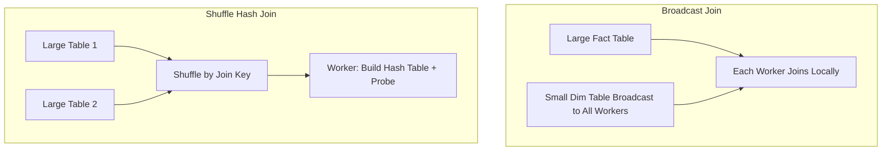
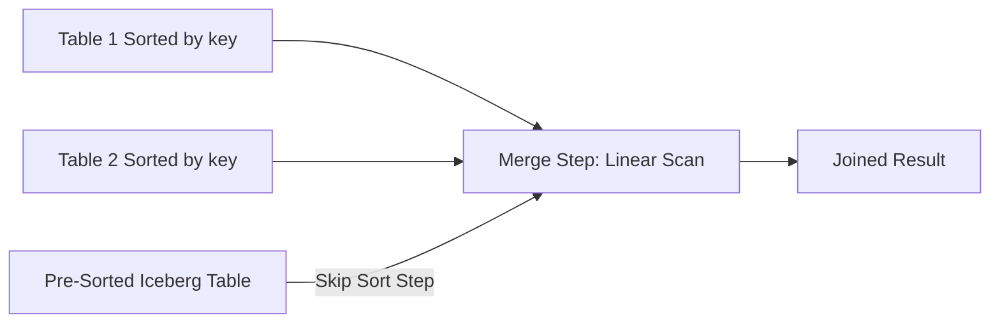

# Join Strategies

## Core Definition

A Join Strategy is the specific algorithm a query engine uses to physically implement a SQL JOIN operation: matching rows from two (or more) tables based on a join condition. Different algorithms have dramatically different performance characteristics depending on the size, distribution, and sort order of the input tables. Choosing the wrong join strategy is one of the most common causes of unexpectedly slow analytical queries.

Modern distributed query engines (Dremio, Trino, Apache Spark) implement multiple join algorithms and rely on the Cost-Based Optimizer (CBO) to select the most efficient algorithm for each join in a query plan based on table statistics. Understanding when each algorithm is appropriate helps data engineers write better queries, design better data models, and interpret EXPLAIN plans to diagnose performance issues.

## Broadcast Join (Map-Side Join)

**Algorithm:** The smaller ("build") table is fully replicated and broadcast to every worker node in the cluster. Each worker then independently joins its partition of the larger ("probe") table against its local copy of the build table, with no network shuffle required for the probe side.

**Advantages:** Zero network shuffle of the probe side (the large table). Very fast for joins where one side is small. Highly parallelizable: all workers join independently without coordinating.

**Disadvantages:** The entire build table must fit in each worker's memory (typically limited to 100MB-1GB configurable threshold). Broadcasting large tables to all workers consumes significant network bandwidth and memory.

**When to Use:** When one join input is small enough to fit in memory and the other is very large. Classic example: joining a 1 billion row fact table to a 10,000 row dimension table. Always prefer broadcast join for this pattern.

**Iceberg Optimization:** For small Iceberg tables (dimensions, lookup tables), pre-sorting and caching common broadcast tables in the query engine's memory across sessions eliminates the broadcast cost for repeated queries.

## Hash Join

**Algorithm:** The build side (typically the smaller table) is scanned and used to build an in-memory hash table, keyed on the join column(s). The probe side (larger table) is then scanned; for each row, its join key is hashed and looked up in the hash table. Matching rows are joined and emitted.

**Distributed Hash Join (Shuffle Hash Join):** In distributed execution, a preceding shuffle (exchange) operator redistributes both tables so that rows with the same join key end up on the same worker node. Each worker then builds a local hash table from its partition of the build side and probes it with its partition of the probe side.

**Advantages:** Works for arbitrarily large tables (with sufficient memory for the hash table). Handles equi-joins efficiently. Parallelizes well in distributed settings.

**Disadvantages:** Requires a shuffle (expensive network operation) in distributed settings. Hash table must fit in memory; large build sides may require spilling to disk.

**When to Use:** The default join algorithm for most analytical JOIN operations where neither side is small enough to broadcast and the data is not pre-sorted on the join key.

## Sort-Merge Join

**Algorithm:** Both join inputs are sorted by the join key (if not already sorted). The sorted streams are then merged linearly: the merge step walks both sorted sequences simultaneously, advancing the pointer on whichever side has the smaller current key, joining matching rows when both pointers point to rows with equal join keys.

**Advantages:** After sorting, the merge step is a single linear scan with no memory-intensive hash table. If both inputs are already sorted on the join key (e.g., from a prior sort step or because the data is physically sorted in storage), the sort step is eliminated entirely and the merge is O(n+m).

**Disadvantages:** Requires both inputs to be sorted, which is expensive if they are not already sorted. Sorting large datasets requires memory (and spills to disk for very large sorts) plus additional I/O.

**When to Use:** When both inputs are already sorted on the join key (e.g., two time-series tables both sorted by timestamp). Iceberg tables with a sort order spec that matches the join key benefit most: the pre-existing physical sort order eliminates the sorting step.

## Cross Join (Nested Loop Join)

**Algorithm:** For every row in the left table, scan every row in the right table and emit the pair if the join condition is satisfied (or always emit for a CROSS JOIN). O(n×m) complexity.

**When to Use:** Only for genuine CROSS JOINs (Cartesian products) or for very small tables where the O(n×m) cost is tolerable. Should never appear in plans joining large tables, if the optimizer chooses a nested loop join for large tables, it almost always indicates missing join statistics or a missing join predicate.

## Join Reordering

In queries joining multiple tables (3, 5, or 10 tables), the order in which tables are joined has enormous impact on performance. The intermediate result of joining A and B becomes the input to the next join with C, and so on. Joining in an order that produces small intermediate results minimizes memory usage and network traffic.

The CBO uses dynamic programming to search for the optimal join order given estimated row counts and join selectivities from column statistics. Accurate statistics are critical: stale or missing statistics cause the optimizer to choose suboptimal join orders that can produce 100x slower execution plans.

## Visual Architecture

### Diagram 1: Hash Join vs Broadcast Join

### Diagram 2: Sort-Merge Join

