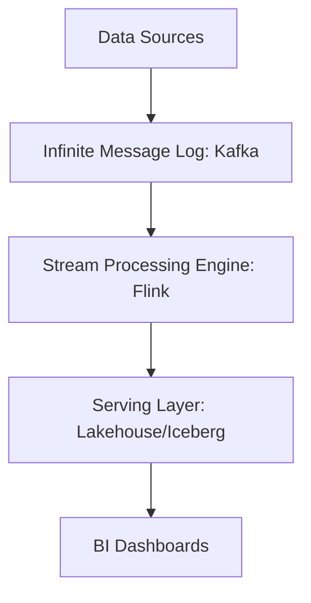
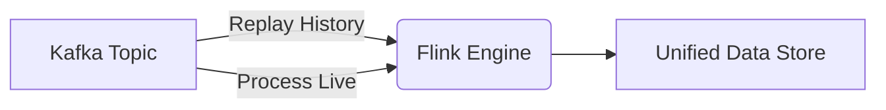

# Kappa Architecture

## Core Definition

Kappa Architecture is a software architecture pattern introduced by Jay Kreps (co-creator of Apache Kafka) as a direct critique and simplification of the highly complex Lambda Architecture. 

The core philosophy of Kappa Architecture is elegant: **Everything is a stream.** 

Instead of maintaining two completely separate codebases and infrastructure stacks for batch and real-time processing, Kappa Architecture proposes using a single Stream Processing Engine (like Apache Flink) to handle *both* real-time events and historical batch processing.

## Implementation and Operations

To implement Kappa Architecture, you require a message broker capable of storing an infinite log of events for long periods of time (e.g., Apache Kafka configured with infinite retention, or Kafka Tiered Storage offloading to Amazon S3).

When new real-time data arrives, the stream processor handles it instantly and updates the Serving Layer. 
The brilliance of Kappa becomes apparent when you need to recalculate history (for example, if a bug is found in the tax calculation logic). In a Lambda architecture, you would fix the bug and run a massive Batch job. In a Kappa architecture, there is no batch job. Instead, you deploy a new, updated version of the streaming job and instruct it to **replay the stream from the beginning of time**. 

The stream processor rapidly consumes the years of historical data stored in Kafka, processing it as quickly as the CPU allows, effectively acting exactly like a batch job. Once it catches up to the present moment, it without extra work transitions back to processing real-time events.

**Tradeoffs:**
Kappa significantly reduces operational complexity by unifying the codebase. The primary challenge is infrastructure cost. Storing petabytes of historical data forever inside a message broker like Kafka is historically much more expensive and difficult to manage than dumping CSV files into a data lake. However, modern innovations like Apache Iceberg and Kafka Tiered Storage are making the Kappa Architecture increasingly viable and popular for modern enterprises.

## One Path, and What It Demands

Kappa architecture responded to Lambda's duplication with a single proposal: process everything as a stream, and handle reprocessing by replaying the stream from the beginning rather than maintaining a separate batch path.

The appeal is that business logic exists once, in one system, with one execution model. Reprocessing after a bug fix means starting a second instance of the job from the earliest offset, letting it build a parallel output, and switching consumers when it catches up.

### The Requirement Most Teams Miss

Kappa depends entirely on the log being a durable, complete, replayable record of history. If the log retains seven days, reprocessing reaches back seven days, and the architecture's central claim fails for anything older.

Retaining the full history in a log is possible with tiered storage, where older segments move to object storage. It is also a substantial operating commitment: the log becomes the system of record rather than a transport, with the durability, access control, and cost that implies.

Where a lakehouse already holds the full history in Iceberg, the log is transport and the table is the record. Reprocessing then reads from the table rather than replaying the log, which is a reasonable design that is no longer Kappa as originally described.

### Where It Fits Well

Kappa suits systems that are genuinely event-driven end to end: the source produces events, the log is the integration point between services, and the analytical output is one consumer among several. In that setting the log is already durable and complete for reasons unrelated to analytics, and Kappa costs nothing extra.

It fits poorly where sources are databases and events are manufactured by CDC purely to feed the pipeline. There the log is an intermediate artefact, and treating an intermediate artefact as the system of record adds a durability obligation for no benefit.

### The Practical Position

The unification Kappa argued for largely happened, through engines that express batch and streaming in one API and through table formats that accept both. Most current architectures are neither Lambda nor Kappa: one codebase, streaming ingestion, batch transformation where latency allows, and a table format as the point where both meet.

## Visual Architecture

### Diagram 1: Conceptual Architecture

### Diagram 2: Operational Flow

