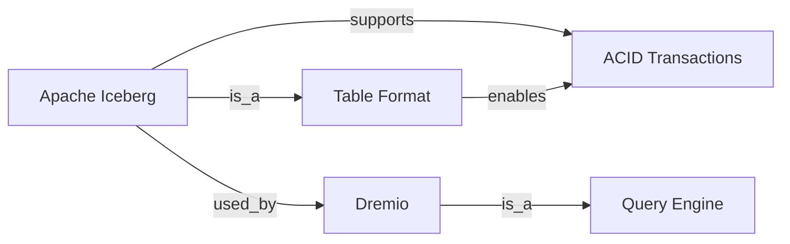
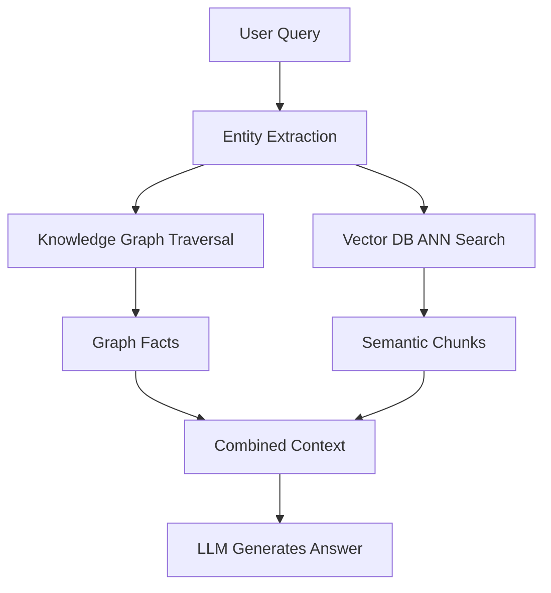

# Knowledge Graphs

## Core Definition

A Knowledge Graph is a structured representation of knowledge as a network of entities and the relationships between them. Each entity (a person, organization, product, event, concept, or data asset) is a node in the graph. Each relationship between two entities (Person A "works for" Company B, Product X "belongs to" Category Y) is a directed edge between the corresponding nodes. The edges are labeled and typed, capturing the semantic meaning of each relationship explicitly.

The term was popularized by Google's 2012 announcement of the Google Knowledge Graph, which powers the information panels shown in search results. But the concept is far older: knowledge representation using semantic networks, ontologies, and description logics has been active in AI research since the 1970s.

Knowledge graphs are distinct from property graphs (like those in Neo4j) and from relational databases. While relational databases organize data into fixed schemas of rows and columns with explicit joins, knowledge graphs are schema-flexible: new entity types and relationship types can be added without restructuring existing data.

## Structure: Triples

The fundamental unit of a knowledge graph is the **triple** (also called a statement or RDF triple):

**Subject — Predicate — Object**

Examples:
- `Apache Iceberg` — `is_a` — `Table Format`
- `Table Format` — `provides` — `ACID Transactions`
- `Dremio` — `supports` — `Apache Iceberg`
- `Alex Merced` — `works_at` — `Dremio`
- `Dremio` — `is_a` — `Query Engine`

A knowledge graph is essentially a very large collection of such triples. The resulting structure can be traversed like a graph, queried using graph query languages, and reasoned over using logical inference engines.

## RDF and the Semantic Web Standard

The W3C standard for representing knowledge graphs on the web is the Resource Description Framework (RDF). In RDF, every entity is identified by a URI (Uniform Resource Identifier), ensuring global uniqueness and interoperability across different knowledge graphs.

SPARQL (SPARQL Protocol and RDF Query Language) is the standard query language for RDF knowledge graphs, analogous to SQL for relational databases. A SPARQL query can traverse graph patterns, filter by property values, apply aggregations, and perform federated queries across multiple knowledge graph endpoints.

## Property Graphs

While RDF/SPARQL is the web standard, many enterprise knowledge graph deployments use the Labeled Property Graph (LPG) model, popularized by Neo4j. In LPGs, both nodes and edges can have key-value properties attached to them. The `works_at` edge between a Person and a Company might have a `start_date` property and a `role` property.

Property graphs are queried using Cypher (Neo4j), Gremlin (Apache TinkerPop), or openCypher. The LPG model is generally more intuitive for developers familiar with object-oriented programming, while the RDF model provides stronger semantic foundations and standardized interoperability.

## Knowledge Graph Construction

Building a knowledge graph from enterprise data sources involves three main approaches:

**Manual Curation:** Domain experts define the ontology (the schema of entity types and relationship types) and manually populate the graph. Produces very high quality but is expensive and slow to scale.

**Automated Extraction (Information Extraction):** NLP pipelines extract entities and relationships from unstructured text (documents, emails, reports) using Named Entity Recognition (NER), Relation Extraction (RE), and coreference resolution models. Modern LLMs are highly effective at this extraction task with appropriate prompting, making automated knowledge graph construction from text corpora practical for the first time.

**Mapping from Structured Sources:** ETL processes map structured data (relational database tables, CSV files, Iceberg tables) to knowledge graph triples using declarative mapping rules (R2RML for relational sources, YARRRML for YAML-based mappings).

## GraphRAG: Knowledge Graphs for LLM Retrieval

The integration of knowledge graphs with Retrieval-Augmented Generation (RAG) systems — called GraphRAG — addresses a fundamental limitation of vector-only retrieval: the inability to perform multi-hop relational reasoning.

Standard vector search retrieves documents that are semantically similar to the query. But some questions require traversing relationships across multiple entities: "Which Dremio customers in the APAC region that use Apache Iceberg have also opened support tickets related to metadata catalog performance in the last 90 days?" This is a 4-hop traversal across Customer, Region, Technology, and Support Ticket entities — impossible with vector similarity alone.

GraphRAG (introduced by Microsoft Research in 2024) extracts a knowledge graph from the document corpus. When a query requires relational reasoning, the system traverses the graph to collect all relevant entity and relationship facts, then injects those structured facts into the LLM's context alongside any vector-retrieved documents. The LLM reasons over both the structured graph facts and the unstructured text context, producing answers with multi-hop relational depth that vector-only RAG cannot achieve.

## Knowledge Graphs in the Data Lakehouse

In the open data lakehouse ecosystem, knowledge graphs serve several critical functions:

**Metadata Knowledge Graph:** The data catalog (Apache Polaris, AWS Glue) can be augmented with a knowledge graph layer that explicitly represents relationships between data assets: Table A `derives_from` Table B, Column C `is_a_metric_defined_as` Expression D, Pipeline E `produces` Table F. This richer relational metadata enables AI agents to trace data lineage, understand metric calculations, and discover related datasets automatically.

**Business Entity Graph:** A knowledge graph of business entities (Customers, Products, Contracts, Suppliers, Employees) with their relationships enables AI agents to answer complex business questions that require traversing multiple business domains: "Show me all customers who purchased discontinued products and have active support contracts expiring this quarter."

**Ontology-Driven Query Generation:** When the AI Text-to-SQL agent has access to a business entity knowledge graph, it can resolve ambiguous natural language references by traversing the graph to identify the correct table and column for each business concept, dramatically improving SQL generation accuracy for complex multi-entity queries.

## Visual Architecture

### Diagram 1: Knowledge Graph Triple Structure

### Diagram 2: GraphRAG Architecture

