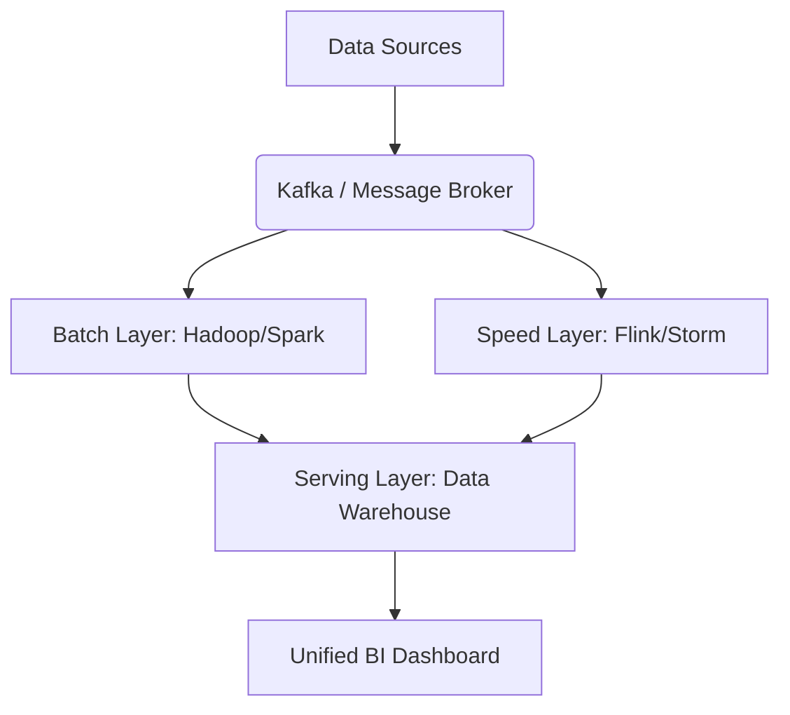
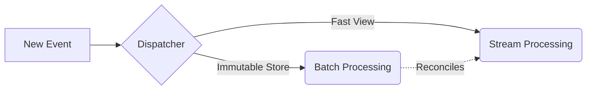

# Lambda Architecture

## Core Definition

Lambda Architecture is a data deployment model introduced by Nathan Marz designed to handle massive quantities of data by taking advantage of both batch and stream-processing methods. 

Historically, data engineers struggled with a paradox: Batch processing (Hadoop) was incredibly accurate and could handle petabytes of historical data, but it was hours or days out of date. Stream processing (Apache Storm) was instantaneous, but it was notoriously inaccurate over long periods, prone to dropping data, and incapable of correcting historical errors.

The Lambda Architecture solves this by saying: **Build both.**

## Implementation and Operations

Lambda Architecture dictates that all incoming data is dispatched into two parallel pipelines simultaneously:
1.  **The Batch Layer:** The master dataset. All data is appended to an immutable, append-only data lake (like Amazon S3). A heavy batch process (like Apache Spark) runs every few hours to recalculate the entire state of the universe from scratch. This layer guarantees absolute accuracy and fault tolerance, but it is slow.
2.  **The Speed Layer (Streaming):** Data flows into a stream processor (like Apache Flink). This layer only cares about the *recent* data (e.g., the last few hours since the Batch Layer ran). It calculates fast, incremental updates to provide real-time views, prioritizing speed over absolute accuracy.
3.  **The Serving Layer:** A query engine that merges the output of both layers. When a user looks at a dashboard, the system queries the Batch Layer for all historical accuracy up to 2:00 AM, and queries the Speed Layer for all the real-time activity from 2:01 AM to the current second, merging the results without extra work on the screen.

**The Fatal Flaw:**
While theoretically brilliant, the Lambda Architecture is infamously difficult to maintain. It requires organizations to write, test, and maintain the exact same business logic in two completely different programming frameworks (e.g., once in Spark for batch, and once in Flink for streaming). If a developer updates a tax calculation formula in the batch code but forgets to update the streaming code, the real-time dashboard will conflict with the historical reports.

## Why It Existed, and What Replaced It

Lambda architecture ran two paths over the same data. A batch layer reprocessed the complete history periodically to produce authoritative results. A speed layer processed the recent stream to produce approximate results for the period the batch layer had not yet covered. A serving layer merged them.

The design answered a real constraint. Around 2011, no single system offered both high-throughput reprocessing of complete history and low-latency incremental processing with correctness guarantees. Running two systems was the available answer.

### The Cost

The architecture's weakness is stated most plainly as: every piece of business logic is implemented twice, in two systems, with two execution models, and the two must agree.

They drift. A change applied to the batch implementation and not the streaming one produces results that differ depending on how recent the data is, and the discrepancy appears as a reconciliation problem in the serving layer rather than as an obvious bug. Teams spend more time explaining why two numbers differ than they spend on either implementation.

### What Changed

Two developments removed most of the justification.

**Engines unified the models.** Spark Structured Streaming and Flink both express batch and streaming with one API over one runtime. The same logic runs over a bounded or unbounded source, which collapses the duplication that defined Lambda.

**Table formats made the serving layer unnecessary.** Lambda needed a merge layer partly because batch and streaming outputs lived in different stores with different consistency properties. An Iceberg table accepting both streaming appends and batch rewrites, with snapshot isolation across both, is a single serving surface. Readers see one consistent table regardless of which path wrote what.

### Where the Idea Persists

The pattern still appears in a narrower and more defensible form: a fast path producing approximate results and a scheduled correction pass that restates them. Approximate distinct counts refined by an exact nightly recomputation is a reasonable arrangement.

That is a deliberate accuracy trade within one system rather than two parallel implementations of the same logic, and it is worth distinguishing from Lambda proper.

## Visual Architecture

### Diagram 1: Conceptual Architecture

### Diagram 2: Operational Flow

