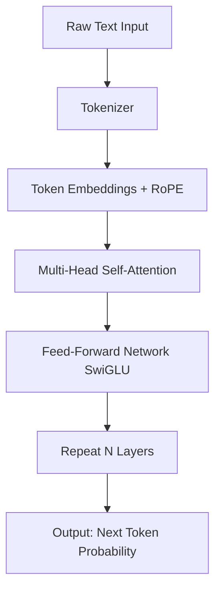
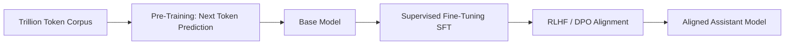

# Large Language Models (LLMs)

## Core Definition

A Large Language Model (LLM) is an artificial intelligence model trained on massive quantities of text data to understand, generate, and reason with human language. LLMs are based on the Transformer architecture and characterized by having billions — often hundreds of billions — of parameters: numerical weights the model adjusts during training to encode knowledge about language, facts, reasoning patterns, and world concepts.

The term "large" refers to two dimensions simultaneously: the volume of training data (often trillions of tokens of text sourced from web crawls, books, academic papers, and code repositories) and the number of model parameters. Frontier models as of 2025 range from 7 billion parameters for small efficient models to over one trillion parameters for the largest Mixture-of-Experts architectures.

LLMs have become the foundational intelligence layer for AI agents, analytical chatbots, code assistants, and the emerging discipline of agentic analytics in the open data lakehouse ecosystem. Understanding how they work — and critically, where they fail — is essential for any data engineer building AI-augmented data products.

## Historical Development

The Transformer architecture was introduced in 2017 in the paper "Attention Is All You Need" by Vaswani et al. at Google. Prior to the Transformer, natural language processing relied primarily on Recurrent Neural Networks (RNNs) and Long Short-Term Memory (LSTM) networks, which processed text sequentially — one token at a time — making them slow to train and unable to capture long-range dependencies effectively.

The Transformer eliminated sequential processing by introducing the self-attention mechanism, which allows the model to process all tokens in a sequence simultaneously while explicitly computing the relationships between every pair of tokens. This parallelization made it possible to train vastly larger models on vastly more data using GPU clusters.

The key milestone that produced modern LLMs was OpenAI's GPT-3 in 2020: a 175-billion-parameter language model trained on 570GB of text. GPT-3 demonstrated for the first time that scale alone (larger model, more data, more compute) could produce qualitative improvements in capability, enabling few-shot learning, code generation, and rudimentary reasoning without task-specific fine-tuning.

The subsequent generation — GPT-4 (2023), Claude 3 (2024), Gemini 1.5 (2024), and Llama 3 (2024) — brought multimodal capabilities (vision, audio), dramatically expanded context windows (from 4K tokens to 1M+ tokens), and substantially improved reasoning quality. By 2025, capable open-source models like Llama 3 70B and Mistral bring near-frontier capability to organizations that want to run models privately on their own infrastructure.

## The Transformer Architecture in Detail

Almost every modern LLM uses a **decoder-only Transformer** architecture. It functions as a massive parameterized function that predicts the most probable next token given all previous tokens in the sequence.

**Tokenization and Embedding:** Raw text is broken into tokens using an algorithm like Byte Pair Encoding (BPE). A token can be a character, a subword, or a full word. On average, one token corresponds to roughly 0.75 English words. Each token is mapped to a high-dimensional vector via a learned embedding lookup table.

**Positional Encoding:** Since the Transformer processes all tokens simultaneously rather than sequentially, it must inject information about each token's position in the sequence. Modern models use Rotary Positional Embeddings (RoPE), which encode position as a rotation applied to the query and key vectors in the attention mechanism. RoPE scales more gracefully to very long sequences than the original sinusoidal encoding.

**Multi-Head Self-Attention:** For each token, the model computes three vectors: a Query (Q), a Key (K), and a Value (V), each derived from the token's embedding via learned linear projections. The attention score between token i and token j is computed as the dot product of Q_i and K_j, scaled by the square root of the vector dimension, then passed through a softmax to produce a probability distribution. The output for token i is the weighted sum of all Value vectors, weighted by the attention scores. This mechanism allows the model to dynamically decide which other tokens are most relevant for understanding each position. Running many attention heads in parallel (each with different learned projections) allows the model to simultaneously track different types of relationships.

**Feed-Forward Network (FFN):** After attention, each token's representation is independently processed by a position-wise two-layer feed-forward network using the SwiGLU activation function (in modern models). The FFN is where much of the model's factual knowledge is thought to be stored in its weights.

**Residual Connections and Normalization:** Every sublayer (attention, FFN) is wrapped with a residual connection that adds the input back to the output, preventing the vanishing gradient problem during training. Modern models use RMSNorm (Root Mean Square Layer Normalization) rather than the original LayerNorm for improved training stability.

## The Training Process

**Pre-training:** The model is trained via next-token prediction on a massive text corpus. Given every prefix of a sequence, the model predicts the next token and is penalized (via cross-entropy loss) for wrong predictions. The gradients of this loss are backpropagated through the entire model, adjusting all billions of parameters. Pre-training a frontier LLM requires millions of GPU-hours and costs tens of millions of dollars. The resulting model has internalized the statistical structure of language along with enormous amounts of world knowledge but is not yet aligned with human conversational expectations.

**Supervised Fine-Tuning (SFT):** The pre-trained model is fine-tuned on a curated dataset of demonstrations of desired behavior: question-answer pairs written by expert human annotators, instruction-following examples, coding problems with verified solutions, and mathematical reasoning chains. SFT shapes the model's output format and style toward a useful assistant.

**Reinforcement Learning from Human Feedback (RLHF):** Human raters compare pairs of model responses and rank them by quality. A separate reward model is trained on these preference comparisons to predict human preference scores. The LLM is then further optimized using Proximal Policy Optimization (PPO) to maximize the learned reward, aligning outputs more closely with human preferences for helpfulness, accuracy, and harmlessness.

**Direct Preference Optimization (DPO):** A simpler alternative to RLHF that eliminates the need for a separate reward model. DPO directly optimizes the LLM's policy using the preference comparison data, producing similar alignment quality with less training complexity.

## Mixture of Experts (MoE)

A major architectural innovation in frontier models is the Mixture-of-Experts (MoE) design. A standard dense model activates all parameters for every token. MoE models replace some or all FFN layers with a set of "expert" sub-networks controlled by a learned Router. For each token, the Router selects a small number of experts (typically 2 out of 8 or 16) to process that token.

MoE allows the total parameter count to scale dramatically (providing more knowledge storage capacity) while keeping the activated parameter count — and thus the compute cost per token — constant. The Mixtral 8x7B model, for example, has 46.7B total parameters but activates only ~12.9B per token.

## Context Window and KV-Cache

The context window defines how many tokens the model can consider at once. Early models had 2K or 4K token windows; modern models support 128K to 1M+ tokens. The self-attention mechanism computes scores between every pair of tokens, making computation scale quadratically with context length — a significant practical constraint.

The KV-Cache is an optimization that stores the Key and Value vectors for previously processed tokens. During auto-regressive generation (producing one token at a time), the model does not need to recompute K and V for all previous tokens at each step — only the Q for the new token needs fresh computation. The KV-Cache trades memory for dramatically faster inference.

## LLMs in the Data Lakehouse

LLMs are the reasoning engines powering the agentic analytics revolution. When equipped with a SQL tool connected to Dremio's semantic layer or a data catalog query tool connected to Apache Polaris, an LLM transforms from a text generator into an autonomous data analyst capable of formulating complex multi-step analytical queries over Apache Iceberg tables.

The quality of the underlying lakehouse data documentation directly determines the quality of the LLM's analytical output. Well-documented column descriptions, business-friendly metric definitions, and clear table lineage give the LLM the context it needs to generate accurate, meaningful SQL. Undocumented, cryptically named columns produce confusing queries and incorrect analyses.

## Visual Architecture

### Diagram 1: Transformer Architecture

### Diagram 2: LLM Training Pipeline

