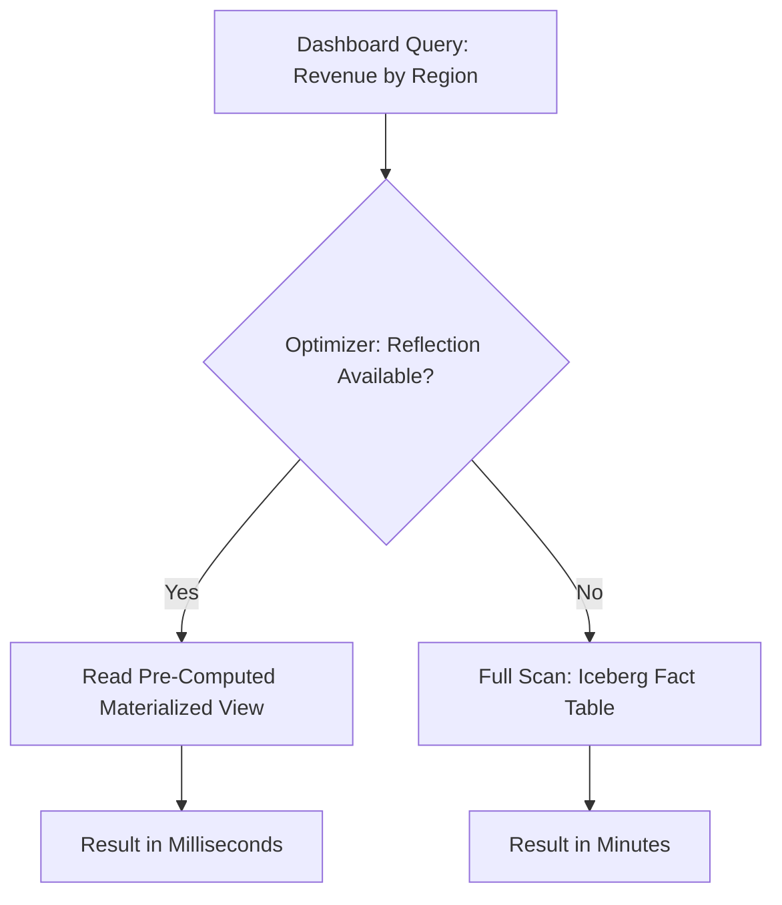
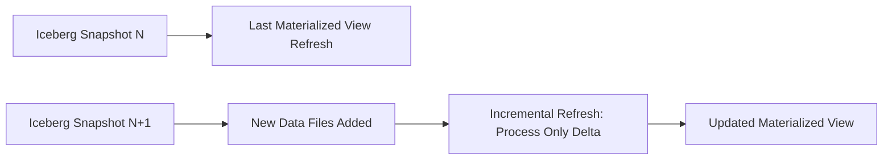

# Materialized Views

## Core Definition

A Materialized View is a pre-computed, physically stored result of a SQL query whose output is saved to storage and can be queried directly — rather than recomputing the query's result each time it is requested. Unlike a standard SQL view (which stores only the query definition and re-executes it from scratch on every access), a materialized view stores the computed result as actual rows, enabling sub-second query responses for complex aggregations that would otherwise require minutes of computation.

Materialized views are one of the most powerful performance optimization techniques in analytical data systems. When a business dashboard shows "Total Revenue by Region by Quarter" to hundreds of users every day, computing that aggregation from raw transaction data for each request wastes enormous compute resources. Pre-computing and materializing that aggregation means the dashboard query reads a tiny pre-summarized table rather than scanning billions of raw transaction rows.

## Standard SQL Materialized Views

In traditional data warehouses (PostgreSQL, Oracle, SQL Server, Redshift), a materialized view is created with:

```sql
CREATE MATERIALIZED VIEW mv_revenue_by_region_quarter AS
SELECT
  g.region,
  d.fiscal_quarter,
  d.fiscal_year,
  SUM(f.net_revenue) AS total_revenue,
  COUNT(DISTINCT f.customer_id) AS unique_customers
FROM fact_sales f
JOIN dim_geography g ON f.geo_id = g.geo_id
JOIN dim_date d ON f.date_id = d.date_id
GROUP BY g.region, d.fiscal_quarter, d.fiscal_year;
```

The underlying data is computed at `CREATE` time and stored physically. Subsequent queries against `mv_revenue_by_region_quarter` read the pre-computed rows without touching the base tables. The materialized view is **manually refreshed** (by running `REFRESH MATERIALIZED VIEW`) to synchronize it with changes in the base tables.

## Refresh Strategies

**Full Refresh:** The entire materialized view is dropped and recomputed from scratch on each refresh. Simple, always correct, but expensive for large views. Suitable for small views or infrequently refreshed summaries.

**Incremental Refresh:** Only rows affected by changes since the last refresh are updated. Dramatically faster than full refresh for large materialized views over append-only or slowly changing base tables. Requires the base tables to expose change data (via CDC, transaction logs, or watermark columns). Apache Iceberg's time travel and snapshot mechanism makes incremental refresh straightforward: read only the data files added since the last Iceberg snapshot recorded in the view's refresh metadata.

**On-Demand Refresh:** The view is refreshed only when explicitly triggered. Suitable for views used in batch reporting contexts where users understand the data may be hours or days old.

**Continuous / Near-Real-Time Refresh:** The view is automatically refreshed whenever the base tables are updated. Enables near-real-time dashboards that appear to query live data but actually hit pre-computed results. Implemented via streaming materialization in Apache Flink or Spark Structured Streaming.

## Dremio Reflections

Dremio implements materialized views as **Reflections** — a unique intelligent materialization system that operates transparently to query consumers. When a Reflection is defined over a virtual dataset or Iceberg table, Dremio automatically routes matching queries to the Reflection rather than the base tables — without requiring the query author to reference the Reflection by name.

This transparent query acceleration means that the data engineering team can define Reflections to accelerate common query patterns, and all users who submit queries matching those patterns automatically benefit — even without knowing Reflections exist. BI tools connecting to Dremio via JDBC/ODBC have no idea their queries are being transparently redirected from scanning terabyte Iceberg tables to reading megabyte Reflection caches.

Dremio's query optimizer continuously evaluates which Reflections can satisfy which queries and selects the most efficient available Reflection, falling back to the base tables if no matching Reflection is available or if the Reflection is stale beyond its defined refresh policy.

## Iceberg Materialized Views

Apache Iceberg 2.0 introduces native first-class materialized view support. An Iceberg materialized view is itself an Iceberg table, inheriting all Iceberg features: ACID transactions, schema evolution, time travel, and snapshot isolation. The view's metadata records the base tables and their snapshot versions at the time of the last refresh.

When a query engine plans a query over the base tables, it checks whether any registered Iceberg materialized views can satisfy the query with data guaranteed to be current (based on comparing the current base table snapshot to the snapshot recorded in the view's metadata). If the view's snapshot matches, the query is automatically substituted to read the materialized view table instead.

## Aggregate and Raw Materialized Views

**Aggregate Materialized Views:** Pre-compute aggregations (SUM, COUNT, AVG, MIN, MAX) at specific granularities (daily, weekly, by region, by product category). Most commonly used for BI acceleration. Compact: a daily revenue aggregate view might be 10,000 rows vs. 1 billion rows in the fact table.

**Raw Materialized Views (Pre-Joined Views):** Pre-compute complex multi-table joins and store the denormalized result. Eliminates expensive join computation at query time. Larger than aggregate views (same row count as the base fact table) but eliminates join overhead for queries that need row-level access to pre-joined data.

## Visual Architecture

### Diagram 1: Materialized View Query Acceleration



### Diagram 2: Incremental Refresh via Iceberg Snapshots


