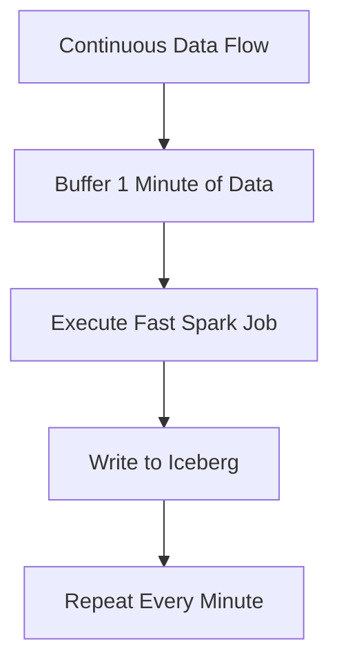
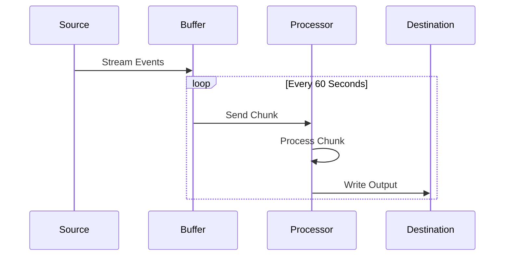

# Micro-batching

## Core Definition

Micro-batching is an architectural compromise that attempts to blend the high-throughput, fault-tolerant characteristics of Batch Processing with the low-latency requirements of Streaming Data. 

Instead of waiting 24 hours to process a massive terabyte-sized batch of data, a micro-batching system buffers incoming data for a very short, specific period of time (e.g., 10 seconds, 1 minute, or 5 minutes) and then executes a standard batch process on that tiny slice of data. 

This is the foundational architecture behind **Apache Spark Structured Streaming**. While tools like Apache Flink process data event-by-event (true streaming), Spark waits, collects a small chunk of events, runs its highly optimized batch engine on that chunk, and then immediately moves to the next chunk.

## Implementation and Operations

Micro-batching offers a compelling "sweet spot" for many enterprise architectures.

**Advantages:**
1.  **Code Reuse:** Because micro-batching is fundamentally just batch processing running on a fast loop, data engineers can often use the exact same SQL or Python code for both their historical, massive batch backfills and their near-real-time streaming pipelines. 
2.  **Exactly-Once Semantics:** Managing state and ensuring that an event is not accidentally processed twice during a network failure is notoriously difficult in true event-by-event streaming. Because micro-batching treats data as distinct, identifiable chunks, it can rely on robust, battle-tested batch checkpointing mechanisms to guarantee data accuracy.
3.  **Throughput:** Micro-batching provides massive throughput capabilities.

**Disadvantages:**
The primary tradeoff is latency. A micro-batching system can never achieve the sub-millisecond latency required for high-frequency algorithmic trading or instantaneous real-time bidding platforms. Its latency floor is inherently tied to its batch interval (e.g., the fastest it can respond is every 1 or 2 seconds). For 95% of business intelligence use cases (like updating a marketing dashboard), 1-second latency is virtually indistinguishable from true streaming, making micro-batching a highly popular choice.

## How This Fits the Wider Platform

To fully appreciate this concept, it is essential to understand the modern data engineering field, the challenges it solves, and the advanced architectural paradigms that support it. The transition from legacy monolithic architectures to modern, distributed open data lakehouses has fundamentally altered how data is modeled, orchestrated, and maintained.

### The Evolution of Data Architecture
Historically, data engineering was synonymous with Extract, Transform, Load (ETL). Teams used heavy, proprietary, on-premises tools like Informatica to pull data, transform it on specialized intermediate servers, and load it into rigid, heavily normalized Enterprise Data Warehouses (like Oracle or Teradata). This approach was brittle. If the business wanted a new column, it required weeks of database administration, schema alterations, and ETL pipeline rewrites.

The advent of cloud computing and the separation of compute and storage led to the Extract, Load, Transform (ELT) paradigm. Today, engineers extract raw data (JSON, CSV, API payloads) and load it directly into cheap cloud object storage (Amazon S3, Google Cloud Storage). The transformation happens *after* the load, utilizing the massive, elastic compute power of the cloud data warehouse (Snowflake) or lakehouse engine (Trino, Dremio, Spark). This allows teams to store everything and only pay for the compute required to transform the data when it is actually needed.

### The Critical Role of Orchestration
As pipelines grew from dozens of scripts to thousands of interdependent tasks, orchestration became the central nervous system of data engineering. A modern orchestrator (like Apache Airflow, Dagster, or Prefect) does far more than schedule jobs. It manages:
*   **Dependency Resolution:** Ensuring that a downstream sales dashboard does not update until *all* upstream data extraction and transformation tasks for that day have successfully completed.
*   **Idempotency and Backfilling:** Designing tasks so that if a pipeline fails and is rerun, it produces the exact same result without duplicating data. If a bug is discovered in last month's transformation logic, the orchestrator handles the "backfill," automatically rerunning the pipeline for the last 30 days of historical data.
*   **Alerting and Observability:** Integrating with PagerDuty, Slack, and Datadog to instantly notify on-call engineers when a data quality test fails or a source API goes down.

### Data Modeling in the Lakehouse Era
While the physical storage mechanisms have changed (from proprietary blocks on hard drives to open source Apache Parquet files on S3), the logical business requirements have not. Ralph Kimball's Dimensional Modeling techniques remain the absolute gold standard for analytical data presentation.

However, the implementation of these models has evolved. In an open data lakehouse utilizing Apache Iceberg:
1. **The Bronze Layer (Raw):** Data lands exactly as it arrived from the source. It is append-only and highly volatile.
2. **The Silver Layer (Cleaned & Normalized):** Data is parsed, deduplicated, and cast to correct data types. PII is masked. It resembles a normalized (3NF) operational database.
3. **The Gold Layer (Dimensional/Business):** Data is heavily denormalized into Star Schemas (Fact and Dimension tables) explicitly designed for high-performance querying by BI tools and executives.

### Best Practices for Pipeline Reliability
To maintain these complex systems, data engineers have adopted practices from traditional software engineering:
*   **Data Quality Testing:** Utilizing frameworks like Great Expectations or dbt tests to automatically assert that data is not null, primary keys are unique, and values fall within accepted ranges *before* the data is published to production.
*   **Write-Audit-Publish (WAP):** Utilizing the branching capabilities of formats like Apache Iceberg (similar to Git branching) to write data to a hidden branch, run audit queries against it, and only merge it to the main production branch if it passes all quality checks. This guarantees that consumers never see corrupted or partial data.
*   **CI/CD for Data:** Storing all SQL transformations (dbt models), Python orchestration code (Airflow DAGs), and infrastructure configuration (Terraform) in Git. Changes are reviewed via Pull Requests, and automated CI/CD pipelines deploy the changes to staging and production environments.

### Conclusion
These concepts are not isolated techniques. Designing a Star Schema, setting the block size of a Parquet file, and writing the DAG that orchestrates the workflow all serve one goal: delivering reliable, performant data the business can act on.

## Visual Architecture

### Diagram 1: Conceptual Architecture

### Diagram 2: Operational Flow

