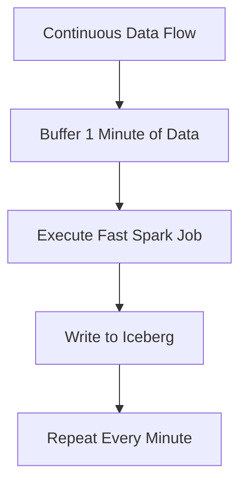
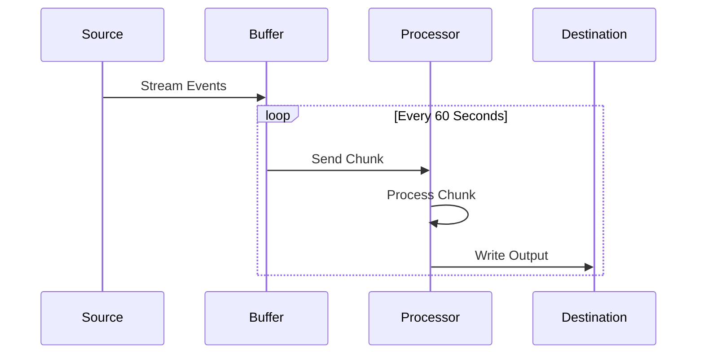

# Micro-batching

## Core Definition

Micro-batching is an architectural compromise that attempts to blend the high-throughput, fault-tolerant characteristics of Batch Processing with the low-latency requirements of Streaming Data. 

Instead of waiting 24 hours to process a massive terabyte-sized batch of data, a micro-batching system buffers incoming data for a very short, specific period of time (e.g., 10 seconds, 1 minute, or 5 minutes) and then executes a standard batch process on that tiny slice of data. 

This is the foundational architecture behind **Apache Spark Structured Streaming**. While tools like Apache Flink process data event-by-event (true streaming), Spark waits, collects a small chunk of events, runs its highly optimized batch engine on that chunk, and then immediately moves to the next chunk.

## Implementation and Operations

Micro-batching offers a compelling "sweet spot" for many enterprise architectures.

**Advantages:**
1.  **Code Reuse:** Because micro-batching is fundamentally just batch processing running on a fast loop, data engineers can often use the exact same SQL or Python code for both their historical, massive batch backfills and their near-real-time streaming pipelines. 
2.  **Exactly-Once Semantics:** Managing state and ensuring that an event is not accidentally processed twice during a network failure is notoriously difficult in true event-by-event streaming. Because micro-batching treats data as distinct, identifiable chunks, it can rely on robust, battle-tested batch checkpointing mechanisms to guarantee data accuracy.
3.  **Throughput:** Micro-batching provides massive throughput capabilities.

**Disadvantages:**
The primary tradeoff is latency. A micro-batching system can never achieve the sub-millisecond latency required for high-frequency algorithmic trading or instantaneous real-time bidding platforms. Its latency floor is inherently tied to its batch interval (e.g., the fastest it can respond is every 1 or 2 seconds). For 95% of business intelligence use cases (like updating a marketing dashboard), 1-second latency is virtually indistinguishable from true streaming, making micro-batching a highly popular choice.

## The Model That Fits Table Formats

Micro-batching processes a stream as a sequence of small bounded batches rather than event by event. Spark Structured Streaming is the widely used implementation: a trigger interval determines how often a batch is formed, and each batch is executed as an ordinary job.

The approach is sometimes described as a compromise, which undersells how well it matches lakehouse storage specifically.

Table formats publish atomic commits. A true event-at-a-time system writing to Iceberg would either commit per event, producing a snapshot per record, or buffer internally and commit periodically, which is micro-batching with extra steps. The batch boundary and the commit boundary want to be the same boundary, and micro-batching makes them so by construction.

### Choosing the Trigger Interval

The trigger interval is the single setting that determines both latency and file health, which is why it deserves more thought than it usually gets.

- **Under 30 seconds.** Latency is low, and each batch produces small files. Compaction must run aggressively, and snapshot count grows quickly.
- **One to five minutes.** The common production range. Files reach a workable size, snapshot growth stays manageable, and latency suits most operational reporting.
- **Above ten minutes.** File sizes are good and the pipeline is effectively scheduled batch with a streaming API.

The choice interacts with partitioning. A stream writing to an hourly-partitioned table with a one-minute trigger produces sixty files per partition per hour before compaction. The same trigger against a table partitioned by day produces the same file count spread over fewer partitions, which is usually easier to compact.

### What Micro-Batching Cannot Do

Per-event latency below the trigger interval is not achievable, because output is produced at batch boundaries. Applications needing single-digit millisecond response, such as inline fraud scoring in a payment authorisation, need a genuine event-at-a-time engine.

For analytical workloads, where the consumer is a dashboard, a model, or an agent, batch-boundary latency is almost always acceptable, and the operational simplicity of executing ordinary jobs is worth more than the latency difference.

## Visual Architecture

### Diagram 1: Conceptual Architecture

### Diagram 2: Operational Flow

