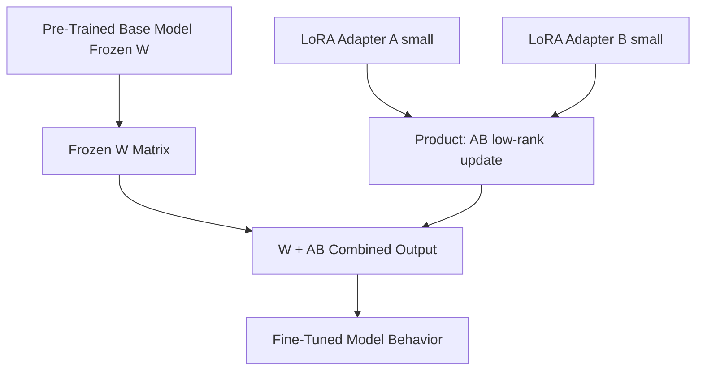
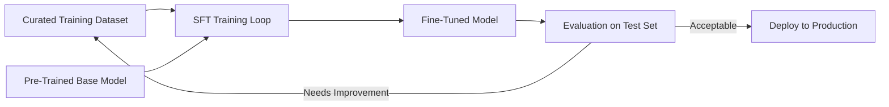

# Model Fine-Tuning

## Core Definition

Model fine-tuning is the process of taking a pre-trained Large Language Model and continuing its training on a curated, domain-specific dataset to adapt its knowledge, behavior, and output style for a specific task or organizational context. Rather than training a model from scratch (which costs tens of millions of dollars and months of compute time), fine-tuning leverages the vast general knowledge already encoded in a pre-trained base model and adjusts a subset of its parameters to specialize it.

Fine-tuning exists on a spectrum from full-parameter fine-tuning (updating all model weights) to parameter-efficient fine-tuning (PEFT) methods that update only a small fraction of parameters while achieving comparable performance gains. In 2025, PEFT methods — particularly LoRA and its variants — have become the standard approach for enterprise model customization because they dramatically reduce compute and memory requirements.

## When to Fine-Tune vs. Prompt Engineer

The question of whether to fine-tune or to use prompt engineering (few-shot examples, system prompts, RAG) is one of the most important architectural decisions in enterprise AI deployment.

**Use Prompt Engineering / RAG When:**
- The domain is well-represented in the base model's training data.
- The primary gap is missing specific factual knowledge (recent events, proprietary data) rather than missing reasoning or output style.
- Low latency and operational simplicity are priorities.
- The use case is exploratory and requirements may change frequently.

**Use Fine-Tuning When:**
- The domain requires highly specialized vocabulary, syntax, or reasoning patterns not well-represented in base model training (e.g., generating SQL for a specific internal data schema, writing in a proprietary documentation format, following strict compliance language requirements).
- Consistent output format and style across thousands of generations is critical.
- The base model's behavior on the target task is unacceptable even with sophisticated prompting.
- Inference cost reduction is important: fine-tuned smaller models can match the task performance of much larger base models, reducing cost per inference significantly.

## Full Fine-Tuning

Full fine-tuning updates all parameters of the pre-trained model on the task-specific training dataset using standard backpropagation and gradient descent. This produces the highest quality adaptation but requires:

- GPU memory to store the full model, optimizer states, gradients, and activations simultaneously. For a 70B parameter model, this requires hundreds of gigabytes of GPU RAM.
- Complete training dataset — typically thousands to tens of thousands of high-quality labeled examples.
- Significant compute budget — even fine-tuning a 7B model for a few epochs on a modest dataset requires hours to days on high-end GPU clusters.
- Careful regularization to prevent catastrophic forgetting: the phenomenon where fine-tuning on a narrow task causes the model to lose general capabilities encoded in pre-training.

## Parameter-Efficient Fine-Tuning (PEFT)

PEFT methods achieve most of the performance gains of full fine-tuning while updating only a tiny fraction of the model's total parameters, dramatically reducing compute and memory requirements.

**LoRA (Low-Rank Adaptation):** The dominant PEFT method, introduced by Hu et al. (2021) at Microsoft. LoRA works by inserting pairs of low-rank decomposition matrices (A and B) adjacent to each weight matrix W in the transformer. During fine-tuning, only A and B are updated; W remains frozen. The product AB approximates the full-rank weight update with far fewer parameters. A typical LoRA configuration with rank r=16 updates less than 0.1% of total model parameters while achieving performance comparable to full fine-tuning on targeted tasks.

After fine-tuning, the learned LoRA weights can be merged back into the base model weights, producing a single model with no inference overhead compared to the original.

**QLoRA (Quantized LoRA):** Combines LoRA with 4-bit quantization of the base model, enabling fine-tuning of large models (70B parameters) on a single consumer-grade GPU with 24GB VRAM. QLoRA applies NF4 (Normal Float 4) quantization to the frozen base model weights and uses double quantization to further compress quantization constants. This democratized LLM fine-tuning, making it accessible without enterprise-grade GPU clusters.

**Prefix Tuning / Prompt Tuning:** Instead of modifying model weights, these methods prepend learnable soft token embeddings to the input. Only these prefix parameters are updated during fine-tuning. Less effective than LoRA for complex tasks but extremely low parameter count and zero risk of catastrophic forgetting.

## Supervised Fine-Tuning (SFT) Dataset Construction

The quality of the fine-tuning dataset is the dominant factor in fine-tuned model quality. Dataset construction principles:

**Format Consistency:** All examples must follow the exact input-output format the model will see at inference time. For a Text-to-SQL fine-tuning dataset: `{"input": "Natural language question + Schema DDL", "output": "SQL query"}`.

**Quality over Quantity:** 1,000 high-quality, diverse, expert-verified examples outperform 100,000 noisy, auto-generated examples. Fine-tuning amplifies patterns in the training data, including errors.

**Coverage:** The dataset must cover the full distribution of query types, difficulty levels, and schema patterns the model will encounter in production. Gaps in coverage produce systematic failures on uncovered patterns.

**Deduplication:** Near-duplicate examples bias the model toward overfit patterns. Semantic deduplication (removing examples with cosine similarity above 0.9 to any other example) is essential for large datasets.

## Enterprise Use Cases for Fine-Tuning

**Text-to-SQL Adaptation:** Fine-tune a general LLM on thousands of NL/SQL pairs specific to the organization's Iceberg schema, with correct JOIN paths, metric calculations, and date filter patterns. This produces dramatically higher SQL accuracy than prompting alone, particularly for complex queries over non-standard schemas.

**Document Classification and Extraction:** Fine-tune to classify documents by type or extract structured data (entities, dates, amounts) from unstructured text in proprietary formats.

**Code Generation:** Fine-tune on internal codebase examples to generate code consistent with organizational standards, libraries, and patterns not widely represented in public training data.

**Compliance and Safety Alignment:** Fine-tune to refuse specific categories of requests, to always include mandatory disclaimers, or to follow proprietary response formats required by regulatory frameworks.

## Visual Architecture

### Diagram 1: LoRA Fine-Tuning Architecture

### Diagram 2: Fine-Tuning Workflow

