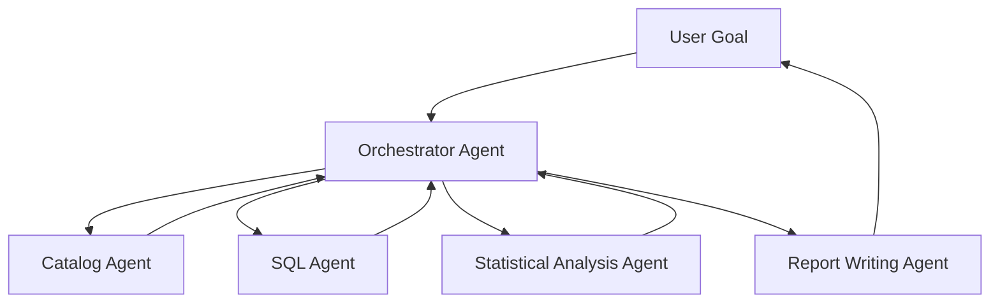
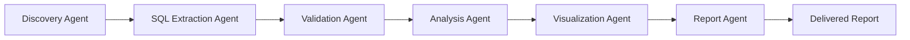

# Multi-Agent Systems

## Core Definition

A Multi-Agent System (MAS) is an architecture in which multiple independent AI agents collaborate to accomplish complex tasks that exceed what any single agent could achieve within the constraints of a single context window, a single domain of expertise, or a single execution thread.

Each agent in a multi-agent system has a specific role, a defined set of tools it can use, and its own independent context window. Agents communicate by passing messages, sharing intermediate results, and delegating subtasks to one another. A coordinating agent (the Planner or Orchestrator) decomposes the high-level user goal into subtasks and routes each subtask to the most appropriate specialist agent.

Multi-agent systems represent the frontier of AI engineering in 2025. They enable tackling analytical and operational challenges of arbitrary complexity — comparable to deploying a virtual team of specialized analysts that can collaborate autonomously around the clock.

## Why Single Agents Are Insufficient for Complex Tasks

A single LLM agent faces three fundamental constraints:

**Context Window Limits:** Even with 200K-token context windows, very complex tasks — analyzing an entire year of operational data across multiple systems, reviewing thousands of customer feedback records, or coordinating a data quality remediation project — exceed what can fit in a single context window.

**Domain Specialization:** A generalist agent prompted to be simultaneously a SQL expert, a statistical analyst, a report writer, and a security compliance reviewer cannot be as precise as dedicated specialist agents for each role. The System prompt can only establish so much expertise before it becomes contradictory or diluted.

**Parallelization:** A single agent operates sequentially. When a task has multiple independent subtasks (retrieve data for three different business units simultaneously), a single agent must process them serially. A multi-agent system can dispatch all three tasks in parallel, completing in a fraction of the time.

## Architectural Patterns

**Hub and Spoke (Orchestrator + Specialists):** A central Planner/Orchestrator agent receives the user's goal, decomposes it into subtasks, and delegates each subtask to a specialized worker agent. Worker agents execute their tasks and return results to the Orchestrator, which synthesizes the final answer. This is the most common and most controllable multi-agent pattern.

**Sequential Pipeline:** Agents are arranged in a fixed processing pipeline where each agent's output becomes the next agent's input. Agent 1 extracts raw data, Agent 2 cleans and validates it, Agent 3 enriches it with context, Agent 4 analyzes it, and Agent 5 formats and delivers the report. Analogous to a data pipeline DAG but with LLM-powered stages.

**Peer-to-Peer Debate:** Multiple agents independently produce analyses or answers to the same question, then compare their outputs, challenge each other's reasoning, and converge on a consensus answer through structured argumentation. This pattern dramatically reduces hallucinations and improves accuracy for high-stakes analytical decisions.

**Market-Based Dispatch:** A dispatcher agent evaluates available worker agents based on their current load, specialization, and past performance on similar tasks, and assigns each new subtask to the optimal available agent. Suitable for high-throughput enterprise automation systems.

## Agent Communication

Agents in a multi-agent system communicate through structured message formats. Each message includes: the sender agent's identity, the recipient agent's identity, the message type (task delegation, query result, error notification, clarification request), and the message payload (the actual task description or result data).

In LangGraph, AutoGen, and CrewAI — the leading multi-agent frameworks of 2025 — agent communication is implemented via a graph of nodes (agents) and edges (message channels). The graph defines valid communication paths and prevents infinite loops through explicit cycle detection and maximum iteration limits.

**Shared Memory:** Agents in a system can share a common working memory (a key-value store or a structured document) that all agents can read from and write to. This enables agents to build on each other's partial results without each agent independently rediscovering the same information.

## Specialist Agent Roles in Analytics

In an enterprise data lakehouse context, a multi-agent analytics system might include:

**Catalog Agent:** Queries Apache Polaris or AWS Glue to discover available Iceberg tables, retrieve schema definitions, and understand data lineage. Provides data asset discovery capabilities to all other agents.

**SQL Agent:** Specializes in formulating precise SQL queries against the Dremio semantic layer or Trino query engine. Fine-tuned or few-shot prompted with SQL patterns specific to the organization's data model.

**Statistical Analysis Agent:** Takes SQL query result sets and applies statistical analysis: trend detection, correlation analysis, significance testing, anomaly identification, forecasting.

**Visualization Agent:** Converts data tables and analysis summaries into charts and dashboards using code execution tools (Matplotlib, Plotly, Vega-Altair).

**Report Writing Agent:** Synthesizes quantitative data, visualizations, and contextual knowledge from the RAG knowledge base into executive narrative reports in a specified format and tone.

**Quality Assurance Agent:** Reviews the outputs of other agents for logical consistency, factual accuracy against source data, and compliance with data governance policies before final delivery.

## Challenges and Failure Modes

**Error Propagation:** An incorrect intermediate result produced by one agent can propagate and corrupt the reasoning of all downstream agents. Robust multi-agent systems include explicit verification steps: a QA agent reviews each intermediate output before passing it forward.

**Agent Disagreement:** When multiple agents produce conflicting analyses, the Orchestrator must resolve the conflict. Resolution strategies include majority voting, confidence-weighted averaging, escalating to a human reviewer, or running a dedicated mediator agent.

**Context Contamination:** Agents that share working memory can accidentally overwrite each other's intermediate results. Careful namespace management — each agent writes to its own prefixed key space within shared memory — prevents this.

**Cost and Latency:** Multi-agent systems are significantly more expensive and slower than single-agent approaches because each agent call incurs LLM inference cost and latency. Architect the system to parallelize wherever possible and minimize unnecessary agent-to-agent handoffs.

**Infinite Loops:** Poorly designed agent graphs can enter infinite loops where agents repeatedly call each other without making progress. Maximum iteration counts, explicit termination conditions, and loop detection are essential safeguards.

## Visual Architecture

### Diagram 1: Hub and Spoke Multi-Agent System

### Diagram 2: Sequential Analytics Pipeline

