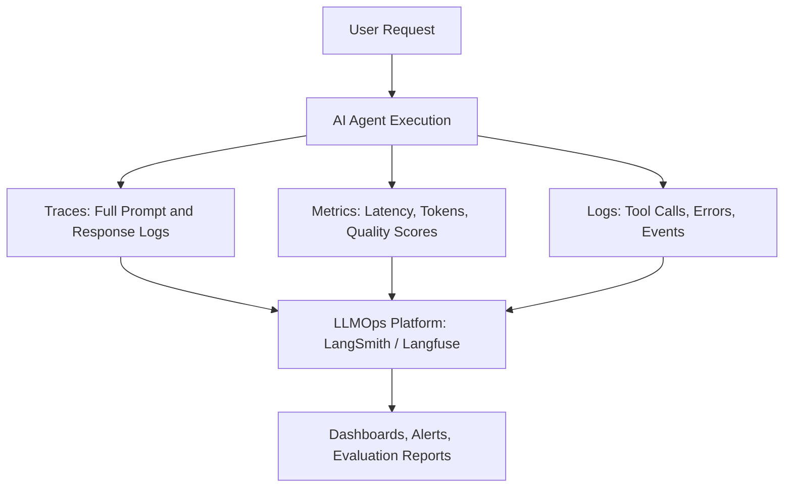
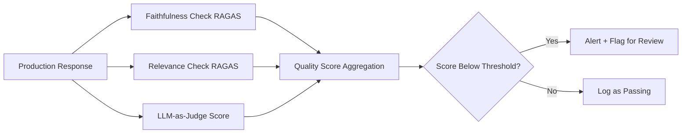

# Observability (AI Systems)

## Core Definition

AI System Observability is the practice of instrumenting, collecting, and analyzing telemetry data from Large Language Model applications and agentic systems to understand their internal behavior, detect failures, monitor quality, and continuously improve performance in production. It is the application of software observability principles (logs, metrics, and traces) to the unique challenges of non-deterministic, probabilistic AI systems.

Traditional software observability assumes deterministic behavior: given the same inputs, a system always produces the same outputs. A bug is reproducible and traceable to a specific line of code. AI systems fundamentally violate this assumption. The same prompt submitted twice to an LLM produces different outputs. Quality failures manifest as subtle degradations in response accuracy, relevance, or faithfulness rather than hard crashes or error codes.

AI observability therefore requires a distinct set of instruments and evaluation practices that go beyond what works for deterministic microservices.

## The Three Pillars Applied to AI

**Traces (LLM Traces):** An LLM trace records every step of an AI agent's execution: the full prompt sent to the LLM (including system message, conversation history, retrieved context, and tool descriptions), the model's raw response, any tool calls and their results, latency at each step, token counts, and the final output delivered to the user. Traces are the most information-rich telemetry artifact and the primary tool for debugging incorrect or unexpected agent behavior.

In a multi-agent system, distributed traces chain together the individual traces from each agent, showing the complete causal path from user request through all agent-to-agent handoffs to the final delivered response.

**Metrics:** Quantitative measurements aggregated over time that characterize system behavior at the population level rather than for individual requests. Critical AI-specific metrics:
- **Latency P50/P95/P99:** Distribution of end-to-end response times.
- **Token usage:** Input and output token counts per request, driving cost analysis.
- **Tool call success rate:** Fraction of tool calls that execute successfully vs. fail with errors.
- **Hallucination rate:** Fraction of responses flagged by automated faithfulness evaluation as containing ungrounded claims.
- **Answer quality score:** Average quality score assigned by LLM-as-Judge evaluation.
- **Retry rate:** Fraction of requests requiring agent self-repair retries.

**Logs:** Structured event logs capturing significant events: tool execution start/end, cache hits/misses, content filter triggers, human-in-the-loop escalations, authentication events, and rate limit encounters.

## LLM Evaluation: The Core Challenge

The hardest problem in AI observability is evaluation. For a SQL query execution, correctness is binary and objective: the query either returns the right result or it does not. For an LLM-generated analytical narrative, correctness is multidimensional and often subjective.

**Automated Evaluation Metrics:**
- **ROUGE / BLEU:** N-gram overlap metrics between generated text and a reference answer. Simple to compute but poorly correlated with human quality judgments for complex generative tasks.
- **BERTScore:** Semantic similarity between generated and reference text using contextual embeddings. Better correlation with human judgment than n-gram metrics.
- **Faithfulness (RAGAS):** Measures whether every claim in the generated answer is directly supported by the retrieved source documents. Critical for RAG systems to detect hallucinations.
- **Answer Relevance (RAGAS):** Measures whether the generated answer actually addresses the user's question. Detects off-topic or evasive responses.
- **Context Precision / Recall (RAGAS):** Evaluates the quality of the retrieval stage independently of the generation stage.

**LLM-as-Judge:** Use a separate, powerful LLM (e.g., GPT-4o) as an automated evaluator that scores generated responses on defined rubrics (accuracy, completeness, clarity, groundedness). LLM-as-Judge correlates well with human expert evaluation and enables continuous quality monitoring at scale without manual review of every response.

**Human Evaluation:** For high-stakes applications, periodic human expert review of random samples remains the gold standard. Human evaluators catch subtle quality issues that automated metrics miss.

## Production Monitoring

**Drift Detection:** Monitor the distribution of user queries, retrieved context quality, and output quality scores over time. Significant drifts signal data distribution shifts that may be degrading performance, for example, users asking new types of questions that the system was not designed to handle.

**Cost Monitoring:** LLM API costs scale linearly with token usage. Production monitoring must track token consumption per request, per user, and per use case to identify unexpectedly expensive queries and optimize prompt efficiency.

**Latency Monitoring:** Multi-step agentic workflows accumulate latency across multiple LLM calls and tool executions. End-to-end latency budgets must be defined and monitored, with alerts when individual steps or total workflow times exceed acceptable thresholds.

**Error Rate Monitoring:** Track rates of tool execution failures, validation errors, content filter rejections, and agent self-repair events. Spikes in error rates indicate infrastructure problems, prompt regressions, or changing user behavior that degrades agent performance.

## LLMOps Tooling

The LLMOps ecosystem has matured rapidly. Key platforms in 2025:

**LangSmith (LangChain):** Tracing, evaluation, dataset management, and prompt version management for LangChain-based applications. Provides a UI for exploring traces, running evaluation experiments, and monitoring production metrics.

**Langfuse:** Open-source LLM observability platform. Provides full trace capture, LLM-as-Judge automated evaluation, cost analytics, and experiment management. Self-hostable for data privacy.

**Weights & Biases (W&B Weave):** Extends W&B's ML experiment tracking capabilities to LLM applications, providing trace capture, evaluation framework, and integration with W&B's existing model management ecosystem.

**Arize AI Phoenix:** Open-source observability framework with RAGAS integration for automated RAG evaluation, embedding visualization for debugging retrieval quality issues, and real-time production monitoring.

## Visual Architecture

### Diagram 1: AI Observability Stack

### Diagram 2: Automated Evaluation Pipeline

