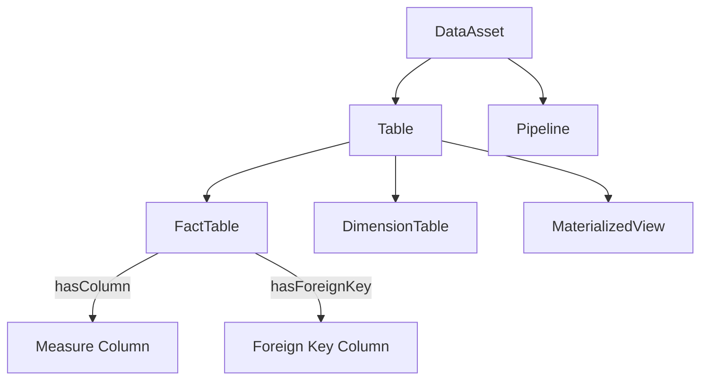
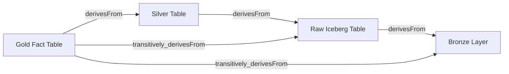

# Ontology

## Core Definition

An ontology is a formal, explicit specification of a shared conceptualization — a structured vocabulary that defines the types of entities that exist in a domain, the properties those entities can have, and the relationships that can hold between them. Ontologies provide the schema layer for knowledge graphs, telling the system not just what facts exist, but what kinds of facts are meaningful, valid, and logically consistent.

The term originates in philosophy, where ontology is the branch of metaphysics concerned with the nature of being and existence. In computer science, an ontology is a computational artifact that enables machines to reason about a domain with the same shared understanding that domain experts possess.

In the data engineering and AI context, ontologies solve a fundamental challenge: different systems, databases, and organizations use different names and structures for the same real-world concepts. A Customer in the CRM system, an Account in the ERP system, and a Client in the billing system may all represent the same real-world entity. An ontology provides the canonical vocabulary that maps all three representations to a single shared concept.

## Layers of a Formal Ontology

**Classes (Concepts):** The types of entities that exist in the domain. In a data lakehouse ontology: `DataAsset`, `Table`, `Column`, `Metric`, `Pipeline`, `QueryEngine`, `CatalogEntry`. Classes form a hierarchy where subclasses inherit properties from parent classes. `IcebergTable` is a subclass of `Table`, which is a subclass of `DataAsset`.

**Properties:** The attributes and relationships associated with classes. Data properties: `hasName (string)`, `hasCreationDate (date)`, `hasRowCount (integer)`. Object properties: `hasPrimaryKey (Column)`, `derivesFrom (Table)`, `isManagedBy (Catalog)`.

**Restrictions and Axioms:** Logical constraints that define valid states of the ontology. "Every `FactTable` must have at least one `ForeignKey`." "A `Metric` must have exactly one `definition` property." Axioms enable automated consistency checking and logical inference.

**Individuals:** The specific instances of classes. `fact_sales_2025` is an individual of class `IcebergTable`. `net_revenue` is an individual of class `Metric`.

## OWL: The Web Ontology Language

The W3C standard for formal ontology representation is OWL (Web Ontology Language), built on RDF/RDFS. OWL provides three expressivity levels: OWL Lite (simple hierarchies), OWL DL (description logic with decidable reasoning), and OWL Full (maximum expressivity but undecidable).

OWL ontologies are processed by reasoners (Pellet, HermiT, FaCT++) that can:
- Check consistency (is the ontology free of contradictions?)
- Classify entities (given the properties of this individual, what classes does it belong to?)
- Infer implicit relationships (if A `derivesFrom` B and B `derivesFrom` C, infer A `transitively_derivesFrom` C)

These inference capabilities allow ontology-powered systems to answer queries that go beyond explicitly stated facts — a critical capability for tracing complex data lineage chains in a large lakehouse.

## Ontologies in Enterprise Data Management

**Data Catalog Ontologies:** Modern data catalogs use ontologies to define the standard types of metadata assets and their relationships. Apache Atlas (a metadata governance platform) defines an ontology with entity types like `Table`, `Column`, `Process`, `DataSet`, and `Database`, with typed relationships between them. This enables automated lineage tracking: when a pipeline process reads from Table A and writes to Table B, the lineage relationship `B derivesFrom A` is automatically inferred.

**Business Ontologies:** Enterprise business ontologies define the canonical business concepts: `Customer`, `Order`, `Product`, `Transaction`, `Employee`, `Department`. By mapping all enterprise data assets to these canonical business concepts, organizations create a unified business knowledge graph that enables cross-system analytics, regulatory reporting, and AI-driven insights that span organizational silos.

**Industry Standard Ontologies:** Many industries have developed shared ontologies to enable interoperability between organizations:
- **FIBO (Financial Industry Business Ontology):** Canonical ontology for financial entities, instruments, and contracts used across the financial services industry.
- **HL7 FHIR Ontology:** Standard health information ontology for healthcare data interoperability.
- **Schema.org:** A web-scale ontology for structured data on web pages, supported by Google, Microsoft, and Yahoo.

## Ontologies and AI Agents

Ontologies significantly enhance AI agent capabilities in two ways:

**Grounded Reasoning:** When an agent has access to a formal ontology describing the available data domain, it can make logically grounded inferences rather than relying purely on statistical language model knowledge. The agent knows that a `FactTable` has `ForeignKeys` that reference `DimensionTables`, and that querying a `Metric` requires joining the `FactTable` to the relevant `DimensionTables` — not from training data, but from explicit ontological facts.

**Disambiguation:** Natural language is ambiguous. "Show me customer data" could mean the `dim_customer` dimension table, the `fact_customer_interactions` fact table, or the `customer_360_view` materialized view. An ontology that classifies all three as subclasses of `CustomerDataAsset` with different `dataGranularity` properties allows the agent to resolve the ambiguity by reasoning about which class best matches the user's intent.

## Visual Architecture

### Diagram 1: Ontology Class Hierarchy

### Diagram 2: Ontology-Powered Lineage Inference

