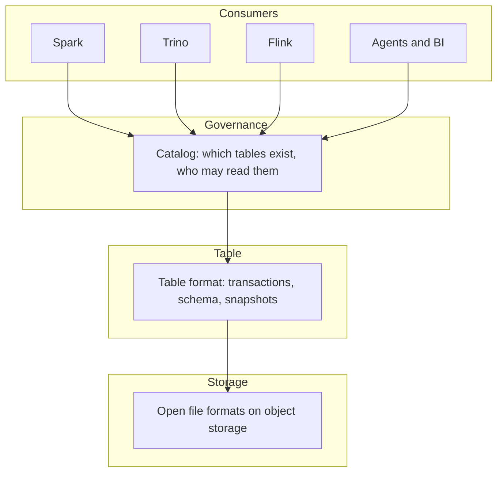

# Open Lakehouse

An open lakehouse is a data architecture that stores data in open file and table formats on commodity object storage, so that any compliant engine can read and write it without vendor lock-in. It combines the scale and cost profile of a data lake with the transactional guarantees of a data warehouse, and it does so without placing the data inside any one vendor's system.

The distinguishing property is not performance or price. It is that the data stays in storage you control, in formats that are publicly specified, and engines are attached to it rather than the other way round. Replacing a query engine becomes a configuration change instead of a migration.

## Core Definition

The term packs three separate claims, and a system can satisfy one without satisfying the others. Separating them is the fastest way to judge whether something genuinely qualifies.

**Open.** The file format, the table format, and the catalog API are publicly specified and independently implementable. More than one engine can read and write the same tables. Nothing about the storage layer requires a particular vendor.

**Lake.** Data sits on commodity object storage that you own, in files you can list and copy. Storage and compute scale independently and are billed separately, which is what makes retaining full history affordable.

**House.** Those files behave like real tables: ACID transactions, schema enforcement and evolution, snapshot isolation between concurrent writers, and the ability to query or roll back to an earlier state.

A system that satisfies "open" and "lake" but not "house" is a data lake. One that satisfies "lake" and "house" but not "open" is a warehouse built on object storage, which is a reasonable architecture but a different one.

## Visual Architecture

Every engine reaches the data through the same catalog, which resolves to the same table metadata, which points at the same files. Because each boundary is a published specification rather than an internal API, any single layer can be replaced without disturbing the others.

## Implementation and Operations

The architecture exists because of a specific failure. The first generation of cloud data lakes wrote Parquet and CSV files to object storage with no transaction management. Writing a thousand files to object storage is not atomic: a failed job left partial data behind, concurrent jobs overwrote each other's results, and there was no reliable way to undo a bad load.

The common workaround was to keep the lake for raw data and copy a curated subset into a warehouse for anything that needed correctness. That meant two systems, two copies, and a pipeline between them that could drift.

Open table formats collapsed that split. By adding a metadata layer over the same files, they made the lake transactional, which removed the reason to copy data into a warehouse at all.

Running one shifts work rather than removing it. Four maintenance jobs recur: compacting small files, expiring old snapshots, removing orphaned files, and rewriting manifests as metadata grows. None is difficult, all are easy to postpone, and postponing them is the usual reason a lakehouse feels slow.

## Summary and Tradeoffs

What you gain is engine choice, a low exit cost, and one copy of the data instead of two. What you take on is assembly and maintenance that a managed warehouse would have handled for you.

The practical test of openness is exit: to replace any single component, would you have to rewrite your data? If the answer is yes, the architecture has a lock-in point regardless of how it is described.

For the full treatment, see [what is an open lakehouse](/what-is-an-open-lakehouse), the [principles](/principles) that make an architecture open in practice, and the [reference architecture](/architecture) covering each layer in turn.
