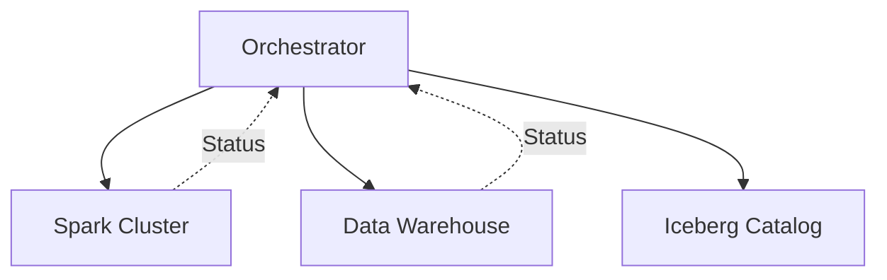
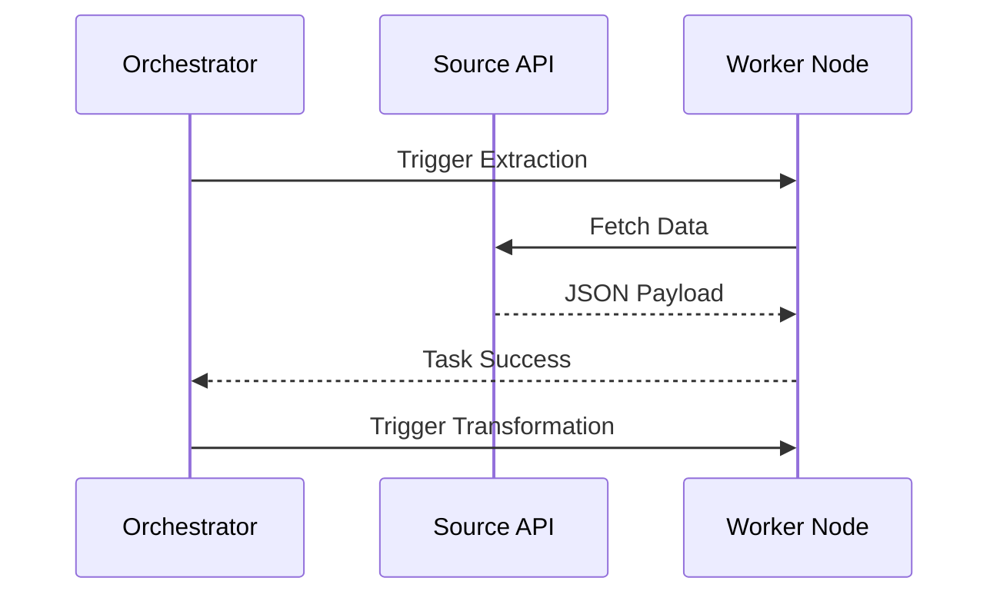

# Orchestration

## Core Definition

In data engineering, Orchestration is the automated configuration, coordination, and management of complex computer systems, software, and services. specifically, it is the overarching system that schedules and monitors the execution of data pipelines (ETL/ELT processes) across a sprawling enterprise data architecture.

Think of an orchestrator as the conductor of an orchestra. The conductor does not actually play the instruments (compute the data). Instead, the conductor tells the strings (Apache Spark) when to start playing, tells the brass (dbt) when to come in, and ensures that everyone is playing to the exact same tempo (the schedule).

## Implementation and Operations

Historically, data engineers used simple operating system tools like `cron` to schedule bash scripts. A script to extract data might be scheduled at 1:00 AM, and a script to transform the data scheduled at 2:00 AM, assuming the first script would finish in time. If the first script failed, the second script would still run at 2:00 AM, process empty or corrupted data, and destroy the downstream dashboards.

Modern orchestrators (like Apache Airflow, Dagster, and Prefect) solve this by explicitly defining dependencies via Directed Acyclic Graphs (DAGs). They manage retries, handle alerting integrations (e.g., sending a Slack message on failure), and provide centralized visibility. An orchestrator allows a team to say: "Run Task B *only if* Task A succeeds. If Task A fails, retry it three times with an exponential backoff. If it still fails, page the on-call engineer."

## What an Orchestrator Is Responsible For

Orchestration is often described as scheduling, which understates it. Cron schedules. An orchestrator handles the problems that appear once work has dependencies and is expected to recover from failure.

**Dependency resolution.** Given a graph of work, determine what can run now, what must wait, and what can proceed in parallel. This is the part that a collection of cron entries cannot express, because cron encodes time rather than dependency, and "run at 02:00 and hope the 01:00 job finished" is a race condition with a schedule attached.

**Retries and partial recovery.** When step 7 of 12 fails, the system should be able to resume from step 7 rather than repeat the first six. This requires knowing what completed, which requires durable state.

**Backfills.** Running historical periods on demand, with the same code paths as scheduled runs, without disturbing the current schedule.

**Observability.** A record of what ran, when, for how long, with what outcome. In practice this is what people use an orchestrator for most often.

### The Idempotency Requirement

Every capability above assumes tasks can be re-run safely. Retries re-run tasks. Backfills re-run tasks. Recovery re-runs tasks. A task that appends rows without a guard produces duplicates on its second execution, and the orchestrator's recovery features become a mechanism for corrupting data.

Making tasks idempotent is therefore not an optimization but the precondition for orchestration to work at all. On a lakehouse the usual approaches are writing to a partition that is replaced wholesale, using `MERGE` keyed on a natural key, or using the write-audit-publish pattern so a failed run never becomes visible.

### Orchestration Is Not Transformation

A recurring design error is placing transformation logic inside orchestrator tasks. The orchestrator then becomes a dependency of the logic, the logic cannot be tested without it, and the pipeline can only run where the orchestrator runs.

Keeping transformation in the engine, in dbt models, or in application code, and reserving the orchestrator for deciding what runs and when, keeps both replaceable.

## Visual Architecture

### Diagram 1: Conceptual Architecture

### Diagram 2: Operational Flow

