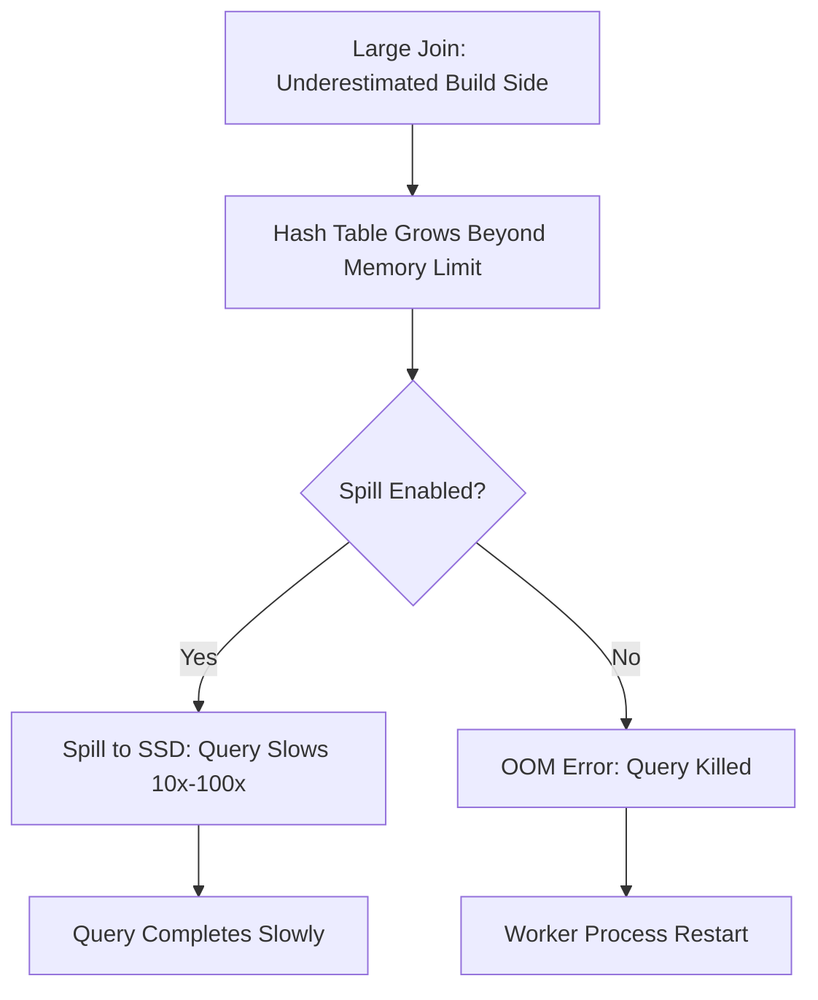
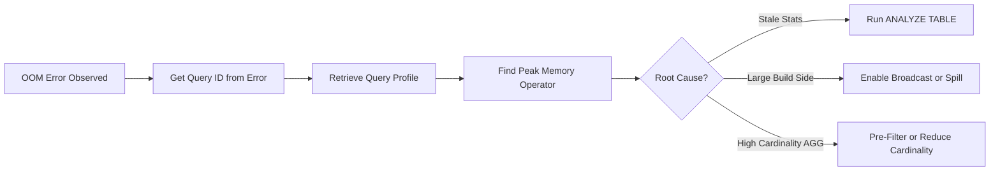

# Out-of-Memory (OOM) Errors

## Core Definition

An Out-of-Memory (OOM) error occurs when a query execution process attempts to allocate more memory than is available to it — either on a single node (exceeding the JVM heap or native memory limit) or across the cluster (exceeding the total memory allocation for the query). The process is killed by the operating system's OOM killer, or the query engine's memory manager terminates the query to protect other running workloads.

OOM errors are among the most disruptive failures in production data lake and lakehouse environments. Unlike a syntax error or a missing table error, an OOM error kills the query mid-execution — potentially after hours of work — producing no partial results and leaving temporary spill files on disk that must be cleaned up. Understanding the causes and prevention strategies is essential for reliable production analytics.

## Common Causes in Lakehouse Workloads

**Oversized Hash Tables (Join Build Side):** The most common cause. When the build side of a hash join is larger than estimated (due to stale statistics, data growth since the last ANALYZE), the hash table grows beyond the memory allocation and the query fails. This is especially common after initial table creation before statistics have been computed.

**Oversized Hash Aggregations:** GROUP BY operations over very high-cardinality columns (billions of distinct user IDs, session IDs, or event IDs) create in-memory hash maps with one entry per distinct key. If the cardinality is underestimated, the hash map overflows.

**Shuffle Buffer Overflow:** In distributed execution, each worker buffers incoming shuffle data from all upstream workers. If all upstream workers simultaneously send large data volumes, the aggregate receive buffer can overflow — particularly in all-to-all shuffle patterns where each upstream worker sends data to all downstream workers.

**Unbounded Collect Operations:** Queries that collect all results to a single driver node (`SELECT * FROM large_table` via a JDBC connection) bypass the distributed execution model and must materialize the full result set in the driver's memory. For large result sets, this causes driver OOM.

**Python/UDF Memory:** User-defined functions (UDFs) executing Python or JVM code run in separate processes alongside the query engine worker. Memory consumed by UDF processes is not always accounted for in the query engine's memory manager, creating hidden memory consumption that can push the total node memory over the limit.

**Memory Leaks:** Long-running query engine daemons (Dremio executors, Trino workers) can accumulate memory leaks from unreleased native memory allocations, direct byte buffers, or JVM class loading. Memory grows gradually until a query that would previously succeed triggers an OOM.

## Diagnosis

**Container/OS OOM Kill Logs:** Linux OOM killer events are logged in `/var/log/syslog` or via `dmesg`. When the OOM killer kills a JVM process, the log shows which process was killed and its memory usage at the time of death.

**Query Engine Error Messages:** Dremio produces detailed error messages identifying the specific operator and query that triggered the OOM. Trino's error includes the query ID and node that failed. These IDs allow engineers to retrieve the query execution profile with per-operator memory statistics.

**Java Heap Dump Analysis:** For JVM-based engines (Dremio, Trino, Spark), enabling `-XX:+HeapDumpOnOutOfMemoryError` captures a heap dump at the moment of OOM. Tools like Eclipse Memory Analyzer (MAT) or VisualVM can identify the dominant object types consuming memory and trace their allocation path.

**Query Profile Memory Statistics:** Dremio's query profile shows peak memory usage per operator. An operator consuming 95% of the total memory budget while other operators use 5% each is the clear culprit. Trino's query detail page shows memory usage per stage and per operator.

## Prevention Strategies

**Maintain Accurate Statistics:** Run `ANALYZE TABLE` on Iceberg tables after significant data loads to ensure the CBO has accurate row count, cardinality, and distribution statistics for join planning and memory estimation.

**Increase Memory Allocation:** For legitimately large queries, increase executor memory allocation (JVM heap size, total memory budget). Dremio executor memory is configured via `dremio-env` and `dremio.conf`. Trino worker memory is configured via `query.max-memory-per-node`.

**Enable Spill-to-Disk:** Configure query engines to spill to disk rather than OOM-kill queries. This trades performance for reliability. Dremio, Trino, and Spark all support spill-to-disk for hash joins and aggregations with configuration settings enabling it.

**Broadcast Small Joins:** Replace hash joins with broadcast joins for small-to-large joins to eliminate the large in-memory hash table requirement.

**Limit Result Set Size:** Add `LIMIT` clauses to exploratory queries to prevent unbounded result collection. Use server-side pagination (OFFSET/FETCH) or cursor-based pagination for large exports.

**Memory Isolation via Resource Groups:** Use query engine resource groups (Dremio Queues, Trino Resource Groups) to limit the total memory available to any single query, preventing runaway queries from consuming all available memory and killing other workloads.

## Visual Architecture

### Diagram 1: OOM Failure Cascade

### Diagram 2: Memory Diagnosis Flow

