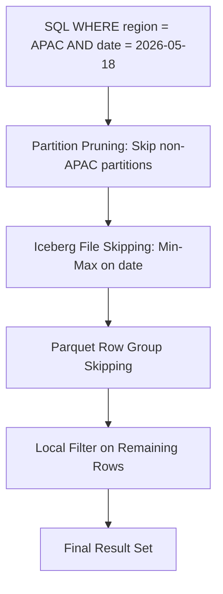
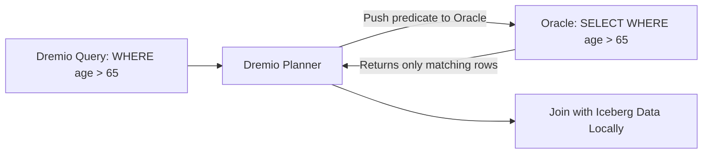

# Predicate Pushdown

## Core Definition

Predicate Pushdown is a query optimization technique in which filter conditions (predicates) from the WHERE clause of a SQL query are applied as early as possible in the execution pipeline, ideally at the data source level, to eliminate non-matching rows before they are read into memory, transmitted across the network, or processed by the query engine.

The name comes from the logical query plan representation: filter predicates are "pushed down" from their original position (often above a join or aggregation in the logical plan) toward the data scan operators at the bottom of the plan tree, where they can be evaluated most efficiently against the raw data.

Predicate pushdown is one of the most universally effective query optimization techniques because it reduces the volume of data that must be read, transmitted, and processed, compounding benefits at every stage of the execution pipeline.

## Why Predicate Pushdown Matters

Consider a query scanning a 1TB Parquet table on S3, joining it to a dimension table, and filtering the result to rows from APAC region in Q3 2025:

**Without predicate pushdown:** Read all 1TB from S3, transmit 1TB across the network to compute nodes, perform all joins on 1TB of data, then apply the APAC/Q3 filter to discard 95% of joined rows.

**With predicate pushdown:** Apply the APAC/Q3 filter at the scan level. Skip 95% of Parquet files based on partition and min/max statistics (data skipping). Read only 50GB. Transmit only 50GB across the network. Perform joins on 50GB of data.

The difference between these two execution paths is often the difference between a query that times out and one that returns in seconds.

## Predicate Pushdown at Different Layers

**Into the Storage Format (Parquet Row Group Level):** Parquet files are divided into Row Groups of typically 128MB. Each Row Group stores column statistics (min, max, null count) in its footer. A filter `WHERE age > 65` can skip entire Row Groups where `max(age) < 65`. The Parquet reader evaluates this predicate against the footer statistics before reading any actual column data from the Row Group.

**Into the Table Format (Iceberg File Level):** Apache Iceberg's manifest files store column statistics for each data file. The query planner evaluates filter predicates against these file-level statistics to eliminate entire files from the scan. This happens before any data is read from S3: pure metadata-level skipping.

**Into the Connector (Partition Level):** For partitioned Iceberg tables, filter predicates on partition columns are evaluated against partition metadata to identify which partitions contain matching rows. Files from non-matching partitions are completely excluded from the scan list.

**Into External Data Sources (Federation Pushdown):** In federated query engines (Dremio, Trino, Presto), filter predicates can be pushed down into external data sources: relational databases (PostgreSQL, MySQL), document stores (MongoDB), or external API connectors. When Dremio federates a query over an Oracle database source, the WHERE clause is translated into an equivalent Oracle SQL filter that is executed inside Oracle, returning only matching rows over the network.

## Supported Predicate Types

Not all predicates can be pushed down to all data sources. The query engine evaluates each predicate against the source connector's push-down capability and routes supported predicates to the source; unsupported predicates are evaluated locally after data retrieval.

**Commonly supported for pushdown:**
- Equality: `column = value`
- Range: `column > value`, `column BETWEEN a AND b`
- NULL checks: `column IS NULL`, `column IS NOT NULL`
- IN lists: `column IN (v1, v2, v3)` (if the list is small)
- LIKE patterns: `column LIKE 'prefix%'` (for some sources)

**Typically not pushed down:**
- Complex expressions involving multiple columns: `col1 + col2 > 100`
- UDFs (user-defined functions) unknown to the remote source
- Very large IN lists (may be evaluated locally for efficiency)
- Non-deterministic functions: `WHERE RANDOM() < 0.01`

## Predicate Pushdown in Apache Iceberg with Dremio

Dremio's Iceberg connector implements multi-level predicate pushdown transparently. When a query contains a WHERE clause, Dremio:

1. Evaluates partition column predicates against the Iceberg partition spec, excluding non-matching partition directories.
2. Evaluates remaining column predicates against Iceberg manifest file statistics (min/max, null count) to exclude non-matching data files.
3. Evaluates column predicates against Parquet Row Group statistics within each scanned file to skip non-matching Row Groups.
4. Applies any remaining unsupported predicates locally on the rows read from passing Row Groups.

The combination of these three predicate pushdown levels often reduces the actual data read from S3 to less than 1% of the total table size for highly selective queries.

## Filter Derivation and Predicate Inference

Advanced query planners can derive additional filter predicates that were not explicitly written in the query but are logically implied by the explicit predicates:

**Join Predicate Inference:** If a query joins fact_sales to dim_date on `date_id` and filters `WHERE dim_date.fiscal_quarter = 'Q3-2025'`, the planner can infer that `fact_sales.date_id` must be in the set of Q3-2025 date IDs, and push an equivalent filter down onto the fact_sales scan: eliminating non-Q3-2025 rows from the fact table before the join.

**Constant Propagation:** If a query contains `WHERE country = 'US' AND country = 'CA'`, the planner detects the contradiction and replaces it with `WHERE FALSE`, eliminating the entire scan.

## Visual Architecture

### Diagram 1: Predicate Pushdown Layers

### Diagram 2: Federation Predicate Pushdown

