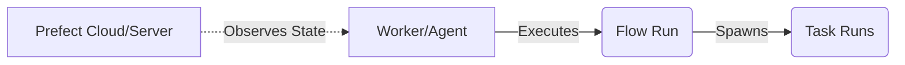

# Prefect

## Core Definition

Prefect is a modern workflow orchestration framework designed to be highly dynamic, Python-native, and focused on observability. Like Dagster, Prefect was built by engineers who experienced the friction of legacy orchestrators like Airflow and sought a more frictionless, developer-friendly approach.

Prefect's philosophy is "Negative Engineering": the idea that data engineers spend too much time handling retries, state management, and logging, rather than writing actual business logic. Prefect aims to eliminate this overhead. You simply write standard Python code, add decorators (`@flow` and `@task`) to your functions, and Prefect automatically handles the scheduling, retries, logging, and state management.

## Implementation and Operations

Unlike Airflow, which requires DAGs to be statically defined before execution, Prefect supports dynamic DAGs. A Prefect flow can decide, based on the data it is currently processing, to spawn a hundred new parallel tasks on the fly. This makes it incredibly powerful for workloads where the size and shape of the data are unpredictable.

Prefect also utilizes a hybrid execution model. The "Prefect Cloud" (or self-hosted Prefect Server) acts strictly as a control plane. It tracks the state of tasks and displays the UI, but it never actually touches or stores the user's data or code. The actual execution happens on "Workers" (or Agents) that reside securely inside the user's own infrastructure (like a private Kubernetes cluster). The Workers simply poll the control plane to ask "What should I run next?", ensuring massive scalability and strict data privacy compliance.

## Dynamic Workflows

Prefect's distinguishing choice is that a workflow's shape can be determined at runtime rather than declared in advance.

In a statically defined DAG, the set of tasks is fixed when the file is parsed. Handling a variable number of inputs means either building the graph from a source the scheduler can reach at parse time, or collapsing the variable work into one task that loops internally and loses per-item visibility.

Prefect flows are ordinary Python functions. A flow can query a source, discover it has 47 files to process, and submit 47 task runs, each tracked and retried individually. The graph is a record of what happened rather than a contract fixed beforehand.

This suits workloads whose shape follows the data: processing whatever files landed, fanning out over tenants that exist today, or branching on a quality check's result.

### The Hybrid Execution Model

Prefect separates orchestration from execution. The orchestration layer tracks state, schedules, and history. Execution happens on workers running in your own infrastructure, which pull work rather than receiving inbound connections.

The consequence that matters for governed data is that code and data stay inside your network. The orchestration layer sees metadata about runs, not the contents of what those runs touch. For teams that cannot send data to a vendor, this arrangement avoids the question entirely.

### The Trade

Runtime-determined graphs are harder to reason about before they run. A statically declared DAG can be inspected, diffed in review, and reasoned about without executing it. A flow whose shape depends on data cannot fully be, and its behavior under unexpected input is discovered rather than read.

The choice is between a structure you can verify in advance and a structure that adapts to what it finds. Neither is generally correct, and the deciding question is whether your work has a fixed shape.

## Visual Architecture

### Diagram 1: Conceptual Architecture

```mermaid
graph TD
    A[@flow] --> B[@task 1]
    A --> C[@task 2]
    B --> D[API Call]
    C --> E[DB Write]
```

### Diagram 2: Operational Flow


