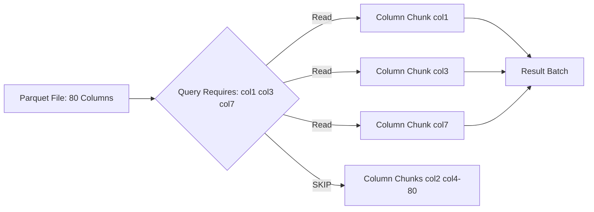
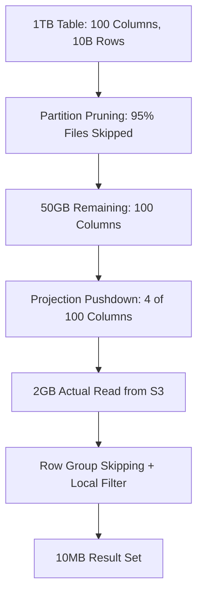

# Projection Pushdown

## Core Definition

Projection Pushdown (also called column pruning) is a query optimization technique in which only the specific columns required by a SQL query are read from storage, rather than reading all columns in the table. In columnar storage formats like Apache Parquet and ORC — which physically store each column's data separately in distinct byte ranges — this optimization directly translates to a proportional reduction in I/O volume.

The term "projection" comes from relational algebra: a projection operation selects a specific subset of columns from a relation, discarding the rest. Pushdown refers to moving this selection as early as possible in the execution pipeline — to the point where data is read from storage — so that unnecessary columns never enter the compute pipeline at all.

## The Columnar Format Advantage

Projection pushdown is only effective with columnar storage formats. In row-oriented formats (like traditional CSV files or PostgreSQL heap storage), all columns for a row are stored together. To read column C for row 1, the storage layer must read the entire row including columns A, B, D, E, and F.

In columnar formats (Parquet, ORC), column A's values for all rows are stored together, column B's values are stored together, and so on. To read only column C for all rows, the storage layer can navigate directly to the byte offset of column C's data and read only those bytes — completely skipping the physical disk regions containing columns A, B, D, E, and F.

This is the fundamental reason why analytical workloads dramatically outperform on columnar storage. Analytical queries ("calculate the sum of revenue grouped by region for all time") typically access only 2-5 columns out of tables that may have 50-100 columns. Without column pruning, the query would read 20-50x more data than required.

## Parquet Column Organization

A Parquet file is organized as a set of Row Groups (horizontal partitions of typically 64MB-1GB of uncompressed data). Within each Row Group, each column's data is stored as a Column Chunk — a contiguous byte range containing the column's values for all rows in that Row Group, compressed together using a column-specific codec (Snappy, Zstandard, GZIP).

Each Parquet file's footer contains a schema and, for each Row Group, the byte offsets of every Column Chunk. The Parquet reader uses these footer metadata to seek directly to the Column Chunks of the requested columns, completely bypassing Column Chunks for unrequested columns without reading them from disk or S3.

## Query Engine Implementation

When a query engine (Dremio, Trino, Spark, DuckDB) plans a query, the logical plan contains a Scan operator with a specified list of required columns. This column list is derived by analyzing all parts of the query that reference columns: SELECT list, WHERE predicates, JOIN conditions, GROUP BY keys, ORDER BY keys.

This column list is passed to the storage connector as the "projection" or "required schema." The connector's Parquet reader then opens each Parquet file and reads only the Column Chunks for the required columns, returning a columnar batch that contains only the projected columns.

For a table with 80 columns where a query requires only 4, projection pushdown reduces I/O by approximately 95% — one of the largest single-optimization improvements available for analytical workloads.

## Nested Column Projection

Modern enterprise schemas frequently use nested data types: Parquet's STRUCT columns contain nested fields, ARRAY columns contain variable-length lists, MAP columns contain key-value pairs. Projection pushdown must support nested column selection to avoid reading entire nested structures when only a leaf field is required.

Apache Parquet's schema definition supports nested column selection at the leaf field level. A query selecting `user.address.city` only needs to read the city leaf values within the nested user.address struct, not the entire user struct (which might also contain name, email, phone, preferences, order_history, etc.).

Apache Iceberg's schema evolution capabilities ensure that when columns are added, removed, or renamed, the reader correctly handles schema mismatches between the current table schema and the historical Parquet file schemas, applying safe defaults (null values) for missing columns and ignoring extra columns that are not in the query's projection.

## Interaction with Predicate Pushdown

Projection pushdown and predicate pushdown work together synergistically. The predicate columns must always be included in the projection even if they are not in the SELECT list — the query cannot filter on `WHERE region = 'APAC'` unless it reads the region column. After filtering, if region is not in the SELECT list, it is dropped from the output before the result is returned.

The combination of predicate pushdown (row elimination) and projection pushdown (column elimination) often reduces the data read from S3 by 99% compared to a full table scan: 95% row elimination through partitioning + file skipping × 95% column elimination = 0.25% of total table data actually read.

## Visual Architecture

### Diagram 1: Columnar Format with Projection

### Diagram 2: Combined Pushdown Effect

